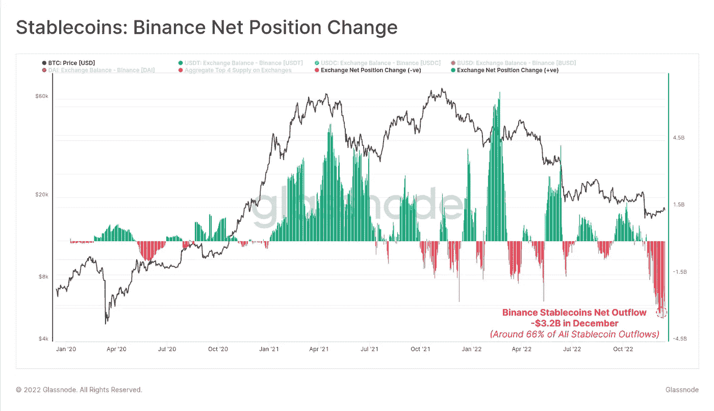

# 秘密游说:币安加入竞争

> 原文：<https://medium.com/coinmonks/crypto-lobbying-binance-joins-the-race-470a44dbb85d?source=collection_archive---------29----------------------->

猜猜谁在大力依靠加密游说？至此，我们都知道[币安交易所](https://blog.hi.exchange/binance-exchange-outflows/)陷入了困境。尽管有人称之为“压力测试”，但大量资金外流是一件严肃的事情。随着不到一周内超过 60 亿美元的资金外流，BNB 几天前抛售了。此前，审计公司 [Mazars Group](https://blog.hi.exchange/mazars-group-audit-firm/) 宣布，由于其资产的超级复杂性，他们将不会为任何加密客户工作。自然，当情况不太理想时，最好的办法就是加入最强大的加密游说团伙。或许，这将确保立法者不再调查币安及其运作方式。毕竟，币安有很多东西需要隐藏。令人难以置信的是，该公司不会[透露](https://www.reuters.com/technology/binances-books-are-black-box-filings-show-crypto-giant-tries-rally-confidence-2022-12-19/)他们的总部在哪里！所以当涉及到他们的书时，没有人知道任何事情，而且似乎他们喜欢保持这种方式。还有什么比加入游说团更好的方式向投资者证明你的公司不是粗略的呢？是的，这是币安的下一步，在美国进行秘密游说。

## **流出量**

自从 FTX[崩溃以来，币安交易所出现了大规模的撤资。到目前为止，外流资金远远超过 60 亿美元，而其中一半以上是稳定的资本。当然，币安的首席执行官赵昌鹏通过清算所有的 FTT 代币引发了 FTX 的崩溃。然而，尽管揭露了 FTX 最肮脏的秘密，投资者现在担心币安也可能是一个大谎言。](https://blog.hi.exchange/ftx-collapse/)

根据分析公司 Glassnode 的数据，stablecoins 在 30 天内总共流出了 32 亿美元。这包括系绳(USDT)，美元硬币(USDC)，美元()和戴(戴)。

Source: Glassnode/Twitter

除了稳定币之外，比特币和以太币也在滑出交易所，因为对它们破产的担忧越来越强烈。

“我们可以看到整个 12 月币安外汇余额的波动性将会加大。

如果我们看看 BTC 的资金流入/流出，我们可以看到最近有大量资金撤出。

13-12 月录得 57，300 BTC 外流，是历史上最大的 BTC 净流出币安。"

同一天，价值超过 5.44 亿美元的以太坊也搬出了交易所。很明显，自我监护现在是每个人的头等大事。虽然这些创纪录的提款正导致消费者情绪的转变，但它们也可能拖垮大型平台，并将 crypto 进一步推入不可避免的冰河时代。

## **秘密游说**

但是不要害怕！昨天，币安[宣布](https://www.binance.com/en/blog/ecosystem/binance-joins-the-chamber-of-digital-commerce-to-support-building-a-regulatory-framework-for-crypto-3395504981619173492?ref=AZTKZ9XS&utm_source=BinanceTwitter&utm_medium=GlobalSocial&utm_campaign=GlobalSocial)他们将加入美国游说团体数字商会。数字商会可能是世界上最大的数字资产协会。这个实体包括一些著名的平台，如万事达卡、花旗、维萨、Ripple 和 Circle。

他们将如何帮助币安？公共事务副总裁乔安妮·库巴是这样描述大堂的。

“作为一个处于行业快速发展和复杂监管环境关键环节的组织，与政策制定者、监管机构和商会这样的行业团体密切合作对币安来说至关重要，”

通过涉足加密游说，币安希望“帮助制定有利于和保护用户的政策”此外，他们希望“教育、倡导和提出解决方案”，以帮助塑造美国的加密监管。

上周，路透社报道称，DOJ 在指控币安洗钱和欺诈的决定上存在分歧。虽然他们还没有继续他们的决定，币安似乎已经准备好迎接一个艰难的冲击。在这一点上，加密游说似乎是他们选择的监管武器。

“[秘密游说:币安加入竞选](https://blog.hi.exchange/crypto-lobbying-binance/)”最初由[尼玛·阿斯加里](https://blog.hi.exchange/author/nimaasgari/)发表在 HiExchange 博客上。

> 交易新手？尝试[加密交易机器人](/coinmonks/crypto-trading-bot-c2ffce8acb2a)或[复制交易](/coinmonks/top-10-crypto-copy-trading-platforms-for-beginners-d0c37c7d698c)