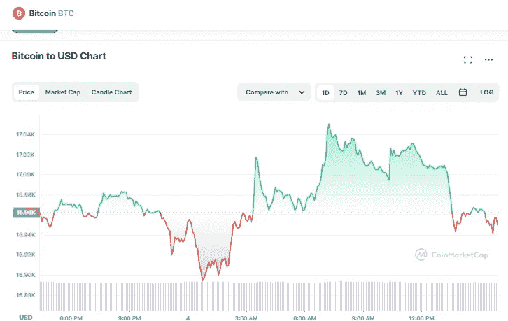

# 今天，12 月 4 日，密码市场价格分析

> 原文：<https://medium.com/coinmonks/crypto-market-news-today-4th-of-december-4720d46ba355?source=collection_archive---------22----------------------->

# **比特币** (BTC)

Source photo [Bitcoin price today, BTC to USD live, marketcap and chart | CoinMarketCap](https://coinmarketcap.com/currencies/bitcoin/)

目前 1 个比特币价值 16944.19 美元，24 小时交易量为 15890098043 美元。

在过去的一天里，比特币的价值下跌了 0.09%。Live 市值目前为 325，972，160，497 美元，是 CoinMarketCap 上市值最大的加密货币。