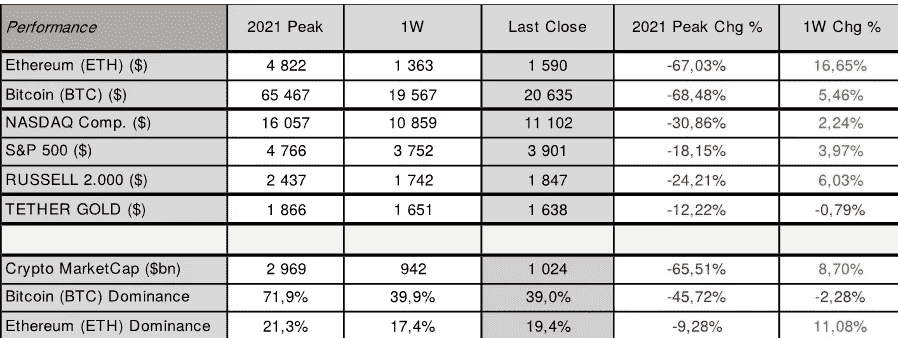
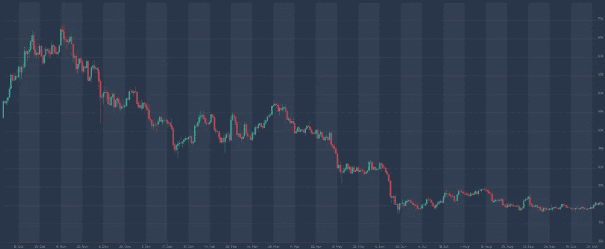
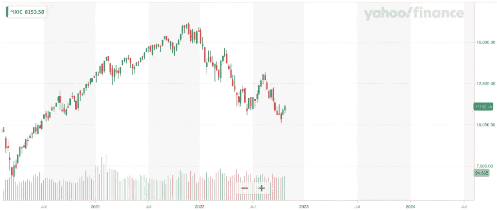
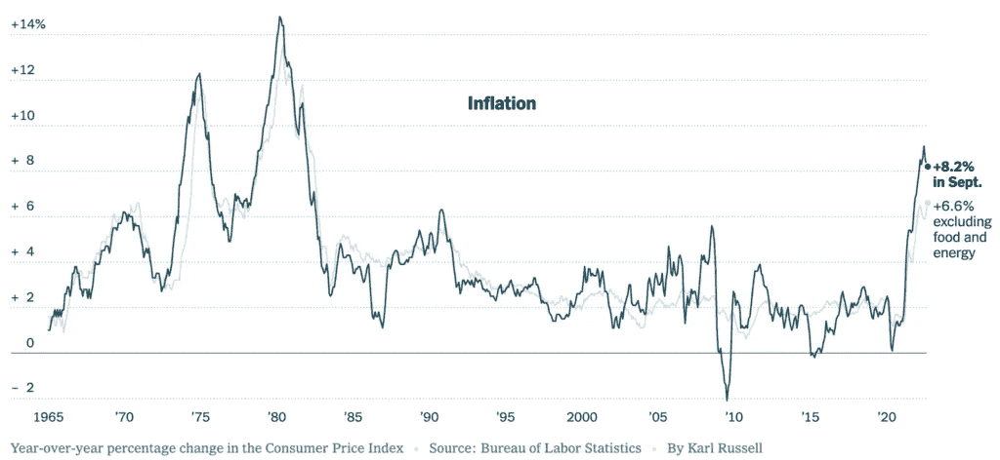

# 加密市场—第 43 周概述

> 原文：<https://medium.com/coinmonks/crypto-market-overview-for-week-43-3a23e1b0d97f?source=collection_archive---------40----------------------->

Source: [altFINS](https://altfins.com/)

上周，我们报告了美国股票和加密市场的强劲表现。纳斯达克上周五收盘上涨**11.102 美元** ( **2.24%** )和**S&P**3.901 美元 ( **3.97%** )。比特币( [**BTC**](https://altfins.com/crypto-screener) )本周收盘上涨 **5.46%** ，周日收盘突破**20.000 美元**关口，而以太坊( [**ETH**](https://altfins.com/crypto-screener) )跃升逾 **15.0%** 至**1.590 美元。股市和股票市场在本周开始表现低迷，但周中出现了由几个事件引起的新的价格波动。**

****对 2022 年 10 月的通胀预测表明，美国核心 CPI 不会上涨，但 CPI 读数将会下降。**此外，美国财政部考虑向市场供应短期国库券以应对当前的短缺，表明市场特定的量化宽松政策(QE)。**

**接下来，随着 Rishi Sunak 成为新的“亲加密”首相，英国终于有了一个更稳定的政治前景。最后， **Twitter 宣布计划推出自己的加密钱包，埃隆·马斯克最终完成了收购交易。所有这些事件伴随着一些以太坊(Ethereum)的报道，推动 ETH 价格上涨，将密码市场推向新高。****

# ****密码市场和股票市场表现****

****

****本周，预计美联储将第四次上调基金利率 0.75%。预计它还将在 2022 年 12 月进一步加息 0.50-0.75%，并在 2023 年 2 月加息 0.50%。为了暂停加息，美联储需要看到通胀开始每月向 2%的目标放缓。目前，联邦基金利率目标区间为 3.00-3.25%，美联储董事会成员对目标区间中点的最后一个中值预测仍为 2022 年底的 4.4%和 2023 年底的 4.6%。****

****经过再次修正，我们预计 2022 年 10 月美国 CPI 将降至 8.11%，核心 CPI 也将降至 6.58%，**与 2022 年 9 月的 8.20%和 6.64%分别相比**。**尽管美国国内生产总值在第三季度出现反弹，但有强烈的迹象表明，随着商业活动连续第四个月收缩，消费者需求正在减弱，这反过来有助于缓解供应僵局，从而降低航运服务的集装箱成本。**

# **比特币价格**

****

**来源:altFINS.com**

# **纳斯达克**

****

**来源:[雅虎财经](https://finance.yahoo.com/)**

# **美国消费物价指数**

****

# **美国基金利率**

****

**来源:路孚特|路透社，2022 年 9 月 14 日**

# **秘密市场情绪**

****与一周前相比，秘密市场情绪(通过秘密恐惧&贪婪指数衡量)上升至 31/100，表明恐惧**，而一周前我们看到的是 22/100，代表极度恐惧。加密市场的总市值终于再次突破了 1 万亿美元的心理关口。周日收盘时收于 1.024 万亿，较一周前上涨近 10.0%。以太坊(ETH)的主导地位已上升至 19.4%，较前一周收盘上涨逾 10.0%。而比特币(BTC)的主导地位则下降了 2.0%以上，至 39%。**

****看点:**欧洲央行下一次货币政策会议:2022 年 12 月 15 日；2022 年 11 月 01-02 日美联储本周；美国 10 月份劳动力市场报告将于美国东部时间 2022 年 11 月 4 日上午 8:30 发布。下一次美国 2022 年 10 月 CPI 发布定于 2022 年 11 月 10 日。**

**找到更多关于 altfins.com 的信息**

> **交易新手？尝试[加密交易机器人](/coinmonks/crypto-trading-bot-c2ffce8acb2a)或[复制交易](/coinmonks/top-10-crypto-copy-trading-platforms-for-beginners-d0c37c7d698c)**