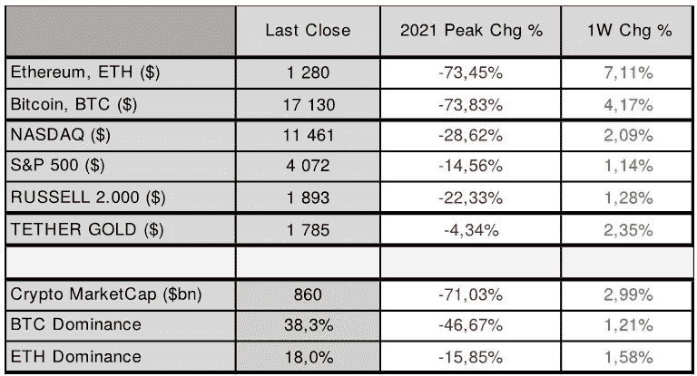

# 第 48 周加密市场概述

> 原文：<https://medium.com/coinmonks/crypto-market-overview-for-week-48-2cba2176fbc2?source=collection_archive---------43----------------------->

**市场在本周结束时再次走强，**与**纳斯达克**收盘上涨 **(** [**纳斯达克**](https://finance.yahoo.com/quote/%5EIXIC?p=%5eIXIC&.tsrc=fin-srch) **⬆️2.1%)** 收于**11.461 美元**和 **S & P 500** 收盘上涨**(**[**s&p500**](https://finance.yahoo.com/quote/%5EGSPC?p=%5eGSPC&.tsrc=fin-srch)**⬆️1.1%】在数字资产方面，**以太坊**表现优于股票市场，收盘上涨**(**[**eth**](https://altfins.com/crypto-screener)**⬆️7.1%)**至**1.280 美元**，而**比特币**本周收盘上涨[**BTC**](https://altfins.com/crypto-screener)**⬆️4.2%**，收于**17.135 美元****

Source: [altfins](https://altfins.com/research/exclusive/69-Crypto-Market-Overview-for-week-48)

美联储上周发出强烈信号，表示准备在本月放缓加息步伐，并将基金利率仅上调 0.50%。因此，美国股市价格上涨，因为投资者认为美联储变得更加温和，有迹象表明美国 CPI 最终也在回落。必须指出的是，美联储也强调工作尚未完成，通胀仍高度不确定。

我们预测 2022 年 11 月的同比通胀率将降至 7.5%，核心 CPI 将小幅降至 6.2%左右。最新公布的 2022 年 10 月美国 CPI 为 7.7%，核心 CPI 为 6.3%(见下图)，**9 月份为 8.20%和 6.64%。**

**我们还重申，如果通胀继续比预期下降得更厉害，我们将在年底前看到风险资产反弹的可能性增加。因此，下周将于 2022 年 12 月 13 日发布的下一次 CPI 数据将受到密切关注。**

****加密市场继续面临更高的下行风险**，因为许多加密分析师和交易员认为加密市场仍未见底。市场继续收到更多与上个月 FTX 崩盘有关的负面消息。**

**数字资产市场情绪( [**加密恐惧&贪婪指数**](https://alternative.me/crypto/fear-and-greed-index/) )下降到 **⬇️26/100，**表示**恐惧**。周日收盘时，加密货币市场总市值上升至约 8600 亿美元，比一周前高出约 14 ⬆️3.0%。**以太坊(**[**eth**](https://altfins.com/crypto-screener)**)的统治力**上升到 **18%** ，高出 **⬆️1.6%** ，而**比特币(**[**BTC**](https://altfins.com/crypto-screener)**)的统治力**则由 **⬆️1.2%** 上升到 **38%** 。**

****看点:**美联储**下一次货币政策会议:2022 年 12 月 13 日-14 日**欧洲央行**下一次货币政策会议:2022 年 12 月 15 日**；美国 2022 年 11 月 CPI 将于 2022 年 12 月 13 日发布。**

> **交易新手？尝试[加密交易机器人](/coinmonks/crypto-trading-bot-c2ffce8acb2a)或[复制交易](/coinmonks/top-10-crypto-copy-trading-platforms-for-beginners-d0c37c7d698c)**