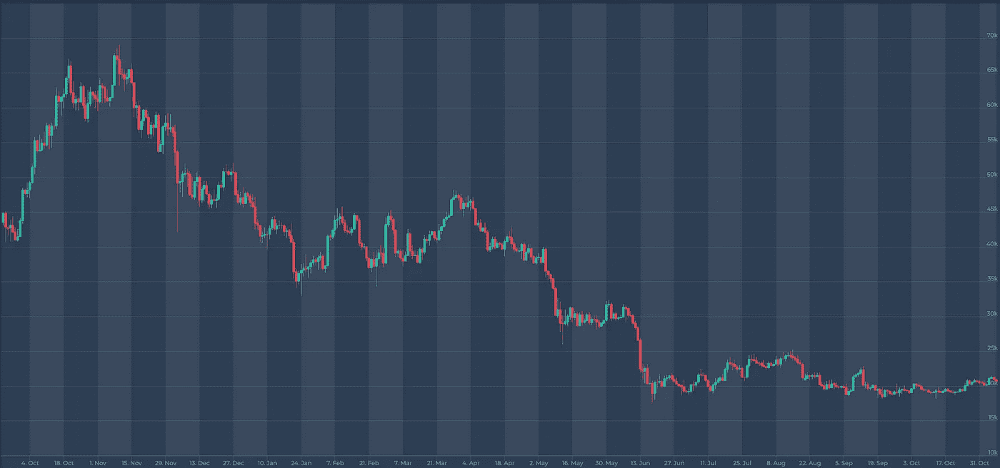

# 密码市场概述/宏观回顾/第 44 周

> 原文：<https://medium.com/coinmonks/crypto-market-overview-macro-review-week-44-c0a9b5737877?source=collection_archive---------47----------------------->

Source: altfins.com

**与前一周相比，美国股票和数字资产得到修正，**与**纳斯达克**收盘下跌 **(** [**纳斯达克**](https://finance.yahoo.com/quote/%5EIXIC?p=%5eIXIC&.tsrc=fin-srch) **⬇️5.65%)** 收于**10.475 美元 **S & P 500** 收于**(**[**s&p500**](https://finance.yahoo.com/quote/%5EGSPC?p=%5eGSPC&.tsrc=fin-srch)****以太坊**修正仅通过**(**[**eth**](https://altfins.com/crypto-screener)**)以 **$1.572** 收盘一周。**另一方面，**比特币本周收盘上涨近([**【BTC】**](https://altfins.com/crypto-screener)【⬆️**2.00%)**，收盘略低于**21.000 美元关口。********

******上周，美联储将基金利率上调 0.75%，**今年第四次，**将利率推至 3.75% — 4.00%的新目标区间。在新闻发布会上，美联储主席杰伊·鲍威尔曾警告利率可能达到高于预期的水平，这向市场表明美联储尚未转向。美联储董事会成员对目标区间中点的最后一个中值预测仍为 2022 年底的 4.4%和 2023 年底的 4.6%，然而，市场已开始将明年达到 5.00%以上的联邦基金利率峰值计入价格。******

# ****市场表现****

********

****Source: [altfins.com](https://altfins.com/)****

****美国劳动力市场上个月增加了 26.1 万个新职位，超过了 20 万个的预测。美国劳动力市场保持稳定，这仍然是美联储的担忧，因为他们的目标是抑制经济增长，以降低高通胀。根据美联储主席 Jay Powell 的说法，美国劳动力市场“过热”，失业率为 3.7%，高于疫情前的水平。尽管劳动力市场强劲，但联邦银行计划在 12 月的会议上放松加息，将利率上调 0.50%，并在 2023 年 2 月再上调 0.50%。****

******经过修正后，我们预计 2022 年 10 月美国 CPI 将进一步降至 8.09%，核心 CPI 将降至 6.58%，**相比之下，2022 年 9 月的 CPI 分别为 8.20%和 6.64%**。**伴随着一些以太坊( [ETH](https://altfins.com/crypto-screener) )的报道，鲸推高了 [ETH](https://altfins.com/crypto-screener) 的价格，将密码市场推向新高。****

# ****比特币价格****

********

****Source: altfins.com****

# ****纳斯达克****

********

****Source: Yahoo Finance****

# ****美国消费物价指数****

********

# ****美国基金利率****

********

****Source: Statista, Nov. 07, 2022****

# ****秘密市场情绪****

****数字资产市场情绪( [**加密恐惧&贪婪指数**](https://alternative.me/crypto/fear-and-greed-index/) )进一步上升至 **33/100，**继续表明**恐惧**。上周，该指数为 31/100。 [**加密货币市场总市值**](https://coinmarketcap.com/charts/) 一直保持在**1 万亿美元大关之上，周日收盘时收于 **1.03 万亿**，比⬆️ **一周前高出 0.50%** 。**以太坊(**[**eth**](https://altfins.com/crypto-screener)**)的统治地位**已经下降到**的 18.8%** ，比 **⬇️2.5%** 低了不止，而**比特币(**[**BTC**](https://altfins.com/crypto-screener)【t44)的统治地位几乎下降了 **⬇️1.0%** 到 **38】********

******关注内容:**美联储下一次货币政策会议:2022 年 12 月 13 日至 14 日欧洲央行下一次货币政策会议:2022 年 12 月 15 日；美国 2022 年 10 月 CPI 将于 2022 年 11 月 10 日公布。****

****[**altFINS**](https://altfins.com/) 是**一个领先的加密分析平台**，被成千上万的交易者和投资者用来寻找有利可图的交易思路。****

****altFINS 项目是出于对缺乏高质量工具的失望而开始的，这些工具用于寻找交易想法、创建警报、执行交易策略以及监控交易所之间的投资组合表现。我们的团队决定填补这一空白。****

****我们正在构建一个全面而直观的平台，使用传统的技术分析和替代的链上数据以及跨交易所的交易执行来进行硬币筛选和分析。交易想法发现和交易执行的结合在加密交易领域是独一无二的。****

****欲了解更多信息，请访问:altfins.com****

> ****交易新手？试试[加密交易机器人](/coinmonks/crypto-trading-bot-c2ffce8acb2a)或者[复制交易](/coinmonks/top-10-crypto-copy-trading-platforms-for-beginners-d0c37c7d698c)****