# 密码市场年度回顾

> 原文：<https://medium.com/coinmonks/crypto-market-year-review-3bb7a9c2e63f?source=collection_archive---------12----------------------->

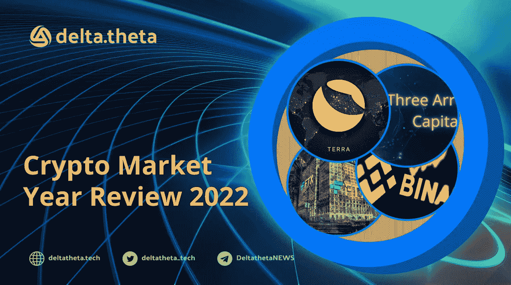

# 共同市场

像之前的许多年一样，今年也有丰富的事件、新闻和价格变动。全球金融市场的股票和加密货币价值在开始时创下历史新高，covid 后对包括技术在内的许多行业的前景进行了重新评估。

> 交易新手？在[最佳密码交易所](/coinmonks/crypto-exchange-dd2f9d6f3769)上尝试[密码交易机器人](/coinmonks/crypto-trading-bot-c2ffce8acb2a)或[复制交易](/coinmonks/top-10-crypto-copy-trading-platforms-for-beginners-d0c37c7d698c)

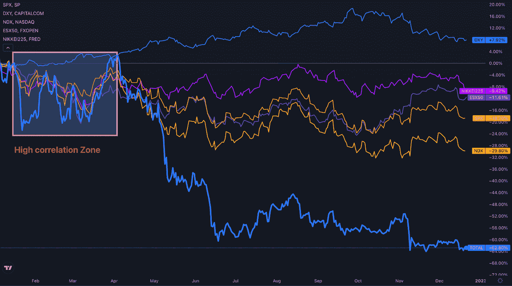

专家们对美国和全球经济前景的讨论始于 2021 年底，到早春时变得越来越活跃。宏观统计数据、失业数据、资源成本、零部件和物流数据引发了人们对市场前景越来越多的担忧。

结果，全球持续高通胀成为一个不容忽视的事实。世界主要经济体的金融当局开始了加息进程，但不同国家对这些进程的最终效果有不同的动力和预期。因此，包括加密货币在内的主要股票市场之间的高度相关性被动荡和分散的现金流所取代。

自 5 月份以来，每个市场的本地因素变得越来越重要。美国加息速度快于其他市场，超过了通胀率，美元指数的强势被年底的下跌所取代，欧洲和亚洲市场开始表现出更强劲的势头，预计不久将出现负担得起的宽松融资条件。在这种情况下，加密市场被放任自流——作为降低风险和全球多样化机制的一部分，大量交易流动性离开了利基市场。

# 利率上涨

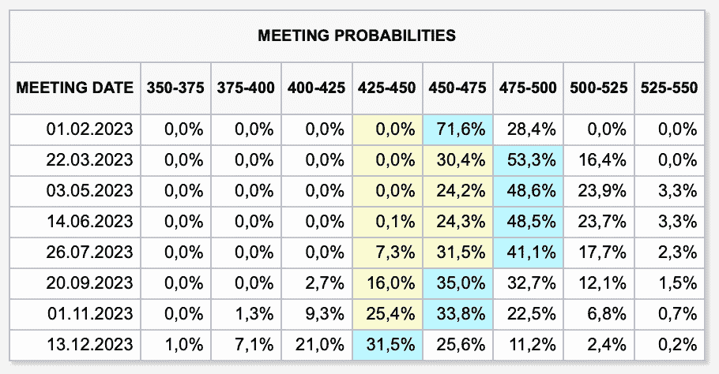

目前，美国市场的再融资利率接近近年来的最高值——4.00-4.25。然而，未来最大程度紧缩的前景是矛盾的。正如实践向我们表明的那样，美联储对市场状况的变化反应较晚，并在上次会议结束时发表声明，表示不打算在 2023 年降低利率。然而，股票交易员有不同的看法，并预计在 2023 年秋季开始减少。这一指标对加密货币极其重要，因为过去的低利率和廉价流动性周期是去年价格纪录的主要原因之一。

# 总体加密市场资本总额

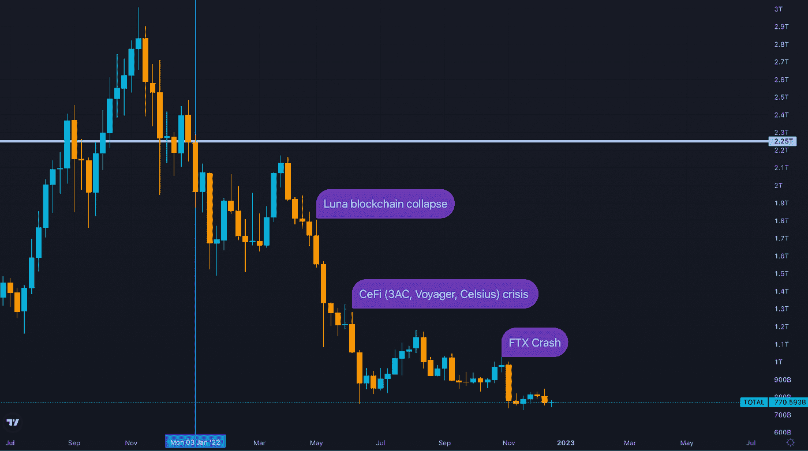

自今年年初以来，加密市场的资本总额已从 2.25 万亿美元的峰值增长近两倍，至年底的 7800 亿美元。市场在很短的时间内经历了一系列的震荡。整个卢纳区块链生态系统在 5 月份的崩溃以及随之而来的主要混合密码贷方的破产，最终导致了最大的密码交易所之一 FTX 的划时代破产。这样的事件不可避免地让我们重新评估“可靠”和“去中心化”的意义。然而，正是完全去中心化的协议(如 AAVE 和马克)向我们表明，它们能够如预期的那样经受住压力测试，通过这个“障碍课程”只会突出它们作为传统金融未来替代方案的优点。

# 现货市场

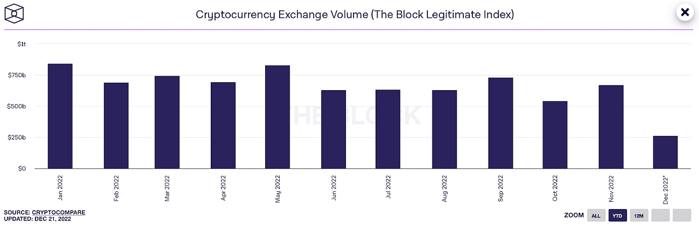

随着加密货币的下跌，现货市场的交易量也有所下降。从 1 月份超过 8000 亿的峰值到 11 月份不到 6000 亿。这种趋势在初秋加剧，并在 FTX 股市下跌后的 11 月达到顶峰。

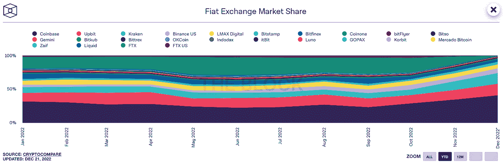

应该指出，三个最大的交易所(比特币基地、北海巨妖和 BinanceUS——在直接接受法定货币存款的交易所中)从这一事件中受益匪浅。总的来说，交易量的下降并不令人意外，也不是行业的关键变化，这只会对上市公司的估值产生影响。

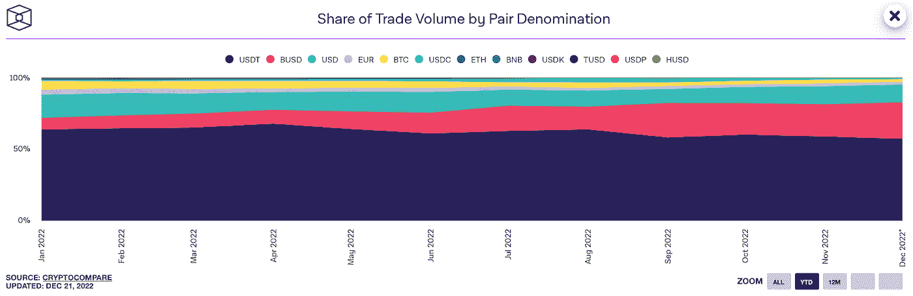

另一个新趋势——对稳定玉米的生态系统战争——伴随着更加严重和长期的后果。面对流动性下降，市场竞争明显加剧，导致交易生态系统之间寻求新的优势。稳定的硬币已经取代了新进入者进入这个行业的第一个明确的入口。留住现有用户并吸引新用户的逻辑，迫使币安从报价中删除了资本化程度第二高的 USDC 栈，只剩下与 BUSD 和 USDT 进行加密货币交易的能力。这些行动很快影响了发行数量，BUSD 的发行数量从 2022 年春天的 140 亿增加到 11 月的 220 亿。USDT 仍然是最受欢迎的 stablecoin，但在未来，不同 stable coin 在不同区块链的表现在争夺最终用户方面将更加重要。

# 期货

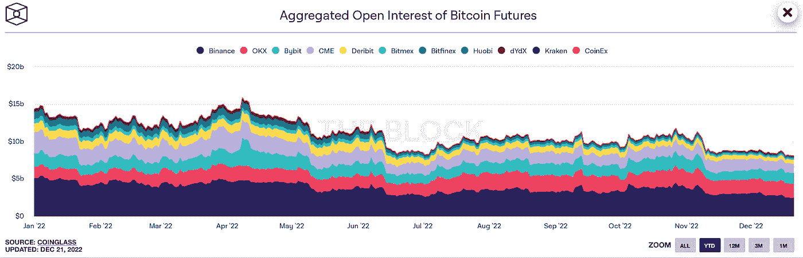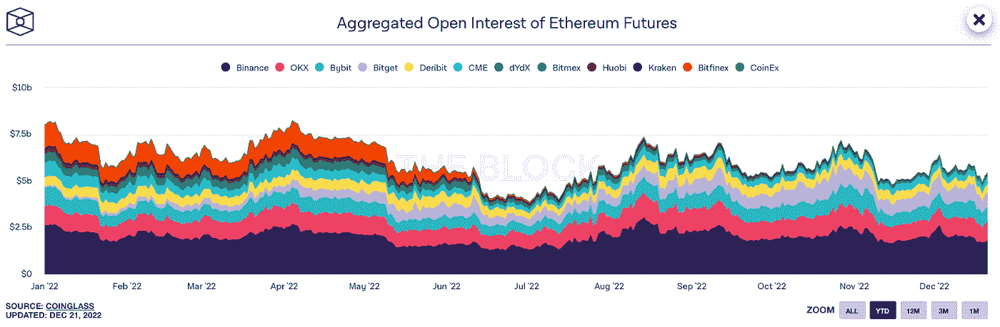

期货交易量也有所下降，但比特币和以太的情况不同。虽然 130-150 亿英镑是今年年初前加密货币的标准，但到年底这一数字已经减半至 75 亿英镑。对于以太，类似的指标从 75 亿开始，呈下降趋势。然而，共识算法向利害关系证明机制的转变激发了人们对 ETH 的兴趣。一个小规模的夏季本地牛市甚至导致了期权的小幅缩水。因此，目前的未平仓合约量稳定在 55 亿份，并有明显的上升趋势。

# 选择

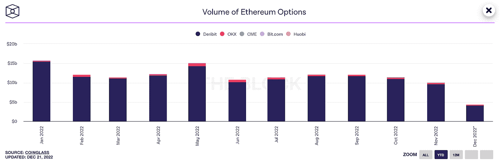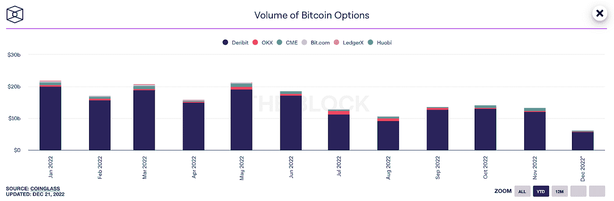

作为第一近似值，期权市场显示出与期货市场相似的趋势。年初出现峰值(以太网为 150 亿，比特币为 200 亿)，之后连续下降(分别降至 100 亿和 120 亿)。但是，这一点需要进一步研究。

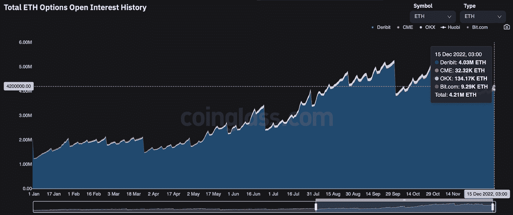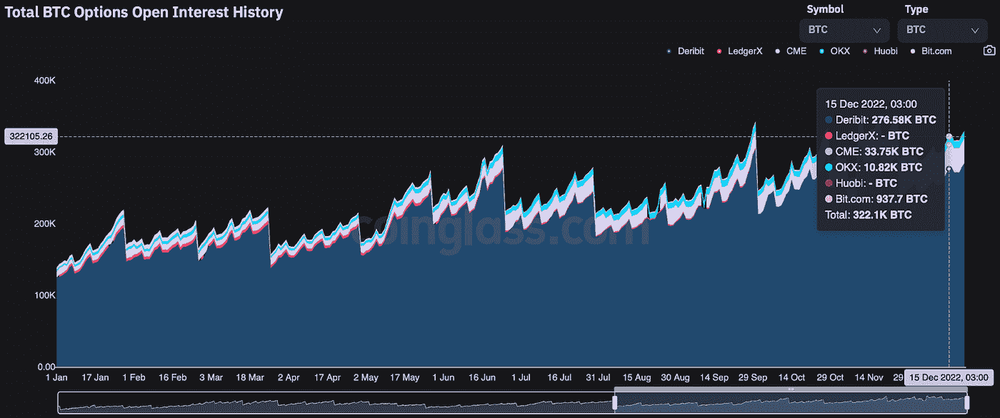

大多数集中交易以相反的形式发生在 Derebit 交易所。即以美元报价。然而，保证金和交割是以基础货币进行的，因此 BTC 和瑞士联邦交易所的未平仓合约量将是一个更明显的指标。事实上，从这个角度来看，情况完全不同——现货价格的下跌促使许多交易员专门在期权市场寻求对冲。结果，人们对比特币和以太网的兴趣分别增加了一倍和两倍多。当然，以太的上涨受到了共识转变和参与验证和长期储存组织额外回报的可能性的影响，这自然迫使理性投资者对冲价格风险。

# 波动性

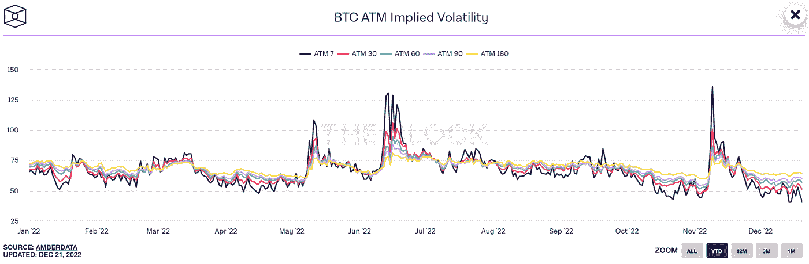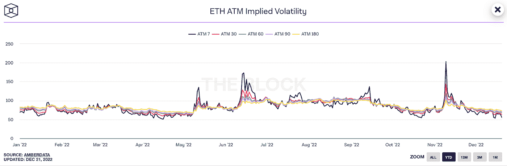

三个几乎同时出现在年度隐含波动率图表上的峰值反映了加密市场的重大冲击。卢纳/塞德菲/FTX 是加密货币在全球市场极度滞后的三大元凶。然而，值得注意的是一个有趣的模式——尽管波动性峰值一直较高，但现货市场的价格波动一直较低。因此，Luna 的下跌导致从 40，000 下降到 25，000 (-37.5%)，Celsius 和 3AC 使市场从 29，000 下降到 20，000 (-31%)，FTX 从 21，000 下降到 16，000 (-23%)。而波动性指标正在一个接一个地刷新年度记录。理论上，这种差异可能表明，负面消息对价格的影响越来越小，市场即将达到其下行极限。

# 挑战

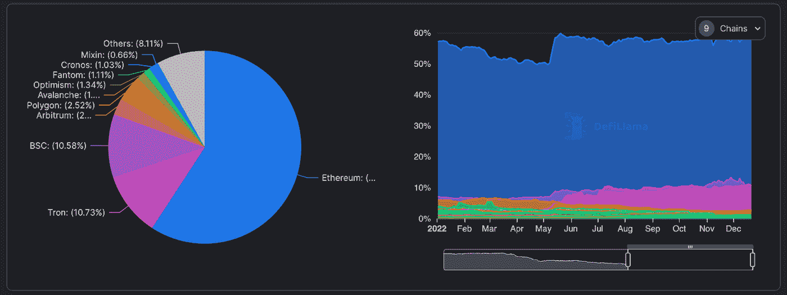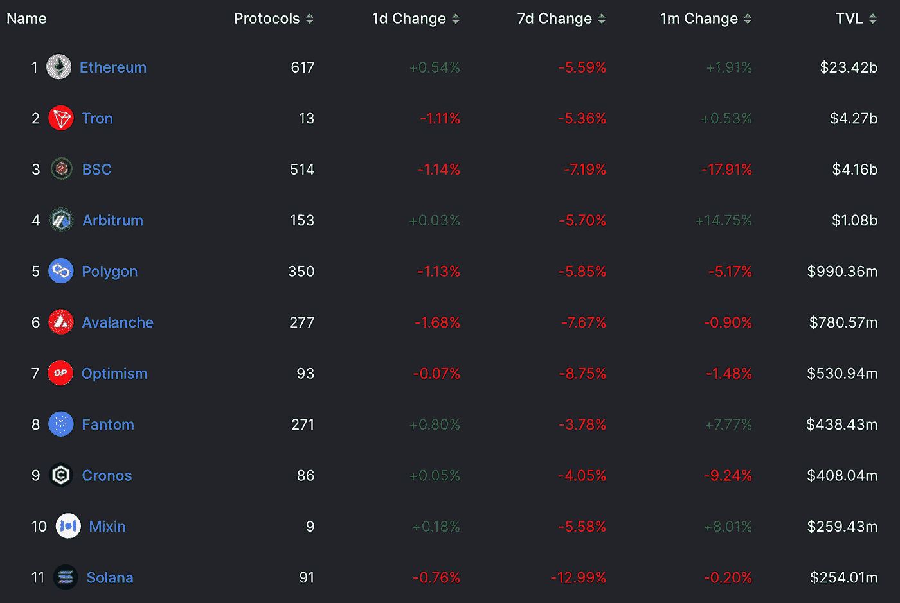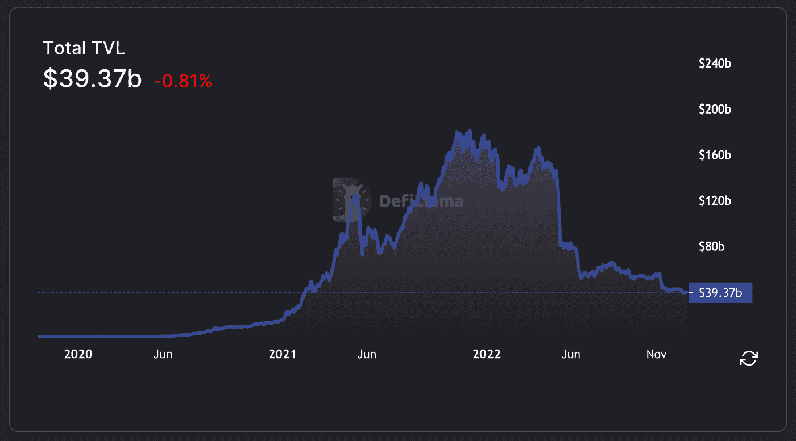

区块链的流动性总量为 390 亿英镑，减少了 4 倍。在这个指标上，区块链以太坊仍然是无可争议的领导者。区块链 Tron 排名第二，领先于 BNB 链和索拉纳(其业务在 FTX 崩溃后下滑)。在卢娜·区块链倒闭后，Tron 根据公正贷款协议为稳定的存款提供有竞争力的存款利率，从而获得了优势。

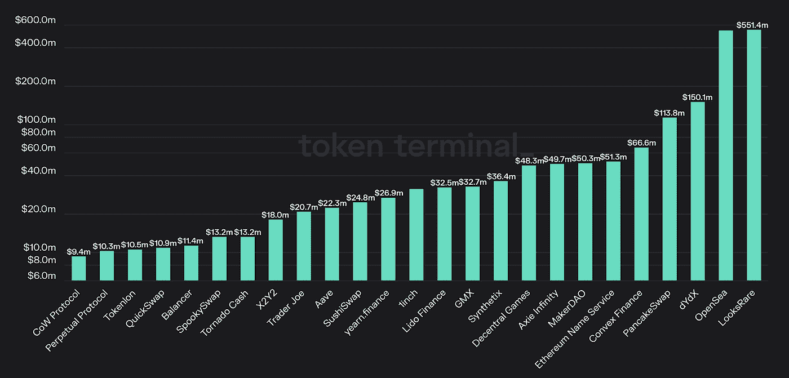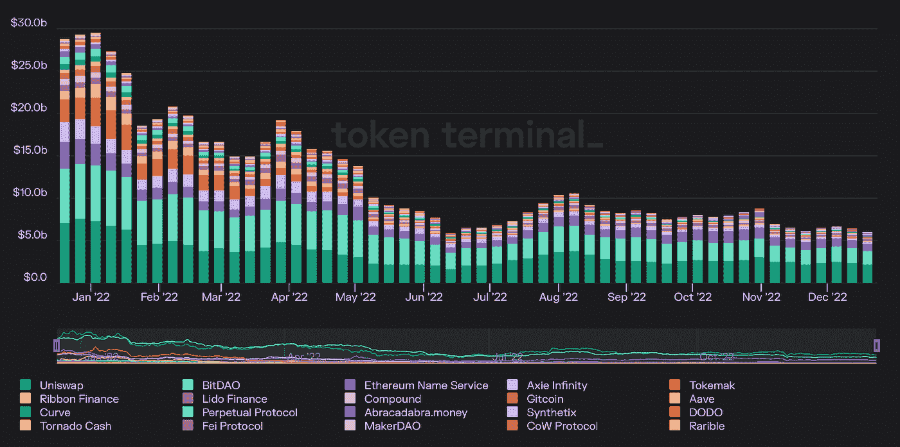

主要加密公司的财富基金的规模已经从冬季的高点下降了 80%，随着以太网汇率的稳定，已经冻结在 50 亿美元的大关。dApp 市场的激烈竞争不断促使项目通过添加新功能和改进基本算法来改进他们自己的产品。因此，许多人设法赚了一大笔钱。总的来说，在许多领域都有盈利的公司——NFT 交易、衍生品交易、掉期交易汇总和游戏。让领导者产生流入的资金流对于测试关于市场状态的假设很重要，这将使创业公司更容易在明年吸引投资。

# 趋势

**DeFi 的自我调节。【Tornado Cash 的情况以及多个乙醚验证器自愿遵守 OFAC 制裁的决定将会得到跟进。一些服务可能会在工作开始时尝试引入一些类似 KYC 的东西来检查用户的保险。**

**订单簿和 CLOB(集中限价订单簿)的趋势明显增强。**在一个混合数据提供商中收集报价(集中和分散)可以大大提高交易效率。

**德菲成年**。在市场危机中，与中央集权的金融服务相比，分散的金融服务没有遭受重大损失。事实证明，智能合同比人的因素更有效。

**新的大机构来了。一方面，众多大型加密公司的破产为市场上的新参与者开辟了道路。另一方面，它让我们确认了关于大型对冲基金和投资银行细分市场盈利能力的概念。下一波机构流动性将在严格的行政程序和监管下进入市场。**

**改变收入模式。**收益不仅来自于报价的增长，也来自于服务的提供。如果说在更早的时候，主要收入模式意味着购买加密货币，并在价格增长倍数后出售，那么现在，随着以太网 PoS 的推出，有机会在流动性市场中获得明确的被动收入和明确的风险。期权交易行业的发展也允许在不直接出售加密资产的情况下获得回报。这些因素越来越促使人们管理资产的长期收益率曲线，而不是简单地进行投机。

还有一个区块链的应用商店的替代品。开发者分配收入的最佳方式无疑是通过区块链，就佣金而言，它不贵，而不是每次转账收取-30%佣金的应用商店

大众 NFT 伙伴关系——作为一个加密机构 B2B 的例子。Polygon 团队为向大型全球公司发行 NFT 系列提供基础设施的马拉松比赛证明，这项技术是受欢迎的，可以被公司接受。

**复杂衍生品从传统市场的迁移**。利率期权、混合掉期、债券期权——对于新的但成熟的机构参与者来说，这些工具将会进入市场。

**期权的优势将会增长**。交易量和未平仓头寸增加的趋势将持续下去，这不仅是因为该工具的吸引力，还因为新的大型机构“巨兽”——资本市场的专业人士——的到来。

与通胀和发行驱动的融资相比，复杂实际回报的新模型将具有优势。在国内通胀严重的情况下，通过发行项目债券来筹集流动性将不再像过去那样容易。基于智能合约的收入参与和奖励分配是一种新趋势，将决定新的一年不同区块链之间的加密资产的方向。

站点— [增量技术](https://deltatheta.tech/)

推特—[https://twitter.com/deltatheta_tech](https://twitter.com/deltatheta_tech)

场外电报组-[https://t.me/deltatheta_TradingGroup](https://t.me/deltatheta_TradingGroup)

> 加入 Coinmonks [电报频道](https://t.me/coincodecap)和 [Youtube 频道](https://www.youtube.com/c/coinmonks/videos)了解加密交易和投资

# 另外，阅读

*   [Bookmap 评论](https://coincodecap.com/bookmap-review-2021-best-trading-software) | [美国 5 大最佳加密交易所](https://coincodecap.com/crypto-exchange-usa)
*   [加密交易机器人](/coinmonks/crypto-trading-bot-c2ffce8acb2a) | [造币评论](https://coincodecap.com/coingate-review)
*   最佳加密[硬件钱包](/coinmonks/hardware-wallets-dfa1211730c6) | [Bitbns 评论](/coinmonks/bitbns-review-38256a07e161)
*   [新加坡十大最佳加密交易所](https://coincodecap.com/crypto-exchange-in-singapore) | [收购 AXS](https://coincodecap.com/buy-axs-token)
*   [红狗赌场评论](https://coincodecap.com/red-dog-casino-review) | [Swyftx 评论](https://coincodecap.com/swyftx-review)