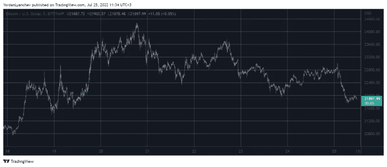

# 随着比特币跌至 6.5 美元，加密市场损失了 500 亿美元

> 原文：<https://medium.com/coinmonks/crypto-markets-lost-50b-as-bitcoin-slumped-to-6-674980e8d0c7?source=collection_archive---------57----------------------->

在相对平静的周末之后，BTC 主要位于 23，000 美元左右，该资产向南下跌，跌至 6 天低点。altcoins 今天也深陷红色，ETH，SOL 和 MATIC 暴跌超过 5%。

# 比特币跌破 2.2 万美元

就在几天前，也就是上周三，比特币突破 24000 美元，达到一个多月以来的最高点。然而，当多头对跌破 25，000 美元的前景越来越兴奋时，情况发生了变化。

这种加密货币在一天内损失了 2000 多美元，因为人们知道特斯拉已经出售了其在 Q2 的大部分 BTC 股份。最初，该资产收复了一些失地，并在周末以 23，000 美元的价格进入市场，随后两天的大部分时间都是如此。

然而，空头在几小时后重新控制了市场，并将 BTC 推向南方。结果，加密货币下跌超过 1000 美元，跌至不到 22，000 美元的 6 天低点。

截至目前，比特币仍在那里苦苦挣扎，市值已降至 4200 亿美元。

# 红色的替代硬币

替代硬币在本周飞得很高，在过去的两天里停滞不前，但现在深陷亏损。

以太坊是最令人印象深刻的表演者之一。它在几天内从 1000 美元涨到 1600 美元以上，昨天还停留在那里。然而现在，5%的日跌幅已经将第二大加密机的价格推高至 1500 美元以上。

Solana 和 Polygon 在一天内损失了相似的百分比。因此，SOL 位于 40 美元以下，而 MATIC 位于 0.8 美元。

BNB、瑞波、卡尔达诺、Dogecoin、波尔卡多特和柴犬现在也处于亏损状态。Avalanche 下跌了近 9%，接近跌破 20 美元。

中低价竞标的情况与此类似。因此，难怪加密市场的总市值一天之内就蒸发了 500 亿美元。这一指标现在刚刚超过 1 万亿美元。

点击这里，关注我们的更多故事[。](http://t.me/etellworld)

> 交易新手？试试[密码交易机器人](/coinmonks/crypto-trading-bot-c2ffce8acb2a)或[复制交易](/coinmonks/top-10-crypto-copy-trading-platforms-for-beginners-d0c37c7d698c)