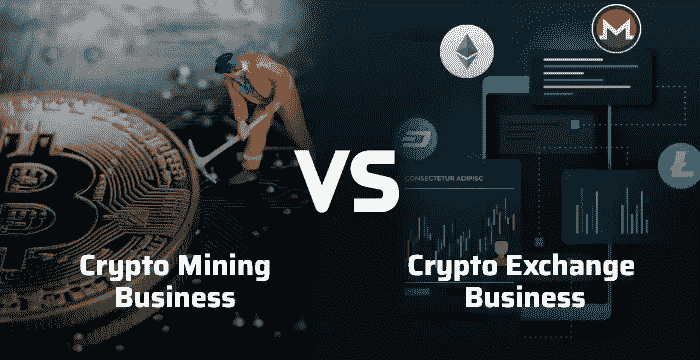

# 加密采矿业务 vs 加密交易业务:最佳加密创业

> 原文：<https://medium.com/coinmonks/crypto-mining-business-model-vs-crypto-exchange-business-model-588eef378445?source=collection_archive---------17----------------------->

[Crypto mining vs crypto exchange business model](https://www.coinsclone.com/?utm_source=mediumstartitup&utm_medium=miningvsexchange&utm_campaign=sinu)

加密货币的出现带来了新形式的商业活动。新的商业机会总是能激发和鼓舞企业家。毕竟，谁不想进入一个几乎没有竞争的创收行业呢？加密交易所是 DeFi 和 CeFi 领域众所周知的商业机会。然而，最少谈论的话题之一是作为一个有利可图的商业机会的密码挖掘。

在这篇博客中，让我们看看这些企业是什么，它们如何比较，它们的类型，以及它们未来的潜力。

# ***密码挖掘业务***

2009 年，随着比特币的推出，挖矿成为热门话题。它始于简单的 CPU 挖掘，人们在笔记本电脑上下载区块链，通过求解哈希方程挖掘比特币。

然后，随着密码价格的上涨，采矿开始变得更加有利可图。这种盈利能力滋生了竞争。这种竞争鼓励人们转向 GPU 采矿(游戏装备)。为什么？GPU 挖掘比 CPU 挖掘效率更高。他们开始使用带有图形处理单元的计算机，这种计算机具有更高的计算能力。

随着采矿钻机变得越来越强大，竞争也越来越激烈，这些类型的设备价格飙升。然而，这并没有持续很久。随着加密减半事件和加密哈希复杂性的稳步上升，GPU 挖掘已经不再使用。

现在，大多数挖掘都属于 ASIC 挖掘的范畴。ASIC(专用集成电路)是更有效的采矿设备。ASIC 挖掘的引入很快取代了 GPU 挖掘。为什么？虽然游戏装备(GPU 矿工)可以挖掘密码，这不是他们的唯一目的。

ASIC 采矿是一种不同的野兽。ASIC 设备只有一个目的，尽可能快地挖掘尽可能多的密码。这种专用的硬件挖掘一直胜过市场上最好的 GPU 挖掘者。

随着对硬件采矿钻机的依赖增加，采矿设备变得昂贵。一个像样的具有强大散列能力(TH/s)的 ASIC 挖掘器至少要花费 100 美元 10K .即便如此，也不能保证它能让用户获得可接受的利润率。

这就是池采矿作为一种合适的替代方法的地方。大多数希望挖掘 crypto 的用户都不是精通技术的程序员。他们对事物的技术方面也不感兴趣。他们是对加密货币感兴趣的普通人。

不想购买特殊采矿设备或没有时间运行区块链节点的用户可以付费给第三方采矿公司来为他们做这件事。进行挖掘的公司向用户支付他们挖掘的密码，同时自己拿走一小部分。用户将租借或租用部分散列功率。

这是加密挖掘商业模式背后的想法。

# ***密码交换*** 业务

在我写这篇文章的时候，网上有 522 个密码交易所。都需要吗？

在我们考虑加密交易所的潜力之前，让我们先看看加密交易所商业模式的历史。

在交易所出现之前，获得比特币的唯一途径是自己挖掘，或者在 Bitcointalk 等论坛上安排点对点交易。然后在 2010 年，第一个密码交易所出现在东京的 Mt. Gox。到 2013 年，Mt. Gox 处理了市场上超过 70%的比特币交易。

然后悲剧在 2014 年发生，臭名昭著的 Mt. Gox 黑客攻击了交易所，迫使其破产并最终关闭。最终，黑客窃取了 644408 个比特币，当时价值超过 4 亿美元。

Mt. Gox 的倒闭造成了市场的权力真空。VirWox、比特币基地、LocalBitcoins、Bithumb、Bitstamp 和许多其他交易所试图抓住他们的荣耀，但这还不够。不久，新的交易所出现了，如 FTX、币安和霍比。每个国家和货币的加密交换。

沿着这条路的某个地方，密码社区渴望更多的选择。于是就出现了波、IDEX、班柯等 DeFi 交易所。DeFi 帮助跳过了加密采用阶段。

今天，我们拥有比以往任何时候都多的加密货币和加密交易所。现在，让我们回到最初的问题。需要它们吗？我们需要密码交换吗？是的，我们有。

为什么？因为加密在很大程度上仍然不受监管，主流的采用仍然没有开始。现在的加密就像是 21 世纪早期的互联网。地球上有超过 70 亿人，只有 3 亿人在使用密码。这还不到全球人口的 5%。想象一下。

在有 20 亿用户之前，我不会认为 crypto 已经完全被主流采用。所以，我们还有路要走。

# ***密码挖掘(vs)密码交换*** 商业模式 ***！哪个更好？***

在 2022 年，开始一项加密采矿业务或加密交易所都是可行的商业想法。加密货币比以往任何时候都多，这对于采矿和交易来说很有希望。更多的商人和矿工有利于生意。

相比较而言，采矿和交换商业模式都有缺点。例如，ASIC 矿机是一种折旧资产。从你购买硬件的那一刻起，它的价值就开始下降。每年都有新型号的硬件采矿设备问世，因此不断升级是必要的。如果业务跟不上竞争，你的用户就会被竞争对手抢走。

同样，加密交换平台需要不断更新和升级，并需要专门的软件专家团队来开发更好的平台版本。唯一值得安慰的是，与每年大量的一次性加密挖掘费用不同，你将需要在全年花费资源，这更易于管理。

当谈到成本、费用和利润时，两者是一样的。启动一个加密交换所需要的努力和建立一个加密挖掘设施一样多。唯一的区别是，挖掘仅限于你可以挖掘的加密货币，但交易所涵盖所有加密货币。因此，交易所有更大的市场可以依赖，因此，更大的灵活性。此外，保护对宏资源(如电力)的访问以进行加密交换远比采矿更有效。

但是，与加密挖掘设施相比，加密交换的规定要严格得多。大多数政府认为加密对他们的货币政策是一种威胁，而不是一种恩惠；因为它有洗钱和恐怖活动的历史。然而，更加简化的政府指导方针和网络安全正在改善加密风险因素。

尽管如此，在大计划中，我认为密码交易业务比密码挖掘更有潜力。尤其是；在全球采用大量加密的情况下。

# ***收尾***

开始一项加密交易业务可能看起来像一项任务，但它比你想象的要容易。毫无疑问，比开始一个加密采矿业务更容易。无论是加密采矿业务还是加密交易业务，请记住，专业支持将始终有助于任何创业。

在更广阔的市场上有许多独立的加密交换脚本提供商。接近一个**专业的** [**加密交换软件**](https://www.coinsclone.com/?utm_source=mediumstartitup&utm_medium=miningvsexchange&utm_campaign=sinu) **提供商**，该提供商拥有积极的评价、加密领域的经验以及一系列成功的项目。为加密货币交易所初创公司寻找熟练的程序员和开发人员可能很困难，这就是为什么技术支持公司会最有帮助。

> [**现在就抢免费试玩**](https://www.coinsclone.com/contact-us/?utm_source=mediumstartitup&utm_medium=miningvsexchange&utm_campaign=sinu)

> 交易新手？尝试[加密交易机器人](/coinmonks/crypto-trading-bot-c2ffce8acb2a)或[复制交易](/coinmonks/top-10-crypto-copy-trading-platforms-for-beginners-d0c37c7d698c)