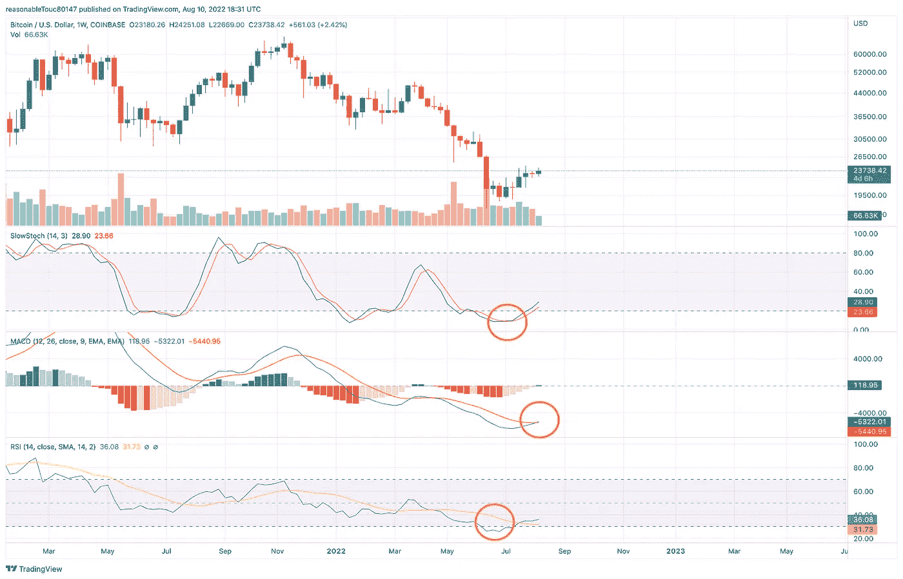
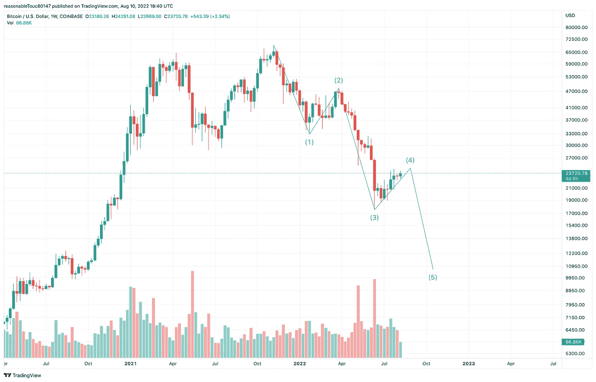
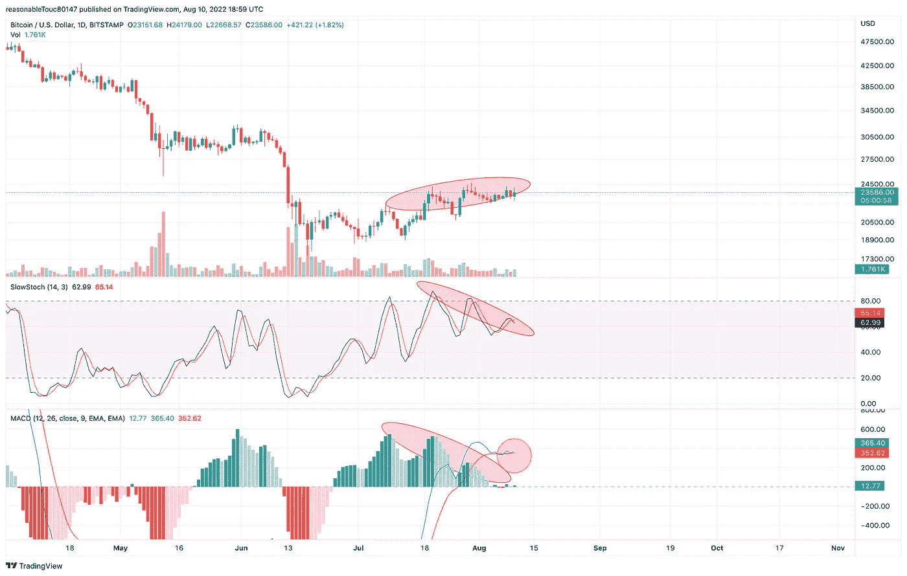
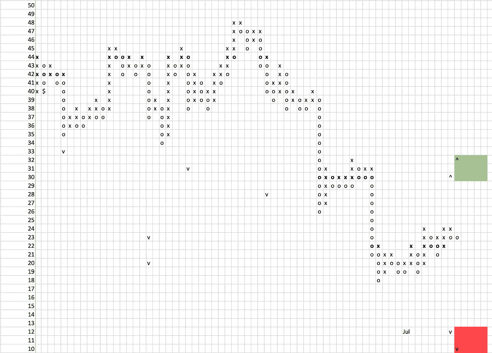

# 加密更多的痛苦来了@蹩脚的交易者笔记#12

> 原文：<https://medium.com/coinmonks/crypto-more-pain-to-come-crappy-trader-notes-12-d4f912859219?source=collection_archive---------31----------------------->

不受欢迎的观点——我们还没有到达谷底。我知道加密空间渴望巨大的盈利概率——但除非你是专业交易者，否则我敢说要有耐心。拿好你的现金，请等待好机会——你会得到丰厚的回报。

如果你进入了秘密空间，你可以感觉到空气中的情绪。去 crypto twitter，你会看到和闻到我的意思。许多人很高兴熊市是直的，而 T2 永久居民是错过换妻机会的傻瓜。

下面是一个加密 twitter hopium 的例子:

> “再来一杯，我就喝一杯”的那群人怎么了？哦他们走了？？？英雄联盟

然而，这些只是观点，所以也许让我们看看事实？

# 事实 1——底部就在附近，那么如何知道什么时候是底部呢？(已更新)

什么？你说痛苦即将来临，但你声称底部已经接近。怎么会这样你可能会感到惊讶，但中期看衰，长期看多。

从周线来看，一个不错的看涨结构正在形成。正如你所看到的，我们遇到了严重的超卖情况，所以从长期来看，我们准备向上移动。但在真正的底部出现之前，我们仍有可能最终调整 20%-50%。因此，如果一个人能在短期内处理好这种损失，那么现在就可以进场。但是如果你想买真正便宜的东西，你需要有耐心。

然而，聪明的交易者会注意到现在进入还为时过早。我等待下列因素出现，以便开始我的 DCA 进入新的牛市(这里我是在某些指标达到时不时更新):

*   对 6 月低点的重新测试——BTC 价格如此大规模的几乎每年一次的下跌不太可能以 v 型方式反转。**(2022 年 11 月 9 日)**
*   多不等，为以后的上涨打下坚实的积累基础。这将需要几周甚至几个月的时间，但如果我们要进入一个新的牛市周期，BTC 需要强有力的手来积累，最终必须从市场上收回供应，让价格再次上涨。
*   看涨背离。这就是为什么我预计会有更多的痛苦。在 RSI 和 MACD 图上，最后一次下跌伴随着运动衰竭的迹象，这将是我开始积累的导火索。
*   伴随着越来越少的波动性，成交量越来越低。因此，经过数周的波动后，在下跌的交易量上，价格波动幅度较小。这是我渴望看到的景象。
*   类似于顶级欺诈或破产的“黑天鹅”事件**(2022 年 5 月 13 日卢娜倒闭，2022 年 11 月 11 日 FTX 破产)**
*   主流媒体一整天都在欢呼加密时代的结束，并有来自影响者的大量 FUD**(《经济学人》加密在 2022 年 11 月 19 日的垮台，正在进行中的 N. Roubini Crypto Twitter FUD )**

# 事实 2——波数和结构

艾略特波浪逼近给了我们一个暗示，即最后的第五次波浪即将到来。

随着这一走势将达到新低，我们需要将 2020 年末的最终需求区间 10-13k BTC SD 视为底部候选区间。

# 事实 3——看跌的日线结构

日线上有明显向下移动的空间。

此外，最近在 24kBTCUSD 级别上的第三次攻击似乎被拒绝，并且每一次攻击都呈现出逐渐减小的音量和功率。

这就是为什么我发现最近的 PA 是一个典型的上涨后分布，这是一个即将下跌的迹象。

# 事实#4 —当地 P&F 计数

当我们使用另一个技术援助工具，即点数和图形计数时，我们可以看到正在建造的基地缺少能够维持向先前 ATH 明显移动的基地。

正如你在下面看到的，我们有两个计数，在熊市情况下，我们有 10，000-12，000 BTCUSD 区域，在牛市情况下，我们有 30-32，000 BTCUSD 区域。但实际上这个基数太弱，不足以把它当作一个真正的底部。

由于每日结构是熊市，我发现熊市的情况更有可能发生，并且与前面提到的大规模累积行为的特征相一致。

# 摘要

耐心点。底部即将到来，但真正的底部结构需要更多的时间来构建。至少持有 17k BTCUSD 甚至 10k-13k BTCUSD 级别的现金。他们肯定会来，但可能需要一些时间。但是值得。

一如既往地保持安全性和流动性。日子不好过，现金为王。

# 更多阅读

如果你想知道我是如何得出当前预测的，我推荐你阅读博客的前几章。因此，你可以理解我的推理，看看我的话有多真实。

*   2022 年 5 月下旬可怕的图表— [BTC 有趣的图表@蹩脚的交易者笔记#11](/coinmonks/btc-intriguing-charts-crappy-trader-notes-11-fd7ed7dcbf78)
*   2022 年 4 月初认罪— [搞错细节@蹩脚交易员笔记#10](/coinmonks/got-the-details-wrong-crappy-trader-notes-10-e9847ae48772)
*   2022 年 3 月初失败的三角诊断— [底部的气味@蹩脚交易者笔记#9](/coinmonks/the-scent-of-the-bottom-crappy-trader-notes-9-a810316a2eaf)
*   2022 年 2 月下旬阐述最可能的底部情景— [底部在情景中@蹩脚交易者笔记#8](https://yentenobserver.medium.com/bottom-is-in-scenarios-crappy-trader-notes-8-9fc2dc4cf017)
*   2022 年 2 月反弹被揭穿— [下一站 30k BTCUSD @蹩脚交易者笔记#7](https://yentenobserver.medium.com/next-station-30k-btcusd-crappy-trader-notes-7-204ea6d157cc)
*   2022 年 1 月熊市情景解释— [BTCUSD 熊市在控制中@蹩脚交易者笔记#6](https://yentenobserver.medium.com/btcusd-bears-are-in-control-crappy-trader-notes-6-50507d28179a)
*   2021 年 12 月下旬 C 波情景的有力证实—[BTC C 波放大@蹩脚交易者笔记#5](https://yentenobserver.medium.com/btc-wave-c-zoom-in-crappy-trader-notes-5-2cd5ccfc6a8a)
*   2021 年 12 月初可能下跌的预警—[BTC C 波风暴来临？@ CrappyTrader 笔记#4](https://yentenobserver.medium.com/wave-c-storm-is-coming-crappytrader-notes-4-d71eee69f4ff)
*   2021 年 11 月下旬对可能的熊市前景的悲观预测— [我们处于 C 浪之中吗？@ CrappyTrader 笔记#3](https://yentenobserver.medium.com/are-we-in-a-c-wave-crappytrader-notes-3-2eecee27ca45?source=your_stories_page----------------------------------------)
*   2021 年 11 月 11 月价格走势有两种选择—[BTC 突破还是牛市陷阱？@ CrappyTrader 笔记#2](https://yentenobserver.medium.com/a-btc-breakout-or-bull-trap-crappytrader-notes-2-f49c476a4c0)

# 你觉得我的工作有价值吗？

如果是，那么您可以通过以下方式支持我的努力:

*   在推特上关注我
*   跟随我的媒体档案