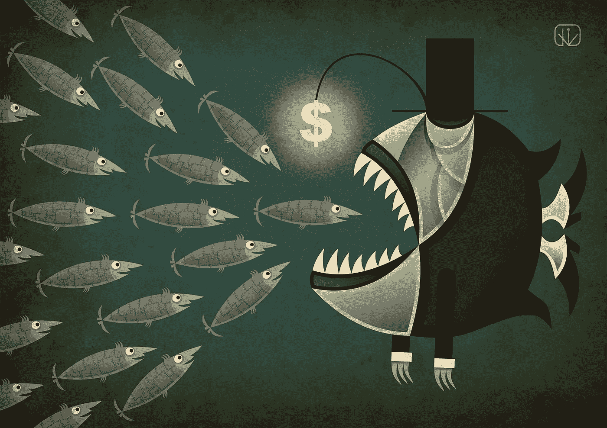

# 密码必须避免垄断

> 原文：<https://medium.com/coinmonks/crypto-must-avoid-monopolies-4b431e87641c?source=collection_archive---------38----------------------->

随着熊市的到来，我们脚下的加密领域正在发生变化，尽管短期内行业整合是必要的，但我们必须避免垄断。随着集中交易所(CEXs)成为通往加密世界的必经之路，谁来守住这个大门变得非常重要。

抛开个性不谈，垄断很少对服务用户有利。由于这一领域的大部分都是新的，价格发现非常重要，弹性的客户供应将有助于为诸如菲亚特入口、交易费和转让等服务设定基准价格。

垄断使得消费者的供给缺乏弹性——他们没有选择，这很少符合他们的最大利益。20 世纪 90 年代，当微软控制了大约 90%的个人电脑市场时，他们免费发布了 Internet Explorer，有效地击败了竞争对手 Netscape Navigator。

微软后来被指控违反反垄断法，因为它在技术上难以用另一种浏览器取代 Internet Explorer，从而造成了垄断。该公司还因向其忠实用户收取微软 Office 等重要软件的高价而受到抨击。

在加密领域，控制国际 cex 的管辖权尚不明确，因此之前针对原始互联网公司提起的民事诉讼可能不会成为一种选择。为了让我们的行业继续繁荣，我们需要鼓励公开竞争来推动创新。

我说的是 crypto 的长远未来。就目前而言，我明白熊市有必要履行自己的职责，淘汰一些公司和那些风险管理不善的公司——正如那句老话所说:当潮水退去，你就能看到谁在裸泳。

这是整合过程的一部分。那些对自己的资产负债表很明智，并通过谨慎的尽职调查为长期发展而建立的 cex、协议和项目将在未来处于有利地位。这应该会产生一小群强大的幸存者，他们有能力将该行业带入下一轮牛市。

但它应该是一个群体，而不是一个控制市场的庞然大物，因为这不会让新生项目有机会凭借其创新而蓬勃发展。事实上，这正是分权原则所要避免的情况。

我完全支持自由市场，虽然垄断可能是一家优秀公司战胜竞争对手的结果，但历史表明，不受挑战的公司会受到惯性的影响，可能会扼杀市场。非常成功的集团可能最终存在，只是为了延续自己，支撑他们的寡头领导。

但是，肯定有必要集中支持加密的力量来倡导行业反对敌对的法规和有问题的中央银行数字货币(CBDC)。我们不需要一个冠军吗？

我不知道你怎么想，但我更喜欢一个“环友”战略，而不是把我们行业的希望寄托在某个詹姆斯·邦德人物身上，老实说，他基本上是一个有酗酒问题的麻烦人物。在我们行业的这个关键时刻，我们需要一个强大的倡导者团队，避免权力过度集中。

事实上，在政府考虑加密监管过程的时候，我们的行业倡导者应该与监管机构合作，研究如何最好地应用当前的法律来打击加密市场的垄断。毕竟，监管者有责任保护消费者免受垄断和欺诈的侵害。

不幸的是，去中心化金融还没有被普遍使用、安全和理解，因为它通过使用去中心化的“道”治理解决了许多这些问题。因此，与此同时，行业、监管机构和 CEXs 的治理必须避免垄断形成和扼杀创新的危险，而创新是 crypto 对金融系统的主要贡献。

> 交易新手？试试[加密交易机器人](/coinmonks/crypto-trading-bot-c2ffce8acb2a)或者[复制交易](/coinmonks/top-10-crypto-copy-trading-platforms-for-beginners-d0c37c7d698c)