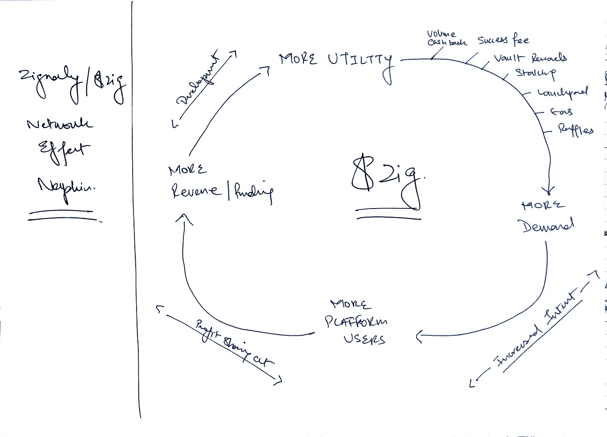

# 加密网络效应

> 原文：<https://medium.com/coinmonks/crypto-network-effects-dbf75a2e2941?source=collection_archive---------26----------------------->

Photo by [Mel Poole](https://unsplash.com/@melpoole?utm_source=medium&utm_medium=referral) on [Unsplash](https://unsplash.com?utm_source=medium&utm_medium=referral)

本周早些时候，我回复了来自 Zignaly 联合创始人 T2 的推特挑战。这个想法是为了分享一个通用的网络效果餐巾纸，说明令牌&项目是如何相互补充的。我选择了 Zignaly 作为案例研究，并提交了它。谢天谢地，它被 Abdul Raffay(感谢他的赞助)很好地接受了，现在我希望成为他将每人发放 200 美元奖金的三个人之一😀

在我提交了这篇文章后，我马上想到这是我在 Zignaly 上每周发布的一篇精彩内容。不仅仅是因为它允许我谈论这个项目和这个令牌，还因为它将让整个加密社区从一个不同的角度理解这个行业。

> 交易新手？试试[密码交易机器人](/coinmonks/crypto-trading-bot-c2ffce8acb2a)或[复制交易](/coinmonks/top-10-crypto-copy-trading-platforms-for-beginners-d0c37c7d698c)

# Zignaly / $Zig 网络效果餐巾

所以让我们把我准备的餐巾纸拿出来。

我们看到 Zignaly 有一个产品提供(利润分享市场)，使其能够赚取收入。这些收入被用来资助针对 ZigCoin 持有者的新公用事业，这反过来又推动了对 ZigCoin 的需求。这种价格反映纯粹是对其核心产品的简单营销，它带来了更多的用户，因此带来了更多的收入(甚至来自风险投资和战略合作伙伴的资金)，允许公用事业发展的下一阶段继续进行。

> 对 Zignaly 感兴趣？从今天开始！：
> 
> 1.使用此链接注册:
> 
> https://zignaly.com/app/signup/?invite=ahmedzig…
> 
> 2.在任何利润分享服务中投资 100 美元
> 
> 3.获得 Zig 中的＄20 作为即时奖金

这里的基本主题是核心产品保持不变。添加的实用程序是子项目，有助于推广令牌并鼓励社区坚持使用它。

# 兑换硬币成功的公式

与币安形成对比。我可以简单地把 Zignaly 换成我的加密网络效果纸巾，然后就能瞄准目标了。基础产品(exchange)与最初推出时保持不变。币安突然不再做任何事，除了它计划要做的事。然而，人们对其本国货币 BNB 有着巨大的需求，这可以从其周围的大量公用事业设施中得到解释。其中包括:

*   立桩标界
*   储蓄产品。
*   交易费折扣
*   转化灰尘
*   为他们的链条加油
*   发射台
*   跳跃
*   液体交换
    — —还有更多！

底线是什么？兑换硬币历来表现良好，因为它们周围有许多实用工具，而且是一种有效的产品。Zignaly 虽然不是一个集中的交易所，但似乎受到了相同原则的启发。

# 刀在这一切中的位置在哪里？

现在唯一缺少的是数量&这就是为什么决定去挑战 T1 是如此重要。有了世界级的公用事业公司，Zignaly 可以继续将其现有的产品重点推向 CeFi。然而，该行业的趋势线似乎表明，向 DeFi 的转变是真实的，并且在未来几年只会变得更强(难怪币安在许多 DeFi 应用中拥有股份)。

向 DeFi 方向重新调整生态系统将打开各种新的资产类别&带来巨大的交易量。就我们的网络效应餐巾纸而言，这将是一个例外，因为该产品将成为新网络效应的起点，带来更多收入、更多效用和更积极的价格行动。

# 结束语

在你离开之前，我建议你看看我上周的帖子，在那里我试图以 Zignaly 为例，使用 TVL 来破解[加密估值。当你读完这篇文章后，你会更好地理解商业方面似乎也支持我们在那里所做的纯粹的数字计算估值。](/coinmonks/crypto-valuation-using-tvl-26a7fa7e9dce)

直到下次，

干杯！

> **免责声明:**本文观点仅代表作者个人观点&不代表其雇主的观点，也不代表财务建议。在投资或使用文中提到的任何产品之前，请做好自己的研究。作者可能会也可能不会投资于任何特定的产品。