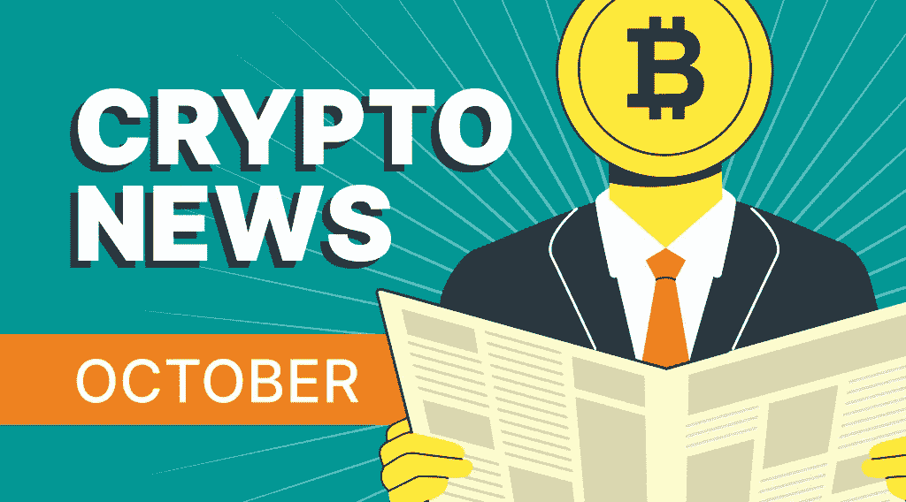
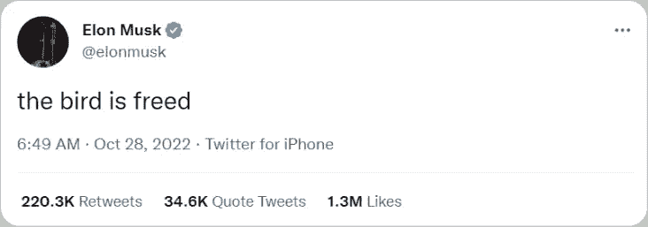
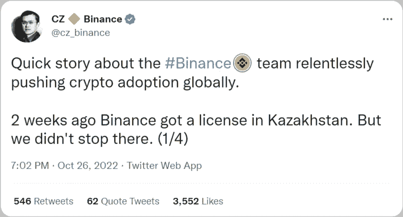

# 加密新闻:加密空间的忙乱十月

> 原文：<https://medium.com/coinmonks/crypto-news-a-hectic-october-in-crypto-space-e865ef034c86?source=collection_archive---------16----------------------->

尽管总体趋势看跌，但加密空间仍在不断发展。10 月份，加密市值上升了约 4.99%，这导致了该领域的一些兴奋。以下是最新加密新闻中最有趣的部分。

# 最新和突发的加密新闻

# BNY 梅隆大学将提供加密服务

10 月初，这家全球资产规模最大的托管银行宣布，在其托管产品中增加了比特币(BTC)和以太网(ETH)。BNY 在 2021 年成立了一个部门，开发数字资产技术的解决方案，利用公司防火墙和 Chainalysis。据 BNY 梅隆公司首席执行官 Robin Vince 称，客户对加密的需求是推出加密托管服务的关键因素。

这家拥有 238 年历史的银行在今年秋天早些时候获得了纽约金融监管机构的批准，是八家具有系统重要性的美国银行中首家存储数字货币的银行。它也是允许其客户使用一个托管平台进行传统和加密货币持有的领先银行之一。

# 谷歌与比特币基地合作

谷歌将在明年年初开始接受云服务的加密支付。正如该公司在其云下一次会议上所声称的那样，该公司将通过与比特币基地加密交易所的集成来接收加密货币支付。加密支付收集将由比特币基地商业提供支持，该公司接受最受欢迎的数字硬币:比特币、以太币、Dogecoin、柴犬币、莱特币和其他一些硬币，包括 USDC 稳定币。

加密支付最初将向 Web3 行业的少数客户推广。谷歌还将使用比特币基地的托管服务比特币基地 Prime。比特币基地的大部分收入来自零售交易，因此将把数据相关应用从市场领先的亚马逊转移到谷歌。

# 麦当劳和加密支付

麦当劳快餐连锁店开始接受比特币支付。这家全球快餐连锁店是第一批参加在卢加诺镇进行的加密友好实验的企业之一，卢加诺镇位于瑞士的意大利语区。

比特币杂志在推特上上传了一段简短的视频，视频中一名女子在麦当劳的数字售货亭点餐，并在常规收银台付款。在视频中，可以在信用提款机上的比特币符号旁边看到一个标志。这并不令人惊讶，因为 2022 年 3 月，卢加诺市宣布将接受比特币、系绳和 LVGA 代币作为法定货币。

# 埃隆·马斯克将收购 Twitter

埃隆·马斯克目前正试图以每股 54.20 美元的价格完成对 Twitter 的收购。这位著名的企业家在 4 月份提出了这一提议，甚至差点得到 8%的折扣，但不幸的是，这并没有发生。经过一系列乏味的讨论和诉讼，这笔 440 亿美元的交易终于有望在本周完成。

然而，仍然存在实际筹集必要资本的问题。埃隆·马斯克已经有 125 亿美元的债务融资，但他还需要 320 亿美元才能完成这笔交易。他正在寻找外部投资者来帮助支付这笔费用。马斯克出售股票的同时，这家电动汽车公司正在考虑其有史以来第一次股票回购，可能耗资 50 亿至 100 亿美元。

由于马斯克将他的 Twitter 个人资料标签改为 Chief Twit，以此暗示收购最终将会完成，Dogecoin 的价格上涨了 20%。在马斯克发布了一段进入 Twitter 总部的视频后，DOGE 的价格也飙升到了这个高度。

# Twitter 传言将发布一款加密钱包

马斯克收购 Twitter 的乏味折磨并不是今年 10 月成为头条新闻的唯一 Twitter 相关新闻。据老牌软件前端开发公司[简·满春·王](https://twitter.com/wongmjane/status/1584616567530483712)最先披露的报道，这家社交媒体公司正在研发一款基于 Web3 的新型加密钱包。这些谣言是在该公司动荡的时期出现的。

该社交媒体公司尚未对此事进行官方确认或提及。正如 Wong 指出的，钱包预计将支持存款和取款，但最初的令牌支持以及许多其他细节尚不清楚。

# 卡戴珊与 SEC 和解

10 月初，金·卡戴珊(Kim Kardashian)同意支付 100 多万美元，以解决美国证券交易委员会(SEC)的指控，原因是她未能披露因在 Instagram 上推广一种加密货币而获得的报酬。

美国证交会表示，卡戴珊同意支付 126 万美元，以了结对 EthereumMax 加密资产推广的指控。监管机构补充说，她还将配合正在进行的调查，并同意三年内不推广加密证券。在一份声明中，卡戴珊的律师表示，她很高兴解决了这个问题。这位名人既没有承认指控，也没有否认。据律师邓肯·莱文(Duncan Levin)称，这项和解帮助卡戴珊避免了一个更具侵入性的过程，该过程可能涉及证词和文件收集。

# 欧盟禁止俄罗斯加密账户支付

在 10 月 6 日的一份声明中，欧盟监管机构禁止所有来自俄罗斯的加密资产钱包、账户和托管服务。这项措施是由于乌克兰旷日持久的冲突而对俄罗斯实施的另一系列制裁的一部分。

新的制裁包括全面禁止俄罗斯和欧盟之间的跨境加密支付。该声明包括禁止“所有加密资产钱包、账户或托管服务，无论钱包金额多少。”之前的制裁将俄罗斯向欧盟钱包的加密支付限制在 1 万欧元(约合 9900 美元)。

该禁令是在俄罗斯官员批准跨境支付加密后不久发布的。据报道，俄罗斯银行和该国财政部刚刚达成协议，允许以加密货币进行跨境结算。

# 里约热内卢允许公民以加密方式缴税

据《环球时报》10 月 11 日报道，从明年开始，巴西城市里约热内卢将允许拥有密码的居民使用硬币来支付财产税。据该报报道，巴西市政厅在其市政公报中发布了一项法令，称力拓将“雇佣专门从事将加密资产转化为法定资产的公司”，让里约居民支付一种被称为 IPTU(城市建设和土地税)的财产税。

市政府解释说，它与加密公司的交易将允许市政府在不增加市政厅“额外成本”的情况下获得菲亚特加密支付的 100%价值。该项目是该市市长爱德华多·派斯(Eduardo Paes)的主意，他是一位坚定的支持加密的政府官员，今年早些时候表示，他正在研究允许力拓在其国库中持有加密的方法。

# 币安将接受坚戈

币安团队正在等待哈萨克斯坦国家银行准备使用数字坚戈的选项。币安 CEO 赵昌鹏透露，链将在哈萨克斯坦共和国央行数字货币(CBDC)中发挥作用。自 2021 年 5 月以来，这个中亚国家一直在角逐 CBDC。

赵在他的 Twitter 上写道，团队正在不懈地推动加密货币在全球的应用。最近几周，顾问们会见了哈萨克斯坦国家银行(NKB)第一副行长 Berik Sholpankulov 和支付与技术中心负责人 Binur Zhalenov。虽然还不知道进一步的细节，但 CBDC 似乎有可能基于多链架构。事实上，NKB 在 2021 年 12 月宣布，CBDC 正在 R3 的 Corda 平台上进行试点。

# 新加坡金融管理局提出降低加密交易风险的措施

10 月 26 日，新加坡金融管理局(MAS)建议采取监管措施，以降低加密货币交易对消费者造成伤害的风险，并支持稳定货币的发展。这些措施将成为《支付服务法》的一部分。这发生在新加坡加密对冲基金三箭资本(3AC)破产之后。

新加坡中央银行发布了两份关于根据《支付服务法》监管数字支付令牌服务提供商和稳定硬币发行商的建议的咨询文件。两份咨询文件都旨在降低加密交易给消费者带来的风险，并提高稳定的硬币相关交易的标准。

# 万事达卡将为银行推出加密交易

最大的国际支付公司之一万事达卡通过开发一种允许银行交易比特币等加密货币的新工具，继续努力推动加密货币的采用。10 月 17 日，万事达卡正式宣布了一项新计划，使金融机构能够为其客户提供加密交易功能和服务。

该计划名为 Crypto Source，旨在允许用户购买、持有和出售加密货币，并辅以万事达卡专有的加密安全解决方案，以提高安全性和合规性。该工具是与万事达卡现有合作伙伴 Paxos 信托公司合作设计的，据报道，预计将于 2022 年第四季度推出。Paxos 以向全球支付巨头 PayPal 提供类似服务而闻名，PayPal 于 2020 年底推出了第一项加密服务。

# StealthEX 推出其加密应用

10 月也是 SteathEX.io 收获颇丰的一个月。该平台刚刚发布了自己的[全新加密应用](https://play.google.com/store/apps/details?id=com.stealthex)，让你只需点击几下鼠标，就可以在 Android 手机上购买加密货币。它目前可以预注册，你可以注册后下载。如果你想了解[更多关于 StealthEX 的加密应用](https://stealthex.io/blog/stealthex-mobile-crypto-exchange-app-is-out/)，请阅读我们的新闻稿。

在 [Medium](https://stealthex-io.medium.com/) 、 [Twitter](https://twitter.com/Stealthex_io) 、 [Telegram](https://t.me/StealthEX) 、 [YouTube](https://www.youtube.com/channel/UCeES_XBesX76ge7xf1meuSw) 和 [Reddit](https://www.reddit.com/user/Stealthex_io) 上关注我们，了解关于 [StealthEX.io](https://stealthex.io/) 和其他加密世界的最新消息。

在购买任何密码之前，不要忘记做自己的研究。本文表达的观点和意见仅代表作者个人。

*原载于*[*https://stealthex.io/blog/*](https://stealthex.io/blog/crypto-news-a-hectic-october-in-crypto-space/)*👈*

> *交易新手？尝试[加密交易机器人](/coinmonks/crypto-trading-bot-c2ffce8acb2a)或[复制交易](/coinmonks/top-10-crypto-copy-trading-platforms-for-beginners-d0c37c7d698c)*