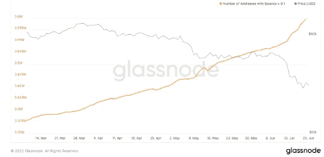
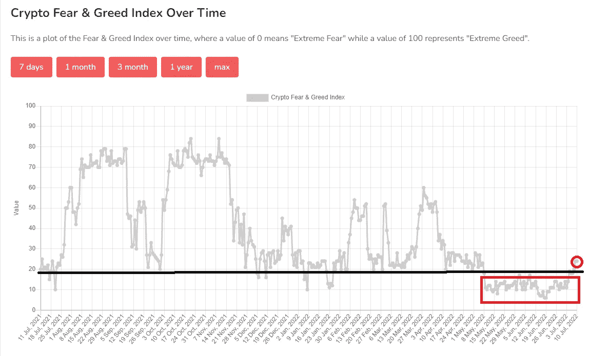

# 秘密新闻。比特币稳定在 20000 美元左右

> 原文：<https://medium.com/coinmonks/crypto-news-bitcoin-stabilizing-around-20000-be2c4c678572?source=collection_archive---------28----------------------->

在过去的几个月里，Crypto 受到了严重的打击。从辉煌的 Luna 崩溃开始，我们经历了 Celsius，Three Arrows Capital liquidation，SBF(FTX 交易所的首席执行官)的批量收购，现在加密货币交易所 [Vauld](https://news.bitcoin.com/crypto-lender-vauld-suspends-withdrawals-company-is-discussing-restructuring-options-with-advisors/) 和[2 getter](https://news.bitcoin.com/spanish-exchange-2gether-blocks-operations-affecting-100000-users/)停止了提款。

似乎是 Luna 的传染效应，3AC 在用户中引起了过度的恐惧，结果在短时间内增加了客户的提款量，并使交易所崩溃，从而进一步表明了我在上次更新中提到的市场流动性危机。我强烈建议仔细检查你拥有的硬币，如果你不准备丢失它们，就从交易所取出它们。我不知道是哪一家，但我有一种强烈的直觉，更多的交易所将会效仿，停止撤资。把它作为一个警告，并采取行动。

尽管有各种坏消息和负面报道，但市场看起来正在喘息，比特币价格在 20000 美元左右。在幕后，零售层面发生了一些严重的购买行为。最近两个月，比特币余额> 0.1 的地址数量增长迅速，比特币余额> 1 的地址也是如此。散户投资者正在慢慢回归吗？

Number of addresses with Bitcoin balance >0.1 — Orange line

无论如何，目前市场稳定了下来，市场上出现了一些乐观情绪。恐惧和贪婪指数从 20 的阻力位爆发，最近两个月一直在此徘徊。

Fear and greed index 24, highest point in the last two months

所有市场现在都在等待 7 月 13 日的通胀数据，预计美国的通胀率将达到 8.8%，比 5 月份高出 0.2 %。低于预期的读数将让投资者放心，美国的通胀可能已经见顶，美联储不必加息 0.75 个基点，甚至不必在会议上变得更加激进，加息 1%。

7 月底的衰退数据失去了一些重要性，我们正在等待 NBER 的官方声明，即“**美利坚合众国正处于衰退**”，此前美国在新冠肺炎经历了严重的困难，市场似乎已经接受了这一观点。美联储的双重任务是维持价格稳定和最大限度的就业，但你不想有一份工作，也无法支付你的账单或食品价格飙升，是吗？因此，增加一点点失业率，通过降低通货膨胀率到一个更容易接受的 4%-5%来稳定物价，失业率再高一些，然后再开始刺激经济，这看起来是可以的。

> 交易新手？试试[加密交易机器人](/coinmonks/crypto-trading-bot-c2ffce8acb2a)或者[复制交易](/coinmonks/top-10-crypto-copy-trading-platforms-for-beginners-d0c37c7d698c)

这意味着什么？总而言之，任何人都可以理解，尽管这里或那里有一些反弹，我们可能会遇到一些动荡，直到美联储变得更加友好，其他国家也效仿。然后**我们去参加比赛**

我们可以与整体指数脱钩，因为 crypto 是如此之早，所有的创新和人才从传统行业的迁移可能会找到自己的节奏。但在著名的破产事件之后，我们呼吁监管，我们希望机构加入这场舞蹈，因此**不，我们现在不脱钩。**

享受旅程，并在投资中保持耐心。祝你今天开心！玩的开心！

免责声明:我必须警告你，有些观点可能是我个人的偏见，但是，我会尽我所能为你提供关于特定主题的客观观点。我不是理财顾问，所有文章只会有严格的教育目的。