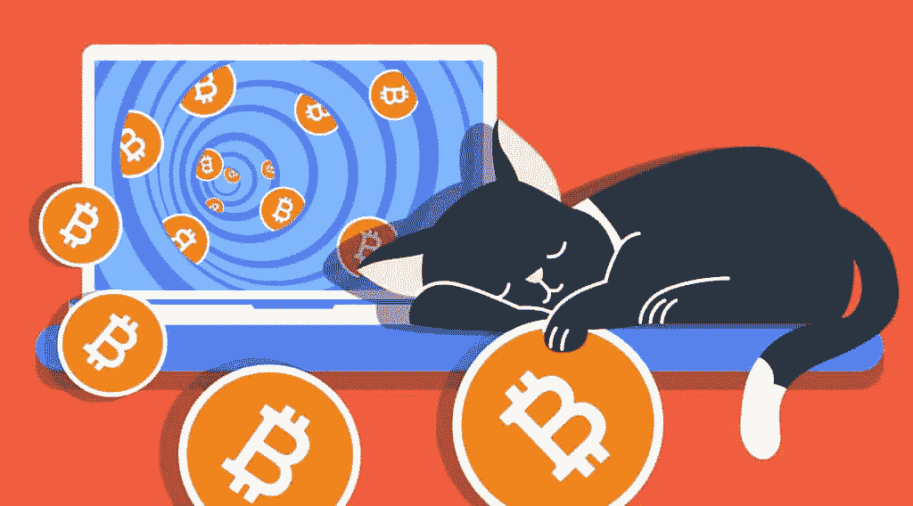

# 加密被动收入:如何赚取免费加密？

> 原文：<https://medium.com/coinmonks/crypto-passive-income-how-to-earn-free-crypto-65fef0a7e9a5?source=collection_archive---------4----------------------->

密码爱好者早就知道投资数字资产的好处。对他们来说，加密货币提供了大量的赚钱机会，这些机会不仅限于在线交易加密货币，或者只是购买并持有加密货币，直到其达到历史高点。如果你是加密货币持有者，让我们来发现一些可以帮助你获得免费加密的投资选择。

# 被动收入:如何赚取免费加密？

# 第一:加密利息账户

许多刚刚开始加密之旅的加密爱好者不知道你可以从你持有的数字令牌中赚取利息——就像你在银行账户中一样。然而，与传统的银行账户不同，你将获得更具吸引力的收益。

这里的 crypto earn 是如何工作的？嗯，除了加密收入之外，还有许多加密平台提供超级赌注池(或计息储蓄账户)和现实生活中的奖励，例如金特。根据金特的超级赌注池用户将他们的 Quint 代币投注到哪个，他们可以赢得奖励，如豪华手表、打折机票、豪华酒店住宿、超级跑车体验等。当用户在金特下注并获得奖励时，他们可以获得高达 16.18%的 APY。当用户持有 BNB 和金特的股票时，可用利率飙升至 39.08%。

在 DeFi Swap、YouHodler，甚至像币安和比特币基地这样著名的密码交易所，也有类似的程序提供给密码持有者。

# 第二:加密贷款平台

在 crypto 中，另一种流行的赚取被动收入的方式是加入一个借贷平台。这些提供了一种新的加密投资方式。在过去的几年里，我们看到了数字借贷和 P2P 借贷的快速发展。然而，由于当前的低利率环境，定期存款的利息收入目前较低。由于这一点和金融科技的发展，一些投资者一直在寻求通过加密货币借贷平台创造更多财富的替代方法。

加密货币借贷是一种 [DeFi](https://stealthex.io/blog/what-is-defi-in-crypto-is-decentralized-finance-the-future/) 服务，充当连接借贷双方的中介。贷方将其加密货币存入利息借贷账户，借方可以通过使用法定或数字资产签订抵押合同来获得贷款。借款人可以获得的贷款产品不限于一种资产，而是更加多样化，如法定货币、加密货币和稳定货币。因此，根据用户访问的平台和使用的加密货币类型，借贷利率会有所不同。

DeFi 借贷平台和银行的关键区别在于借贷资金的速度。由于 DeFi lending platform 是一个使用智能合同的自动化流程，贷款发放几乎是即时的，相关成本也不高。因此，借款人获得融资比传统银行更快、更方便、也更简单。

加密投资者可以使用的平台包括 CoinRabbit、Nebeus、BlockFi、Aave、Compound 等等。

# 第三:采矿

赚取加密货币的最受欢迎的方式之一是采矿，尽管这种方式已经过时了。[挖矿](https://stealthex.io/blog/practical-guide-on-cryptocurrency-mining-for-dummies/)是比特币和其他几种加密货币用来生成新币和验证新交易的过程。十年前，只要有一台像样的家用电脑，任何人都可以成为矿工。但是随着区块链的增长，维护它所需的计算能力也在增加。此外，这一过程所需的电力可能相当昂贵。

目前，第二大、最受欢迎的加密货币以太坊(Ethereum)正在进行技术改造，将把它的协议从工作证明转变为利益证明，这意味着对 ETH 的挖掘将会停止。合并有效地消除了以太坊采矿，让这些矿工没有了收入来源。然而，合并的倡导者说，这种变化将使区块链更快，更节能。

# 第四:立桩

[下注](https://stealthex.io/blog/what-is-staking-crypto-coins-quick-start-guide/)是持有某种加密货币获得奖励的一种方式。如果你拥有的加密货币允许下注，你可以下注你的部分资产，并随着时间的推移获得一定比例的回报。这通常是通过赌注池发生的。

你的密码在下注时获得奖励的原因是区块链让它发挥作用。允许赌注的加密货币使用一种被称为“赌注证明”的共识机制，这是他们确保所有交易都得到验证和保护的方式，中间没有银行或支付处理器。任何投资者的秘密，如果押上赌注，就会成为这个过程的一部分。

为了能够对你的密码进行赌注，你可以下载一个数字钱包，允许赚取你的数字资产的一定比例，如戴(Dai)，宇宙(ATOM)，卡尔达诺(ad a)，泰佐斯(XTZ)，阿尔格兰德(ALGO)，等等。这些功能是原子钱包和 Exodus 内置的。

# 第五:空投

加密空投是创业公司使用的一种营销策略，免费或以最低限度的推广工作为交换，向现有的加密货币交易者提供代币。如果加密爱好者的账户或钱包中有某种加密货币的最低余额，一些 airdrop 项目会向他们发送免费令牌。例如，如果你的加密钱包中至少有 0.1 ETH，你就有资格接收空投。为此，你需要成为一名积极的加密货币投资者，并保持余额。

多年来，许多平台都推出了全新的代币，包括恒星流明(XLM)和比特币现金(BCH)。另一个众所周知的加密空投是 UniSwap 在 2020 年的空投，当时将治理令牌 UNI 分发给去中心化交换的用户。总的来说，超过 250，000 个帐户每个帐户收到 400 UNI，如果你可以批量出售，这是一笔很大的加密被动收入。

# 第六:流动性池

赚取免费加密的地方之一是所谓的流动性池，即锁定在智能合同中的加密货币的数字堆。这就为更快的交易创造了流动性。流动性池的一个主要组成部分是自动做市商(AMMs)。AMM 是一种协议，它使用流动性池来允许数字资产以自动化的方式进行交易，而不是通过传统的买方和卖方市场进行交易。

换句话说，AMM 平台的用户向流动性池提供代币，池中代币的价格由 AMM 本身的数学公式决定。流动性池旨在激励不同加密平台的用户，称为流动性提供商(LPs)。在一定时间后，有限合伙人会获得一小部分费用和奖励，相当于他们提供的流动性，称为流动性提供者代币(LPT)。LP 令牌可以在 DeFi 网络上以不同的方式使用。

SushiSwap(寿司)和 Uniswap 使用以太坊网络上包含 ERC-20 代币的流动性池，而 PancakeSwap 使用 BNB 链上的 BEP-20 代币。

# 第七:硬叉子

硬分叉事件是指区块链分叉成两条不同路径的情况。然而，当不发生分裂时，也可能有不同的情况。下一次硬分叉发生在以太坊合并期间。在贝拉特里克斯升级之前，大多数交易所已经暂停了 ETH 和 ERC-20 令牌的交易，并将在出现硬分叉事件时支持以太坊令牌。

在 hard fork 事件中，投资者将有两种选择来进行 ETH 投资。如果交易所决定让以太坊上市，新投资者将能够购买另一个以太坊。

简而言之，如果您在硬分叉事件之前投资了区块链，您将自动收到新的区块链令牌，您可以将其保存起来供以后使用或出售。

# 第八:在加密中学习和获得

在加密领域，学习赚钱已经被谈论了一段时间。本质上，当你自学加密货币时，你就获得了回报。有许多流行的加密交易所和平台提供这种投资选择。你可以在我们的文章“最好的学习赚钱的加密平台”中了解更多信息。

# 第 9 名:游戏赚钱

另一个最近受到广泛关注的秘密运动是被大肆宣传的“游戏赚钱”趋势。有了 NFT 驱动的 P2E 游戏，玩家现在有机会真正拥有他们的游戏内资产，这些资产被 P2E 游戏开发商铸造成区块链的 NFT。尽管在功能上与传统游戏完全相同，但将游戏中的物品铸造成 NFT，并将游戏中的货币完全用作密码，为玩家提供了许多可能性。你可以在我们的文章中找到关于这个主题的更多信息——‘T2 最好玩的 carn 加密游戏’。

# 第 10 名:附属公司和推荐

最后，如果你是一个有影响力的人或媒体人，你可以通过加入一个加密程序来获得被动收入，如 [StealthEX 附属程序](https://stealthex.io/blog/more-crypto-benefits-with-stealthex-affiliate-program/)。该服务允许您从三个选项中选择一个— [API 集成、推荐链接或小部件](https://partners.stealthex.io/login)。或者，你可以使用 StealthEX 购买该平台提供的 450 多种加密货币中的一种或几种。你可以私下做这件事，不需要注册服务。您还可以即时无误地进行钱包间转账。

# 如何在 StealthEX 购买 Crypto？

只需进入 [StealthEX](https://stealthex.io/) 并遵循这些简单的步骤:

1.  选择要兑换的货币对和金额。例如，BTC 到瑞士联邦理工学院。
2.  按下“开始交换”按钮。
3.  提供要将您的加密传送到的收件人地址。
4.  处理交易。
5.  接受你的 ETH 硬币。

在 [Medium](https://stealthex-io.medium.com/) 、 [Twitter](https://twitter.com/Stealthex_io) 、 [Telegram](https://t.me/StealthEX) 、 [YouTube](https://www.youtube.com/channel/UCeES_XBesX76ge7xf1meuSw) 和 [Reddit](https://www.reddit.com/user/Stealthex_io) 上关注我们，了解关于 [StealthEX.io](https://stealthex.io/) 和其他加密世界的最新消息。

在购买任何密码之前，不要忘记做自己的研究。本文表达的观点和意见仅代表作者个人。

*最初发表于*[*https://stealthex.io/blog/*](https://stealthex.io/blog/crypto-passive-income-how-to-earn-free-crypto/)👈

> 交易新手？试试[加密交易机器人](/coinmonks/crypto-trading-bot-c2ffce8acb2a)或者[复制交易](/coinmonks/top-10-crypto-copy-trading-platforms-for-beginners-d0c37c7d698c)