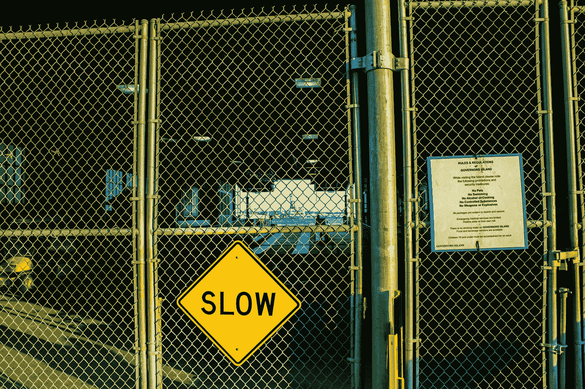

# 密码规则即将出台

> 原文：<https://medium.com/coinmonks/crypto-regulations-are-coming-de1f87e7f12?source=collection_archive---------39----------------------->

Photo by [Emil Bruckner](https://unsplash.com/@emilbruckner?utm_source=medium&utm_medium=referral) on [Unsplash](https://unsplash.com?utm_source=medium&utm_medium=referral)

这几乎相当于现代版的玻璃天花板:一堵隐约可见的监管墙，将保护密码免受黑客和其他外部威胁。但就像任何监管改革一样，在我们挖掘出未开发的潜力之前，尤其是在 FTX 崩盘之后，还需要一些调整和新规定。话虽如此，有一点是肯定的:监管变化不会完全消除加密货币。还有…