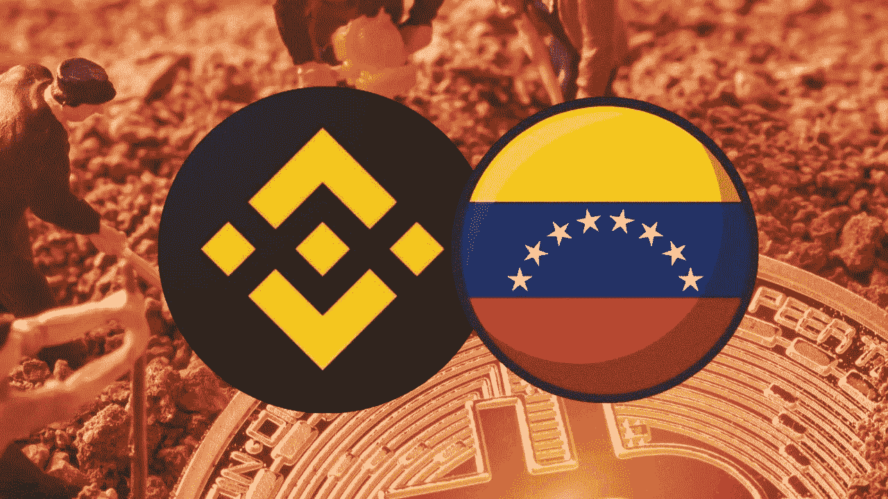
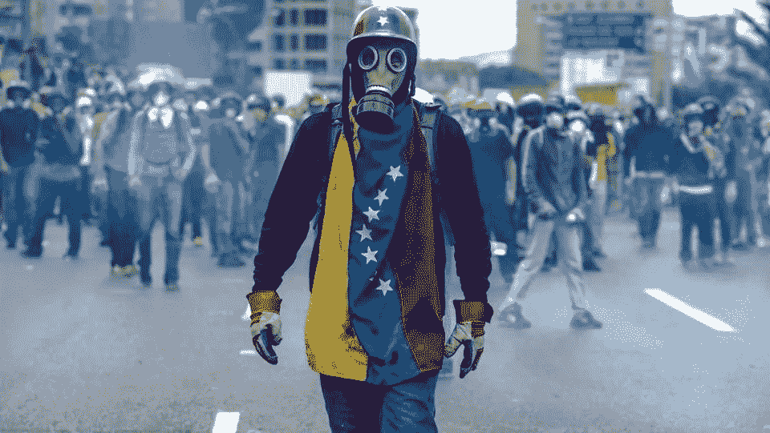
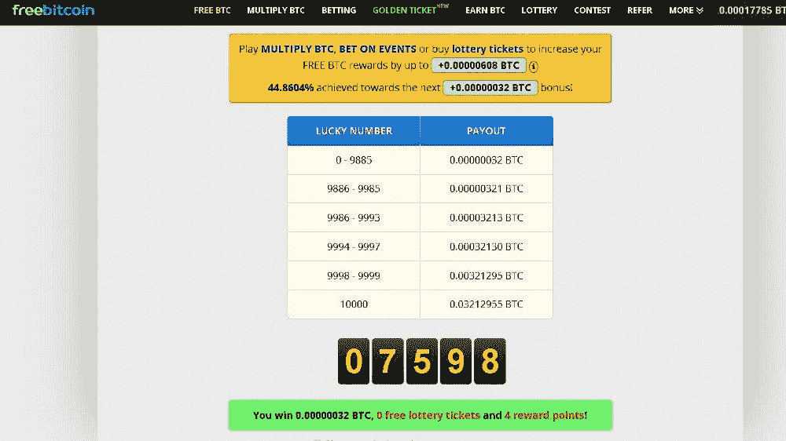
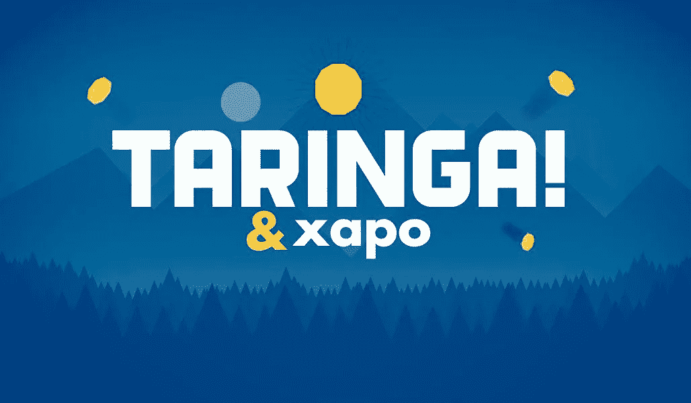

# Crypto 在现代史上最大的一次危机中救了我，下面是方法

> 原文：<https://medium.com/coinmonks/crypto-saved-me-in-one-of-the-biggest-crises-in-modern-history-heres-how-90a5cbef6d70?source=collection_archive---------22----------------------->

我已经沉浸在这个加密货币的世界大约 5 年了，因为实际上比特币在传统市场的大众化和许多替代硬币的兴起，直到现在许多新概念正在变得为人所知，自从我开始了解这个整个主题以来，我有一些使用加密货币工作和获得报酬的经验。这是我在这些市场的经历的一个小帖子，它如何极大地帮助我克服了近代史上最严重的危机之一，当然也是我的国家最严重的危机。

我应该给一点关于委内瑞拉危机的背景，虽然许多人肯定会在新闻中听到它，这是一个经济衰退时期，我的国家从 2014 年到现在一直生活在这个时期，其主要特征是猖獗的通货膨胀，摧毁了国家货币，并在国库中产生了巨大的漏洞，食品短缺， 公共服务不足，我记得我们每天都停电，持续了一天的大部分时间，人们很饿，经常去我们家问我们要一些食物，我相信我们大多数委内瑞拉人都记得这些时候，感到悲伤。

[Source](https://polemos.pe/cleptocracia-declive-venezuela-analisis-la-crisis-del-chavismo-maduro/)

此时，我还在读高中，但我已经感受到了这场危机的直接影响，我的朋友每周都移民去寻找更好的生活，我的家人都在工作，尽管我们相对较好地养活了自己，但我们注意到，我们周围已经出现了抢劫企业或封锁街道要求改善公共服务的情况，国家货币似乎正在贬值，所以我开始寻找一种方法来支持我的家人，并在经济上帮助自己。

**那些年工作待遇很差**，所以我没有想到放学后出去找工作，我把头转向了互联网。这在某种程度上符合水龙头和网站的兴起，这些网站为你填写 catpcha 提供一小部分比特币，这些奖励你可以带进你的钱包(我想我当时使用的是 Xapo 钱包)。

[Source](https://www.josportal.com/foros/foro-criptmonedas-bitcoins-y-otras-criptomonedas/48820-tutorial-definitivo-para-ganar-bitcoin-de-forma-gratuita-en-freebitcoin-despues-de-2-anos-de-uso-os-explicamos-estrategias-y-mas)

随着我对这个世界越来越感兴趣，我开始赚取我的第一份小份额 cryptos，我开始了解 altcoins 以及我对 Poloniex 或 Bittrex 等平台上的交易非常感兴趣(没有太大成功)，这些平台当时拥有最多的用户。

虽然我刚开始从这些网站获得第一笔收入，但我的收入仍然不多，可能刚好够每三天买一顿午餐，这个收入并不多，所以我再次开始寻找，我听说在南美有一个非常知名的内容平台(taringa。)已经推出了比特币奖励计划，奖励那些在自己网站上发帖的用户。因此，我在这里注册了比特币，而且在满足了相关要求(当时我感到相当困惑)之后，我开始通过别人对我的帖子的评价以及他们给我留下的分数来赚钱。这种奖励制度有些不正规，但这是我第一次看到这么多比特币转账到我的账户。

[Source](https://www.taringa.net/+economia_negocios/taringa-paga-a-sus-usuarios-con-bitcoin_hljha)

在 Taringa 上制作内容对我学习文案写作、搜索引擎优化有很大帮助，总的来说，也有助于我在其他平台上找到写作工作，比如在刚刚起步的 Fiverr。

大约在这几年(2017-2018 年)，我的国家的危机变得更加严重，我的一部分家庭开始移民到其他国家。再过几个月，我就要开始上大学了，我必须决定是离开还是把我在加密货币上的赌注和我的工作翻倍。我决定也开始在 Fiverr 之类平台上写作，但我的赌注主要是在 Taringa 创作者项目上，在这个比特币价格开始爆发并每周上涨的时期，这个数字还要高得多。

> 我的投资组合慢慢开始有了更多的收入，这些月来我基本上都在帮着买家里的周市值。

币安在我的国家开始崭露头角，许多人已经开始采用这个平台，并利用其 P2P 市场和 USDT 稳定币来保护自己的存款。我也不例外。我一有机会就在这里开立了一个账户，开始存钱。这一点在后来变得更加重要，届时我就能够用钱包里的存款来翻修我家的房子。

[Source](https://www.trabajaytriunfa.com/superacion/alcanzar-superacion-personal/)

几年过去了，我的情况有了很大的改善，虽然我所在的内容货币化项目停止了工作，我开始寻找其他收入来源，而且我已经这样做了 5 年了，但它也有起有落，但我可以肯定的是，如果没有加密货币，我肯定会成为众多离开美国寻找更好机会的人中的另一个。

通过加密货币，我可以养活家人，亲眼目睹他们成长，而不是像大多数移民一样，坐在电话后面打视频。在我的社区里，我还可以参与许多新的活动，过上更舒适的生活。我还可以向熟人介绍加密货币，现在还可以用它来支付上大学的费用。我能说的就是，很高兴来到这里。

> 这是我在 media 上的第一篇文章，我花了一些时间才开始，但我想我正计划每 3–4 天提供一篇文章，所以你应该跟我来！我将张贴有关加密货币从一个非常个人的角度，并给出一些提示，以处理这个世界

> 交易新手？试试[加密交易机器人](/coinmonks/crypto-trading-bot-c2ffce8acb2a)或者[复制交易](/coinmonks/top-10-crypto-copy-trading-platforms-for-beginners-d0c37c7d698c)