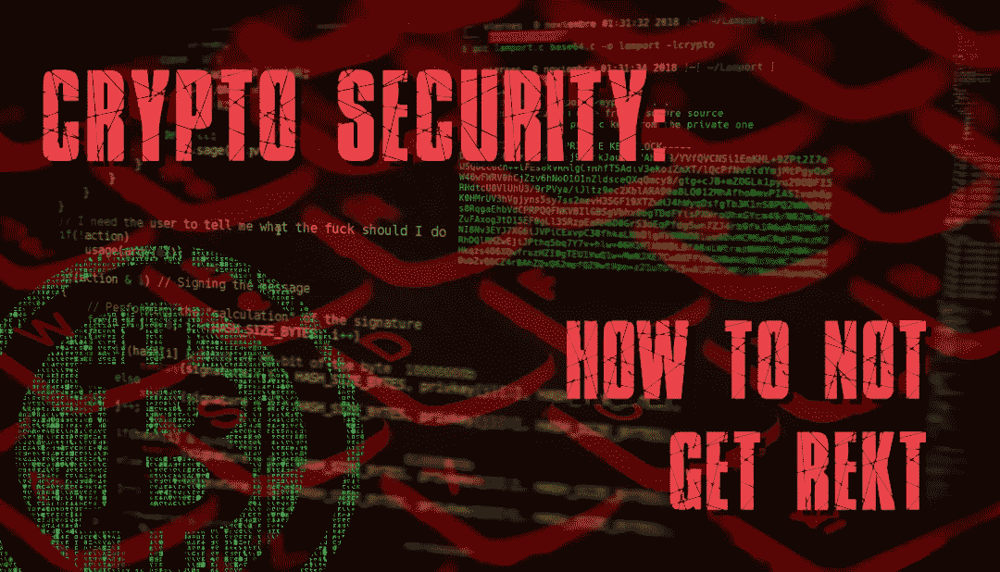

# 加密安全:自我保管和如何不被 rekt

> 原文：<https://medium.com/coinmonks/crypto-security-self-custody-and-how-to-not-get-rekt-2d3a7c0f7d72?source=collection_archive---------6----------------------->

最近，中央加密公司高调倒闭，造成了可怕的损失。以下是保护自己的方法。

Image: PixTeller

# 加密 OpSec 101

如果你不知道，OpSec 代表“操作安全”。当你自行保管加密资产时，OpSec 非常重要。