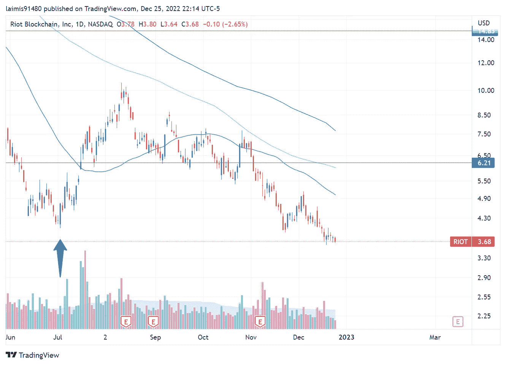

# 加密股票，你现在在哪里？第二部分

> 原文：<https://medium.com/coinmonks/crypto-stocks-where-are-you-now-part-2-49ea269c201?source=collection_archive---------44----------------------->

距离我上一篇关于公开交易的加密货币矿业公司股票的博客文章已经过去了将近六个月。当时，所有这些股票都从峰值下跌了 90%，前景黯淡。[你可以在这里阅读全文](https://laimis.medium.com/bitcoin-related-stocks-ddcf009f2ee3)。

在这篇文章中，我将看看这些股票在将近半年后的现状，同时保持 HIVE、HUT、MARA、RIOT 和比特币的列表不变，以进行比较。7 月 2 日是我发表第 1 部分的日子，所以图表在那之前会有一个月的时间，只是为了让我们更好地了解我们停止的地方。

> 从顶级交易者那里复制交易机器人。免费试用。

# 就在你认为更多相同的事情即将发生的时候…

有趣的是，这篇博文发表的日期标志着这个领域的一个短期转变。我在那里，强调了厄运和黑暗，并预计在不久的将来会有更多的惨败。当然，市场给了我一个惊喜。

让我们看看每个公司的图表，从 HIVE 开始(第 1 部分发布时的蓝色箭头标记):

自从我发表那篇博文以来，HIVE 已经上涨了 100%以上。当然，自那以来下跌了 40%，但这一点肯定是抛售过度到了极点，随后出现了短期缓解。

现在让我们看看小屋

同样荒谬的是，+100%是从发布时开始的。虽然现在派对已经结束，但自 7 月 2 日以来，它已经下跌了 35%。

玛拉描绘了一幅非常相似的画面:

它有一个更令人印象深刻的短期上涨，+230%，最终回落，现在自发布以来下跌了 30%。

最后，暴动，同样的画面:

涨幅+100%，自 7 月 2 日发表这篇文章以来，目前仅下跌了 10%左右。

比特币本身没有像股票那样上涨，从那以后一直保持相对平稳:

该指数曾小幅上涨 10%，此后下跌了 20%。

# 只有惊喜

当我坐下来写第二部分时，我没有想到会看到股票经历的如此巨大的短期上涨。

我们现在处于一个主要的熊市，比特币下跌，然而这些公司看到了至少 100%的涨幅！这是你的短期波动。如果你当时做空，那就不太妙了。

第二个惊喜是，被调查的股票似乎已经与比特币分离。他们在急速上升期间高度相关。但自从比特币崩溃以来，报价器的涨跌似乎更多地由股市指数决定。这是同一时期的 S&P500:

看起来我们经历了熊市反弹，加密股票也跟着上涨。这只是纯粹的猜测，但假设由于比特币崩溃，他们被高度做空，而空头崩溃可能是我们在这段时间看到的 100%至 200%收益的原因。

有趣的是，S&P 看起来有起有落，但总的来说在这段时间里没有任何进展！非常有趣的是，日复一日的波动给人的印象是 S&P 自夏季以来下跌了很多，但它真的没有任何变化。

# **下一步是什么**

和往常一样，没有人真正知道。既然我已经到了要写一篇关于比特币矿工有多惨的文章的地步，或许我们将迎来另一轮上涨和短期上涨。看到这种情况我不会感到震惊，但我完全预计在不久的将来会有更多的熊市下跌。

> 加入 Coinmonks [电报频道](https://t.me/coincodecap)和 [Youtube 频道](https://www.youtube.com/c/coinmonks/videos)了解加密交易和投资

# 另外，阅读

*   [用于 Huobi 的加密交易信号](https://coincodecap.com/huobi-crypto-trading-signals) | [HitBTC 审查](/coinmonks/hitbtc-review-c5143c5d53c2)
*   [TraderWagon 回顾](https://coincodecap.com/traderwagon-review) | [北海巨妖 vs 双子星 vs BitYard](https://coincodecap.com/kraken-vs-gemini-vs-bityard)
*   [如何在 FTX 交易所交易期货](https://coincodecap.com/ftx-futures-trading)
*   [OKEx vs KuCoin](https://coincodecap.com/okex-kucoin) | [摄氏替代品](https://coincodecap.com/celsius-alternatives) | [如何购买 VeChain](https://coincodecap.com/buy-vechain)
*   [ProfitFarmers 回顾](https://coincodecap.com/profitfarmers-review) | [如何使用 Cornix Trading Bot](https://coincodecap.com/cornix-trading-bot)