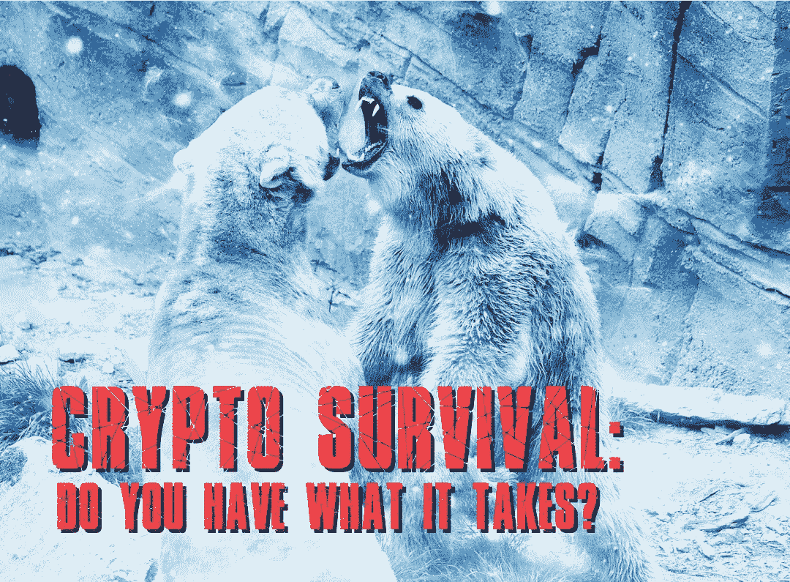

# 密码生存:你有什么需要吗？

> 原文：<https://medium.com/coinmonks/crypto-survival-do-you-have-what-it-takes-821456071024?source=collection_archive---------2----------------------->

承担风险的投资者一直试图抢在美联储前面。为什么一个错误会让你重蹈覆辙。

Image: PixTeller

# 秘密投资者和美联储“支点”

我认为许多加密投资者认为，当美国美联储从激进的加息“转向”时，市场将会反弹。