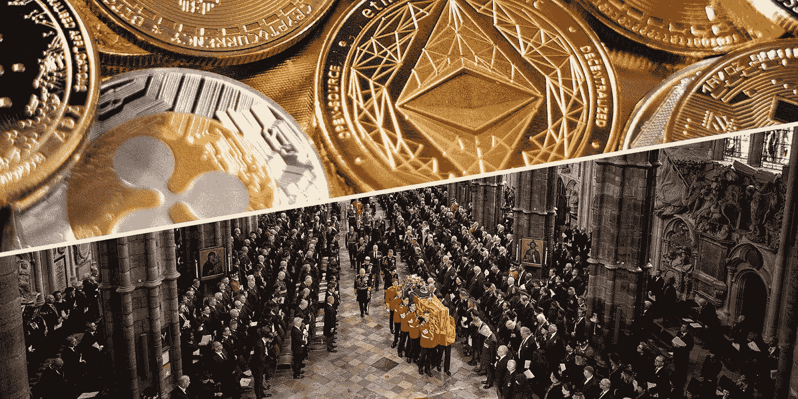

# 密码，女王之死和合并的诞生

> 原文：<https://medium.com/coinmonks/crypto-the-queen-and-the-merge-77e2c6700011?source=collection_archive---------34----------------------->

2022 年 9 月 19 日，英国伦敦威斯敏斯特大教堂，英国女王伊丽莎白二世的国葬仪式。(图片:David Levene—WPA Pool/Getty Images)| Unsplash)

由[史蒂文·博伊基·辛德利](https://www.dailymaverick.co.za/author/stevenboykeysidley/)

2022 年 9 月 19 日

# 最近几天发生了两件完全不相关的重大媒体事件，它们只不过代表了策划和执行的胜利。第一次代号为伦敦桥行动——伊丽莎白女王之死及其随后的葬礼。第二次是合并，这是最危险和最复杂的实时软件升级尝试。君主的死亡和利害攸关的区块链的诞生。

这些有什么不同？首先是规模。根据一份报告,《伦敦桥行动》有望成为有史以来收视率最高的电视节目，观众人数将超过 40 亿。人们可以想象组织者，呃，不想搞砸。

这次合并管理了 41，000 名实时观众(委婉地说，这不算是一场视觉盛宴)，我是其中之一，还有数千万人在 Twitter 上查看更新。当然，观众要少得多。但是，随着数以千计的*数十亿*的美元危在旦夕，我希望合并组织者至少和葬礼策划者一样有动力，也许更多。我没有观看葬礼，但是合并过程中大约 15 分钟的时间是一次令人感动的经历。

这一合并无疑是自 2008 年 Satoshi 的白皮书以来最重要的事件，也是最令人期待的加密事件，它顺利进行了整整七年，也是它真正开始开发的大约四年。我想知道女王的葬礼计划了多久。考虑到她的长寿，也许会持续一段时间。

不过有一个相似之处，那就是这种抨击开始时悄无声息，然后在社交媒体上爆发开来。一方面，那些希望(至少部分地)指责女王殖民主义的人的声音——我最好不要参与这场辩论——另一方面，那些在非常不同但也充满秘密狂热的世界中的评论员，他们对分散化和通货紧缩货币体系等抽象概念大声辱骂和反对。

当然，不要把殖民主义和共识协议混为一谈，但 1 万亿美元的秘密经济有时确实会升温，特别是在经济不确定性似乎比以往任何时候都大的世界里。

我在 YouTube 官方网站上观看了合并，重播了合并的软件开发人员 Zoom 会议。很多很多年轻的面孔，大多是男性，有些衣衫褴褛，衣衫褴褛(大概是因为缺乏睡眠)，许多口音来自世界各地，有些因焦虑而咧嘴笑着，有些面无表情。

出现在 YouTube 上的屏幕非常神秘——图形和滚动代码以及绿色小方块看起来像一个巨大的 Wordle 游戏。被邀请者知道他们在寻找什么；我们其余的人有些无所事事地盯着看，直到这个重大时刻被一个令人印象深刻的超大文本组成的图形在黑白屏幕上记录下来，上面写着——“POS Activated”。全世界掀起了一阵狂热的欢呼。

为什么有人会比令人印象深刻的载着君主的灵车穿过伦敦的队伍更关心这件事，充满了哀悼的平民和穿着华丽的王室官员？为什么要关心这个呢？

在我看来，这一事件代表了对一个时代的低调告别，一个沉重的历史，一个对过去的反思，以及对一个似乎在她的政府参与世界事务的喧嚣中散发出名义上的尊严的人的赞赏。

另一个代表了对未来的看法，证明了人类的创新，证明了我们解决几乎不可能解决的问题的能力，证明了我们拥有与*智人*最显著的不同之处——提前计划、设想场景、只用智慧和逻辑与不确定性搏斗的能力。

许多对加密感兴趣的人立即对 ETH 价格的变化感兴趣。比特币会怎么样？会有矿工起义吗？美国监管机构在想什么？谁赢谁输？

对我来说，这比那更重要。当每天有 10 亿美元在网络中实时流动时，我坐在播客中听着这是如何做到的。委婉地说，协调全球团队中 200 名开发人员的复杂程度和细节令人震惊。

很简单，这是近几十年来最伟大的技术壮举之一。

我听说已故女王的送葬队伍也很值得一看。

(我还没有谈到合并对加密用户的实际意义——对于那些感兴趣的人来说，这在我 8 月 29 日的文章[中有所涉及。)](https://www.dailymaverick.co.za/article/2022-08-29-the-merge-is-coming-to-the-cryptoverse-and-its-going-to-be-huge/)

Steven Boykey Sidley 是约翰尼斯堡大学 JBS 的实践教授。

*本文最早出现在《每日特立独行》*

> 交易新手？尝试[加密交易机器人](/coinmonks/crypto-trading-bot-c2ffce8acb2a)或[复制交易](/coinmonks/top-10-crypto-copy-trading-platforms-for-beginners-d0c37c7d698c)