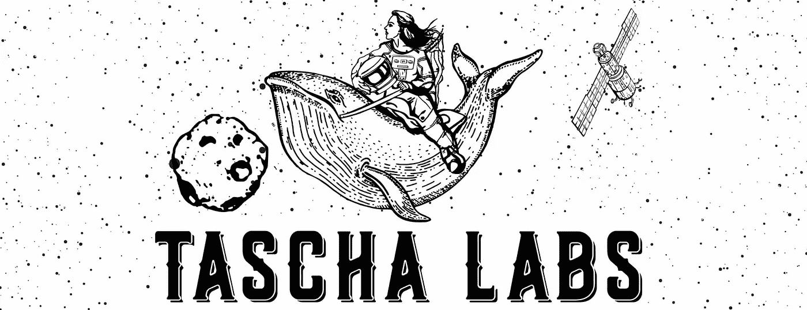
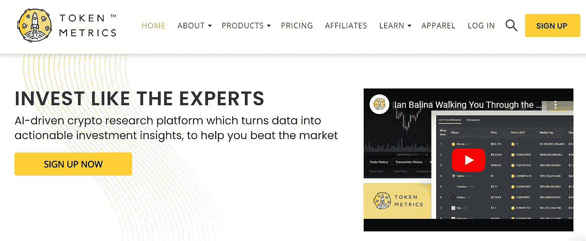
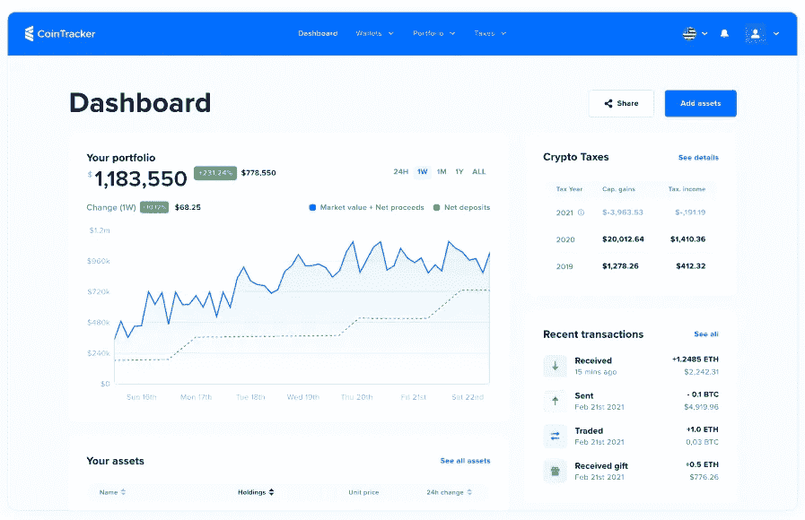
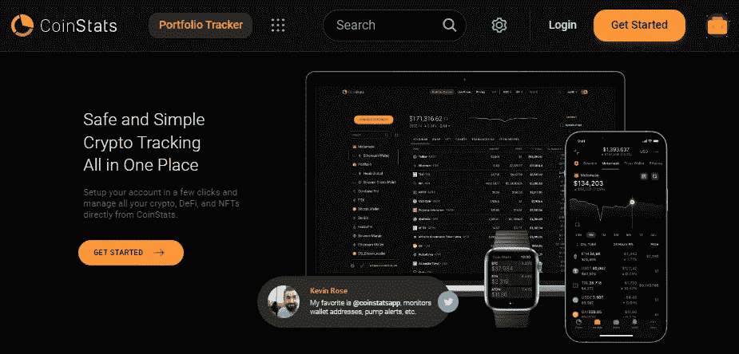
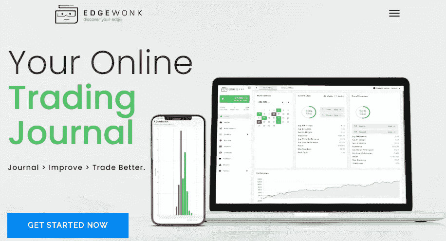

# 加密工具#1

> 原文：<https://medium.com/coinmonks/crypto-tools-1-3ead080b104?source=collection_archive---------13----------------------->

帮助你成为更好的投资者的创新工具列表

Photo by [Jeremy Bezanger](https://unsplash.com/@unarchive?utm_source=medium&utm_medium=referral) on [Unsplash](https://unsplash.com?utm_source=medium&utm_medium=referral)

我会定期发布一份最有用的加密工具或服务清单，帮助你作为投资者学习和成长。

其中一些是成熟的，另一些将是全新的，目标是帮助您找到隐藏的宝石，找到创新的 DeFi 服务，管理您的投资组合，获得链上指标，…

如果您想收到每周一次的热门新工具，请订阅。

这是时事通讯#1，开始吧。

# **#1 最佳加密新闻网站**

让我们从基础开始，好的投资需要好的信息，最新的趋势和事件。

[**币报**](https://cointelegraph.com/)**:2013 年以来的引用**

**[**Coindesk**](https://www.coindesk.com/) :密码圈的彭博社**

**[**Cryptodaily**](https://cryptodaily.co.uk/) :包含加密价格技术分析**

**[**Coinmarketcap**](https://coinmarketcap.com/):绝对的引用，在任何 crypto 上，都有**

**[**Dailycoin**](https://dailycoin.com/) :包括你在别处找不到的文章，有些是关于网络安全的**

****:包括播客、指南和交易工具****

# ******#2 Tascha 实验室******

****一个伟大的网站，来自一个最好的加密和宏领域的观察者。 [Tascha](https://taschalabs.com/) 涵盖宏观和投资，重点是加密宏观经济学。****

********

****Source: Tascha Labs****

# ****#3 令牌指标****

****想找到一些隐藏的宝石吗？ [Token Metrics](https://tokenmetrics.com/) 运行一个人工智能驱动的加密研究平台，将数据转化为可操作的投资见解。****

********

****Source: Token Metrcis****

# ****#4 CoinTracker.io****

****[CoinTracker.io](https://www.cointracker.io/) 提供一个加密投资组合助手来跟踪和管理你的表现。它还包括一个税务模块，用于建立年度纳税申报。还包括一个移动应用程序。****

********

****Source: cointracker.io****

# ****排名第五的硬币统计****

****这个投资组合跟踪器将连接到你最喜欢的交易所或钱包，并为你提供一个完整的监测和分析。有了 [Coinstats](https://coinstats.app/) 你可以在一个地方管理你所有的加密、DeFi 和 NFT。****

********

****Source: coinstats.app****

# ******#6 Edgewonk******

****Edgewonk 是你的在线交易日志，连接着你所有的主要经纪人。适用于股票、外汇、期货、差价合约，当然还有加密货币。它包括在一个完全可定制的交易日志强大的分析。****

********

****Source: edgewonk.com****

****如果有帮助，请让我知道。****

****如果你喜欢这个故事，并且愿意支持我(和其他成千上万的作家)，那么考虑一个[媒体](/subscribe/@John_treadle) [订阅](/subscribe/@John_treadle)，每月只需 5 美元或每年 50 美元。****

****或者你也可以决定给我买一个[**Ko-Fi**](https://ko-fi.com/johntreadle)**:-)******

# ****进一步阅读****

*   ****[如果 Safuu 价格保持不变，我的 400 美元投资将在 12 月变成 14000 美元](/@John_treadle/if-safuu-price-holds-my-400-investment-will-turn-to-14-000-by-december-61870b5545f0)****
*   ****[Yieldnodes 在 6 月份实现了 6.1%的非凡收益率(我的包里多了 1027 美元)](/@John_treadle/yieldnodes-delivers-an-exceptional-6-1-in-june-an-extra-1-027-in-my-bag-3daba786254c)****
*   ****[迈克尔·塞勒刚刚列出了阻碍比特币发展的十大因素](/coinmonks/michael-saylor-just-listed-the-top-10-things-holding-bitcoin-back-91fb1cedf49d)****
*   ****[投降迹象表明，是时候打造我们的 BTC 包包了](/the-capital/capitulation-signs-are-saying-its-time-to-build-our-btc-bags-4b87ce92661f)****
*   ****Yieldnodes 的安全性和可持续性如何？****
*   ****[比特币将达到 100 万美元的 100 个理由](/coinmonks/how-safe-and-sustainable-is-yieldnodes-4bd84d01e5f6)****

> ****交易新手？尝试[加密交易机器人](/coinmonks/crypto-trading-bot-c2ffce8acb2a)或[复制交易](/coinmonks/top-10-crypto-copy-trading-platforms-for-beginners-d0c37c7d698c)****