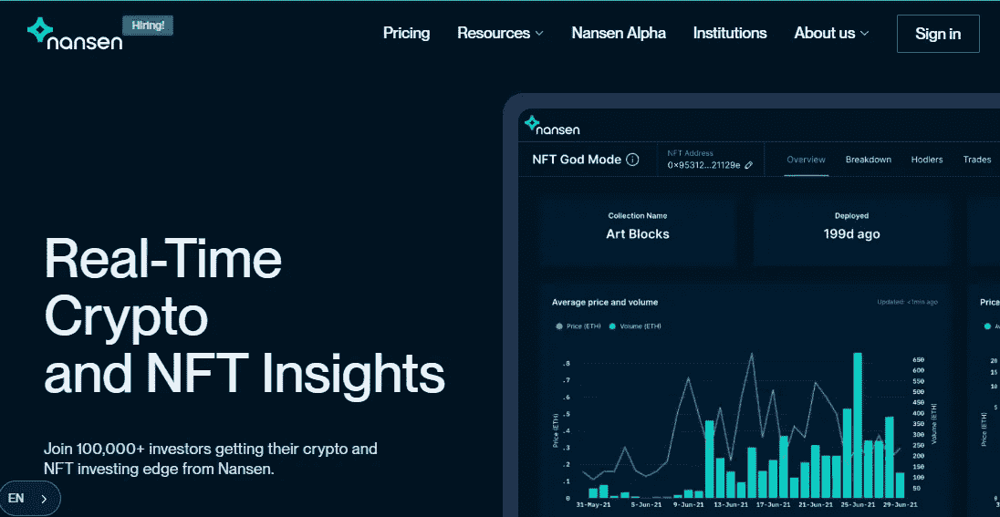
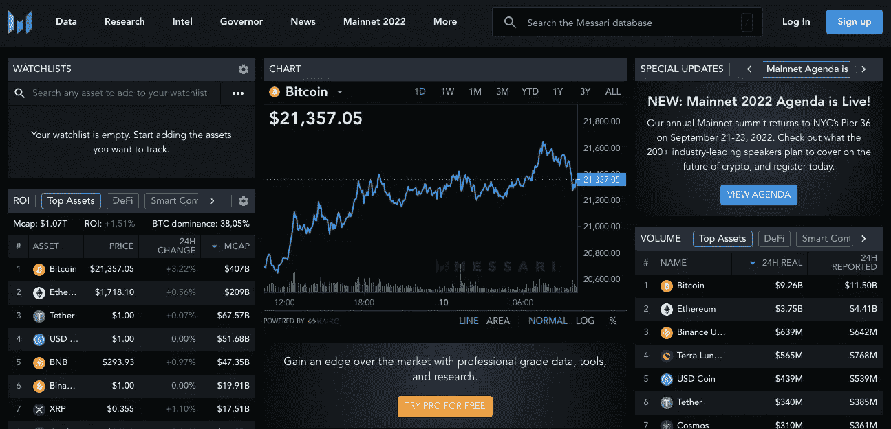
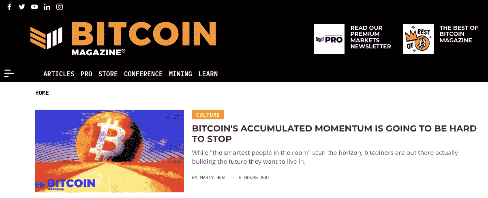

# 加密工具#2

> 原文：<https://medium.com/coinmonks/crypto-tools-2-66c97b0de116?source=collection_archive---------14----------------------->

## 寻找新的创新工具，成为更好的交易者和投资者

Photo by [Jeremy Bezanger](https://unsplash.com/@unarchive?utm_source=medium&utm_medium=referral) on [Unsplash](https://unsplash.com?utm_source=medium&utm_medium=referral)

我定期更新的第二集是关于最有用的加密工具或服务，帮助你学习和成长为一名投资者。

其中一些是成熟的，另一些将是全新的，目标是帮助您找到隐藏的宝石，找到创新的 DeFi 服务，管理您的投资组合，获得链上指标，…

如果您想收到每周一次的热门新工具，请订阅。

# #1 南森. ai

Source: Nansen.ai

[Nansen](https://www.nansen.ai/) 是一个强大的区块链分析平台，结合了链上数据和来自数百万个钱包标签的海量数据。它是最强大的链上分析平台之一，由一些世界领先的风投(a16Z，比特币基地风险投资，潘迪拉，…)支持。).

# #2 市场思考

Source: marketmeditations.io

[市场冥想](https://www.marketmeditations.io/)提供最新信息，帮助你建立你的秘密财富。包括很棒的免费资源，如时事通讯、编辑 Koroush AK 的播客、免费财富指南、拥有密码的初学者指南和很棒的交易指南。

# 第三名梅萨里

Source: messari.io

[Messari](https://messari.io/) 为加密投资者和交易者提供专业级数据、工具和研究。由 Ryan Selkis 创建的 Messari 出版两周一次的新闻摘要，但最著名的是它的年度报告。

# **#4 真实视觉**

Source: realvision.com

由宏观投资者和思想领袖劳尔·帕尔(Raoul Pal)创立的 [Real Vision](https://www.realvision.com/) 提供一系列服务:点播财经电视、youtube 频道、采访、书面报告、每日简报、...Real Vision 处于宏观、金融和加密相结合的分析前沿。

# 排名第五的比特币杂志

Source: bitcoinmagazine.com

[比特币杂志](https://bitcoinmagazine.com/)是关于比特币、区块链和更广泛的加密领域的最古老、最成熟的新闻和信息来源之一。Vitalik Buterin 成立于 2012 年，是其创始人之一，如今 Dylan LeClair 是其著名的编辑。

如果有帮助，请让我知道。

如果你喜欢这个故事，并且愿意支持我(以及成千上万的其他作家)，那么考虑一个[媒介](/subscribe/@John_treadle) [订阅](/subscribe/@John_treadle)，每月只需 5 美元或每年 50 美元。

或者你也可以决定给我买一个[**Ko-Fi**](https://ko-fi.com/johntreadle)**:-)**

# 进一步阅读

*   [如果 Safuu 价格保持不变，我的 400 美元投资将在 12 月变成 14000 美元](/@John_treadle/if-safuu-price-holds-my-400-investment-will-turn-to-14-000-by-december-61870b5545f0)
*   [Yieldnodes 在 6 月份实现了 6.1%的非凡收益率(我的包里多了 1027 美元)](/@John_treadle/yieldnodes-delivers-an-exceptional-6-1-in-june-an-extra-1-027-in-my-bag-3daba786254c)
*   [迈克尔·塞勒刚刚列出了阻碍比特币发展的十大因素](/coinmonks/michael-saylor-just-listed-the-top-10-things-holding-bitcoin-back-91fb1cedf49d)
*   投降的迹象表明，是时候打造我们的 BTC 包了
*   [yield nodes 的安全性和可持续性如何？](/coinmonks/how-safe-and-sustainable-is-yieldnodes-4bd84d01e5f6)
*   [比特币将达到 100 万美元的 100 个理由](/coinmonks/how-safe-and-sustainable-is-yieldnodes-4bd84d01e5f6)

> 交易新手？尝试[加密交易机器人](/coinmonks/crypto-trading-bot-c2ffce8acb2a)或[复制交易](/coinmonks/top-10-crypto-copy-trading-platforms-for-beginners-d0c37c7d698c)