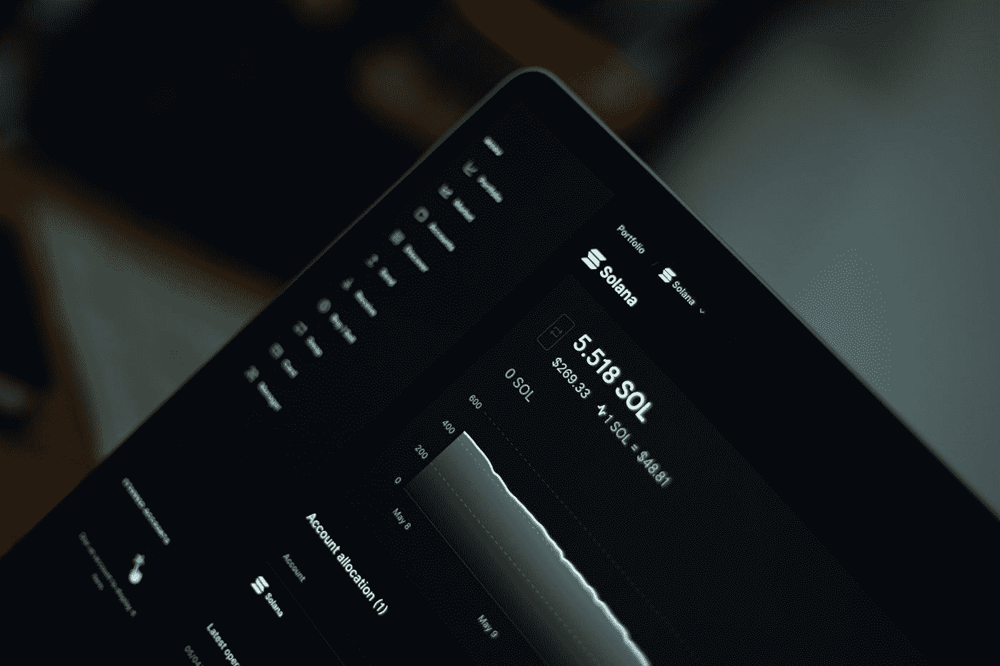
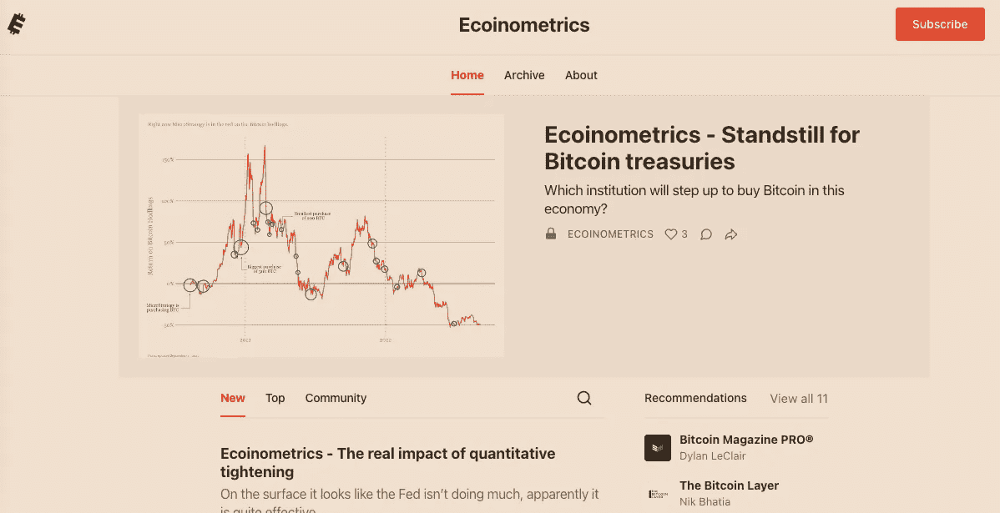
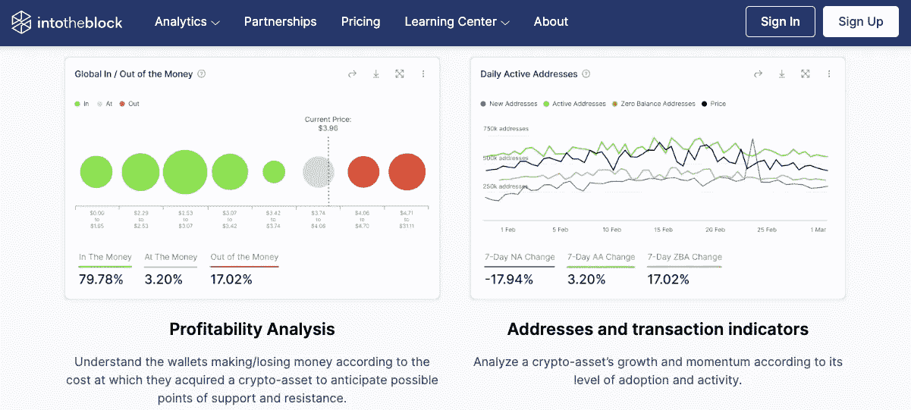
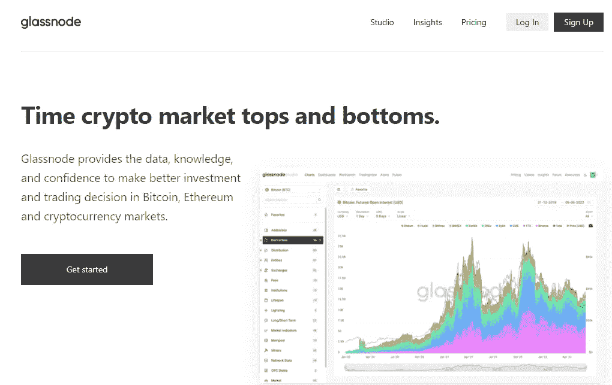

# 加密工具#3

> 原文：<https://medium.com/coinmonks/crypto-tools-3-cafdbfd03c89?source=collection_archive---------12----------------------->

## 这个最新版本包括热门的创新工具，成为一个更好的交易者和投资者。链上分析，新闻和洞察力，发射台，…

Photo by [Amjith S](https://unsplash.com/@amjiths?utm_source=medium&utm_medium=referral) on [Unsplash](https://unsplash.com?utm_source=medium&utm_medium=referral)

我定期更新的第三集是关于最有用的加密工具或服务，帮助你作为投资者学习和成长。

发现隐藏的宝石，创新的 DeFi 服务，投资组合经理，twitter 帐户，youtube 频道，链上指标，…这一切都在这里。

如果您想收到每周一次的热门新工具，请订阅。

# **#1 零点对冲**

Source: zerohedge.com

在 [**Zerohedge**](https://www.zerohedge.com/) 上的帖子都是著名的署名“泰勒·德顿”(以布拉德·皮特在《搏击俱乐部》中的角色命名)。创建该网站的目的是扩大专业投资公众可获得的金融、经济和政治信息的范围。

ZeroHedge 声称要“以怀疑的态度审视并在必要时攻击金融新闻业已经成为的软弱无力的机构”。

多年来，这本反体制的出版物已经成为华尔街最受欢迎的出版物之一。

# #2 经济计量学

Source: ecoinometrics.com

他们发布了绝对最好的数据可视化，你可以从 Twitter 账户@ecoinometrics 获取其中的样本。

# #3 进入区块

Source: intotheblock.com

[**IntoTheBlock**](https://www.intotheblock.com/) 为个人投资者提供来自市场的各种加密资产指标。这包括区块链分析、价格预测、DeFi 和市场分析，所有这些都是由数据科学家、crpyto 专家和人工智能极客团队制作的。

# #4 币安发射台

Source: launchpad.binance.com

[**币安发射台**](https://launchpad.binance.com/en/) 令牌发射平台帮助区块链项目筹集资金，并增加其在整个加密生态系统中的影响力。基本上，你可以从新的暴发户项目中购买令牌，方法是先看看各种项目中有前途的新加密令牌。这也有助于提高这些项目的认知度和采用率。

# #5 玻璃节点

Source: glassnode.com

[**Glassnode**](https://glassnode.com/) 让每个人都可以访问区块链数据。这些服务收集和分析大量的链上数据，以提供有背景的、可操作的见解。

[Glassnode Studio](https://studio.glassnode.com/metrics?a=BTC&m=addresses.ActiveCount) 提供数据、知识和信心，以便在比特币、以太坊和加密货币市场做出更好的投资和交易决策。绝对是这里最好的链上分析来源之一。

像往常一样，如果有帮助，请让我知道。

如果你喜欢这个故事，并且愿意支持我(和其他成千上万的作家)，那么考虑一个[媒体](/subscribe/@John_treadle) [订阅](/subscribe/@John_treadle)，每月只需 5 美元或每年 50 美元。

或者你也可以决定给我买一个[**Ko-Fi**](https://ko-fi.com/johntreadle)**:-)**

# 进一步阅读

*   [如果 Safuu 价格保持不变，我的 400 美元投资将在 12 月变成 14000 美元](/@John_treadle/if-safuu-price-holds-my-400-investment-will-turn-to-14-000-by-december-61870b5545f0)
*   [Yieldnodes 在 6 月份实现了 6.1%的非凡收益率(我的包里多了 1027 美元)](/@John_treadle/yieldnodes-delivers-an-exceptional-6-1-in-june-an-extra-1-027-in-my-bag-3daba786254c)
*   [迈克尔·塞勒刚刚列出了阻碍比特币发展的十大因素](/coinmonks/michael-saylor-just-listed-the-top-10-things-holding-bitcoin-back-91fb1cedf49d)
*   [投降迹象表明，是时候打造我们的 BTC 包包了](/the-capital/capitulation-signs-are-saying-its-time-to-build-our-btc-bags-4b87ce92661f)
*   Yieldnodes 的安全性和可持续性如何？
*   [比特币将达到 100 万美元的 100 个理由](/coinmonks/how-safe-and-sustainable-is-yieldnodes-4bd84d01e5f6)

> 交易新手？尝试[加密交易机器人](/coinmonks/crypto-trading-bot-c2ffce8acb2a)或[复制交易](/coinmonks/top-10-crypto-copy-trading-platforms-for-beginners-d0c37c7d698c)