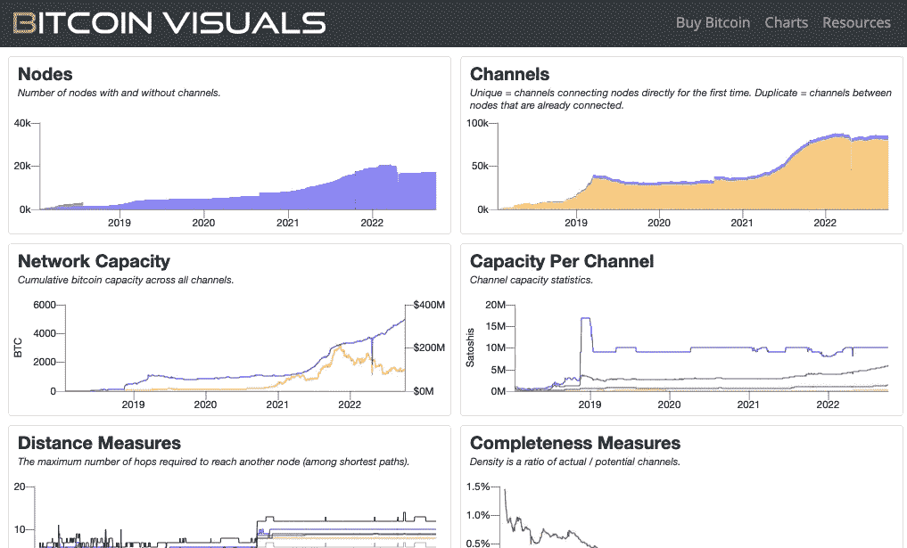

# 加密工具#8

> 原文：<https://medium.com/coinmonks/crypto-tools-8-76f7402cc36b?source=collection_archive---------5----------------------->

这个版本着眼于一个比特币仪表盘工具、一个净值追踪器、一个开发者活动测量器、一个投资追踪器和一个数字媒体平台

Photo by [Art Rachen](https://unsplash.com/@artrachen?utm_source=medium&utm_medium=referral) on [Unsplash](https://unsplash.com?utm_source=medium&utm_medium=referral)

# 排名第一的比特币视觉效果

Source: bitcoinvisuals.com