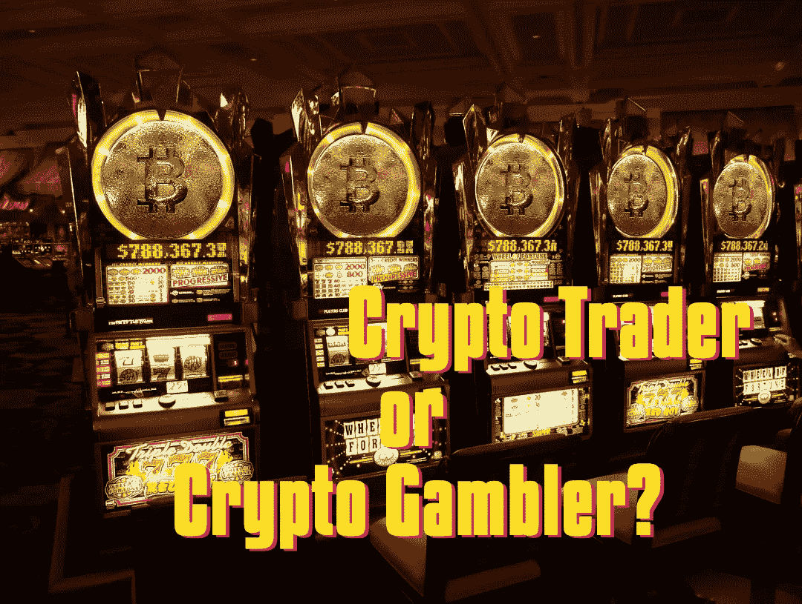

# 密码交易者还是赌徒:你应该问自己三个问题

> 原文：<https://medium.com/coinmonks/crypto-trader-or-gambler-3-questions-you-should-ask-yourself-90863c5a10c0?source=collection_archive---------9----------------------->

大多数人在交易和投资密码时都会赔钱。了解他们失败的原因以及如何避免失败。

Image: PixTeller

# 轻松赚钱

理查德·布兰森曾经说过，如果你想成为百万富翁，从十亿美元开始，创办一家新的航空公司。Crypto 有点不同。