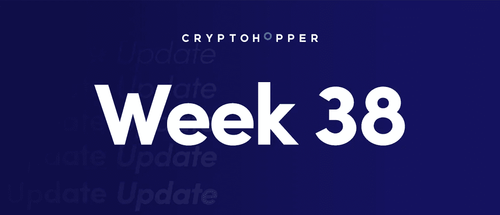
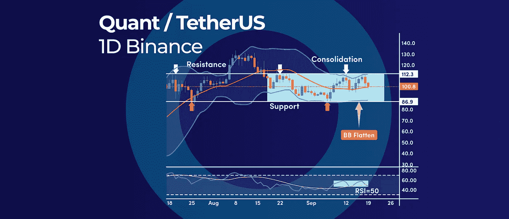
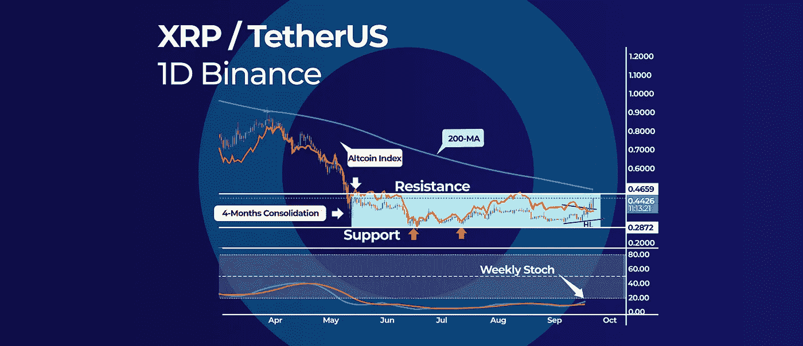
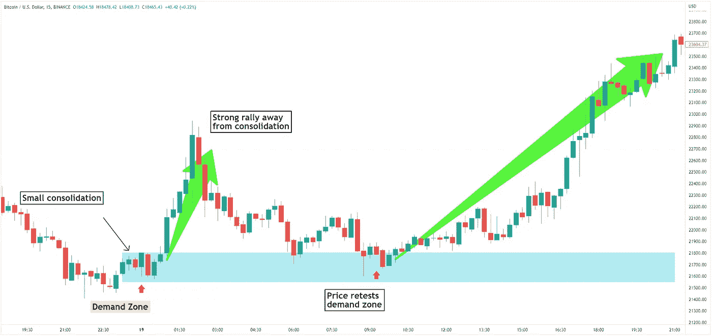

# 加密交易员的供应和需求交易指南|和更多本周加密更新。

> 原文：<https://medium.com/coinmonks/crypto-traders-guide-to-supply-and-demand-trading-and-more-in-this-weeks-crypto-update-85e0a74619fa?source=collection_archive---------25----------------------->

*   QNT 价格分析:进一步整合可能在 100 美元左右
*   波纹显示相对强度上升
*   供求交易密码交易员指南

# QNT 价格分析:进一步整合可能在 100 美元左右

QNT 在 100 美元的心理价位附近保持震荡。随着布林线开始变平，进一步的盘整将会出现，这通常发生在波动性较低的时候。RSI 振荡器徘徊在 50 的中间水平附近，也表明买方和卖方之间的平衡。

## QNT 布林带

设定为 20 期简单移动平均线的中间波段为 98.45 美元，接近 100 美元的整数。上下波段描绘了远离中间波段的两个标准差，创建了一个价格范围。

QNT 的布林带上轨位于 105.70 美元，这是上方阻力位。同时布林线下轨站在 88.15 美元，代表当前价格区间的支撑。

通常，布林线挤压之后是决定性的向上或向下突破。只要 QNT 的价格交易在 100 美元以上，向上突破的可能性就更大，反之亦然，如果我们交易在 100 美元以下。

## RSI 振荡器

相对强弱指数(RSI)在 50 中级附近徘徊，支持短期确立盘整的思路。

展望未来:跌破 9 月低点 85.93 美元可能标志着熊市趋势的复苏，因为我们将创造更低的低点。相反，多头需要突破 8 月高点 133.38 美元才能重振牛市。

## 什么是 Quant？

Quant 是一个分散的网络，允许不同区块链之间的即时交易。它使用一种称为“桥接”的独特系统将不同的区块链连接在一起。这使得在不同的区块链之间传输数据和价值的方式更加有效和安全。Quant 也有自己的本地令牌，称为 QNT，用于为网络供电。

# 波纹显示相对强度上升

Ripple (XRP)的表现优于整体加密市场，显示出相对于 Altcoin 指数的相对实力。然而，XRP 价格仍然被困在 4 个月的盘整格局中，上方阻力线接近 0.50 美元。

## 波纹相对强度

相对强度指标可以帮助我们发现哪些加密货币的表现优于整体市场。当追踪整个比特币市场表现的比特币指数创出更低的低点时，XRP 价格创出更高的低点，这是一个看涨的信号。

这意味着 XRP 的价格在上涨，而其他密码在下跌。

盘整形态 4 个月的盘整形态导致了 0.287 美元的局部底部和 0.457 美元的阻力。如果目前的 XRP 相对强势继续发展，很有可能再次测试盘整形态的顶部。

涨势甚至可以进一步延伸到 200 天简单移动平均线，目前位于 0.50 美元附近。

## 每周随机指标

此外，周线图上的随机指标自当前盘整阶段以来首次出现超卖读数(低于 20 水平)。这可以进一步维持最近的反弹。

**展望未来:**由于我们仍处于盘整格局中，真正的危险是，在真正的催化剂触发突破之前，我们可能会以价格收紧而告终。

## 什么是随机指标？

随机指标是一种动量指标，用于衡量当前趋势的方向和强度。该指标的计算方法是，取某一时期的最高价，除以同期的最低价。上涨的随机指标意味着当前趋势正在变强，而下跌的随机指标意味着当前趋势正在失去力量。

# 密码交易 101:供求交易密码交易员指南

供给和需求是强大的交易概念，可以帮助交易者确定加密价格何时可能反转。传统的[支撑位和阻力位](https://www.cryptohopper.com/blog/7502-how-to-pick-support-and-resistance-levels-the-right-way)的区别在于，供给和需求区域有一个价格范围，而不是单一的价格水平。

支撑位和阻力位交易的缺点是，价格很可能无法精确地在这个水平上变化。然而，如果你使用供求交易的概念，你永远不会遇到这个问题。

## 什么是交易中的供给和需求？

供求是交易中最基本的概念之一。它是指市场上某一特定资产的买方和卖方的数量。如果买方多于卖方，资产的价格就会上涨。如果卖方比买方多，价格就会下降。供求交易是一种策略，试图利用这些不平衡来获利。交易者会在需求大于供给时买入，在供给大于需求时卖出。通过这样做，他们有望低买高卖，在这个过程中获利。

## 如何交易供求关系

确定供求区域是一个简单的过程。你所需要做的就是从过去价格有强烈反应的地方找到价格区域，无论是上涨还是下跌。

供应区可以通过寻找价格大幅下跌的小烛台群来找到，在这些小烛台群中，价格在短期内会出现整合。整个价格整合区代表一个供应区。

相反，需求区可以通过寻找一个明显的价格反弹来找到，远离一群价格在短期内巩固的小烛台。整个价格整合区代表一个需求区。

当价格重新回到供求区时，我们更有可能从这些价格区得到类似的反应，因为那里是买卖最初发生的地方。如果交易也朝着整体市场趋势方向进行，这种策略会更有效。

## 结果

如果你是一个密码交易员，理解和交易供求原则对你的成功至关重要。我们希望这个指南已经给了你一个开始交易的良好基础。记住，关键是要经常做自己的研究，跟上最新的市场趋势。记住这一点，祝交易愉快！

订阅我们的媒体每周博客和更新。
在推特[上关注我们](https://twitter.com/cryptohopper) | [脸书](https://www.facebook.com/cryptohopper)|[Reddit](https://www.reddit.com/r/CryptoHopper/)|[insta gram](https://www.instagram.com/cryptohopper/?hl=nl)

在 [Cryptohopper](https://www.cryptohopper.com/) 开始交易！

> 加入 Coinmonks [电报频道](https://t.me/coincodecap)和 [Youtube 频道](https://www.youtube.com/c/coinmonks/videos)了解加密交易和投资

# 另外，阅读

*   [Bookmap 评论](https://coincodecap.com/bookmap-review-2021-best-trading-software) | [美国 5 大最佳加密交易所](https://coincodecap.com/crypto-exchange-usa)
*   [密码交易机器人](/coinmonks/crypto-trading-bot-c2ffce8acb2a) | [硬币门评论](https://coincodecap.com/coingate-review)
*   最佳加密[硬件钱包](/coinmonks/hardware-wallets-dfa1211730c6) | [Bitbns 点评](/coinmonks/bitbns-review-38256a07e161)
*   [新加坡 10 强密码交易所](https://coincodecap.com/crypto-exchange-in-singapore) | [购买 AXS](https://coincodecap.com/buy-axs-token)
*   [红狗赌场点评](https://coincodecap.com/red-dog-casino-review) | [Swyftx 点评](https://coincodecap.com/swyftx-review)