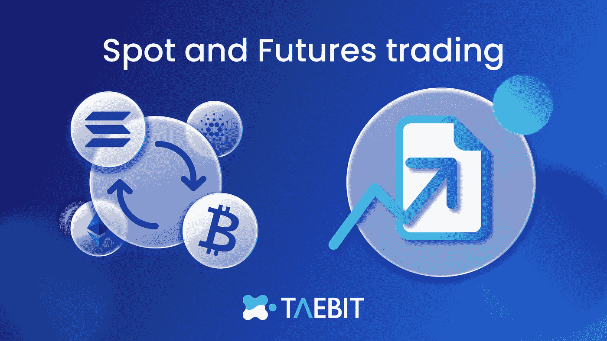
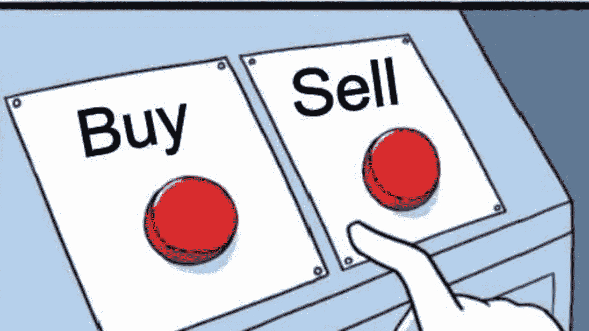
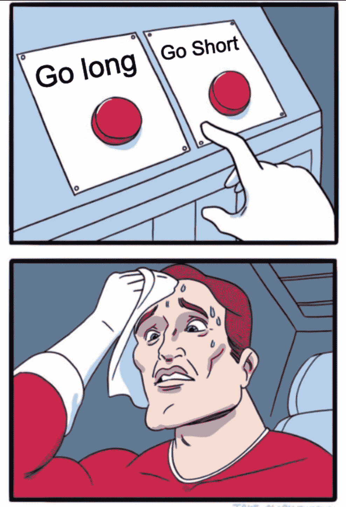
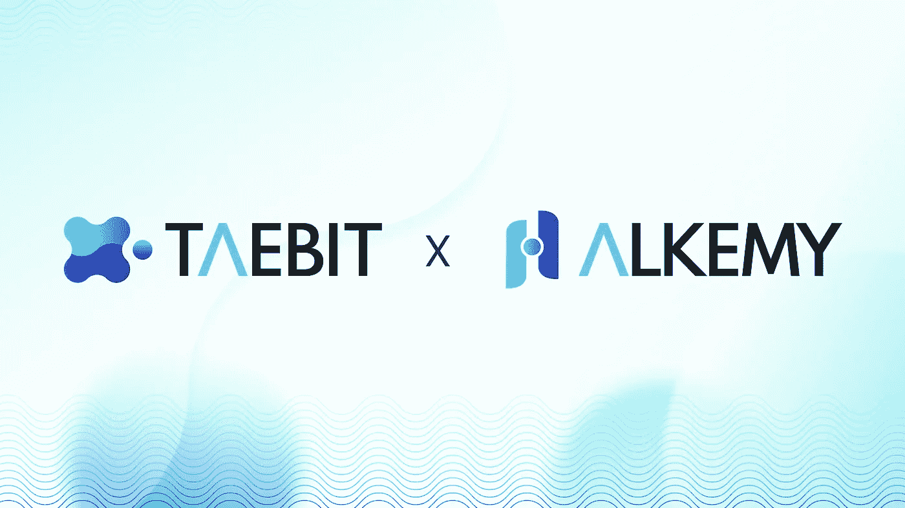

# 密码交易 101:现货和期货交易

> 原文：<https://medium.com/coinmonks/crypto-trading-101-spot-and-futures-843a82514f82?source=collection_archive---------45----------------------->

# 介绍

在最基本的层面上，现货市场是商品、货币、股票和债券交易的即时交割场所。相反，期货市场在预先确定的未来日期结算其基础资产和期货合约的交割。

在这篇博客中，我们将贯穿现货和期货交易的区别，什么样的交易方法最适合每个角色，并讨论 Taebit 和 Alkemy 如何增强整体交易体验。

# 现款现货交易

## 定义

加密货币现货交易是买卖比特币、以太坊等数字资产进行即时交割的过程。换句话说，加密货币是在市场参与者(买方和卖方)之间直接转移的。在现货市场中，你拥有加密货币的直接所有权，并享有合法权利，如投票支持主要分叉或参与下注。

诸如币安、比特币基地、Upbit 和 Gemini 等交易所促进了现货交易活动，使用户能够进行法定对加密和加密对加密的交易。现货交易所充当买家和卖家投标和要求加密资产的中介。当买价或卖价匹配时，交易所将促进交易。现货交易所一周 7 天、一天 24 小时营业，这意味着你可以随时随地买卖密码。

> 相关文章:哪些加密交换对我有好处

## 交易过程

假设你想在现货市场用法币(美元)购买比特币。在这种情况下，您可以去加密交易所现货市场寻找 BTC/美元交易对，并以您想要的价格和数量下单执行。完成交易后，您的代币将被存储在现货钱包中，您可以保存它们，直到它们增值。或者，你可以把它兑换成你认为会升值的其他代用币。

当在现货市场持有加密货币时，随着加密货币的价值随着时间的推移而增加，您可能会从资本增值中受益。

# 期货贸易

## 定义

在期货市场上，你交易的是代表特定加密货币价值的合约。当你购买期货合约时，你并不拥有标的资产。相反，你拥有一份在未来某个日期购买或出售特定加密货币的合同。因此，期货合约的所有权不会给你带来任何经济利益，比如投票和下注。

加密期货合约为其基础资产的波动和不利价格变动提供保护。此外，它也是交易员推测特定加密货币未来价格的代理工具。

有了期货合约，就可以利用 [**价格波动**](/towards-data-science/when-should-i-buy-bitcoin-a-simple-way-to-mitigate-price-volatility-7740e537c694) 。无论价格上涨还是下跌，期货合约都能让你轻松参与加密货币的走势。换句话说，你可以投机一种加密货币的价格，而不是购买基础资产本身。

> 相关文章:[通胀率上升下的密码交易员机会](/@taebitdex/opportunity-for-crypto-traders-under-rising-inflation-rates-26194cb35664)

币安期货或 Deribit 等衍生品交易所促进了加密期货等衍生品的交易。就像现货交易所一样，衍生品交易所全天候运营。现货和衍生品交易所的主要区别在于，衍生品交易所由于产品的复杂性，有保障措施和保险资金等风险管理机制。

# 现货交易和期货交易的主要区别

**1。杠杆**——因为杠杆，交易者被吸引到期货市场。杠杆使得期货交易具有极高的资本效率。例如，在现货市场上购买 1 BTC，你需要几千美元——根据现行市场汇率是 22000 美元。有了期货合约，你可以以很低的成本建立 BTC 期货头寸。这只有在使用杠杆的情况下才有可能。杠杆越高，你在一个头寸上需要花费的就越少。相比之下，现货交易不提供杠杆。假设你只有 USDT 5000 元。在这种情况下，你只能买得起价值 5,000 worth 的比特币。

**2。做多或做空的灵活性**——当你在现货市场购买比特币时，只有当价格上涨时，你才能获利。然而，在熊市中很难赚钱，因为价格正在下降。期货合约允许你从短期价格波动中获利，不管价格走向如何。甚至当[比特币](https://www.binance.com/en/price/bitcoin)价格下跌的时候，你也可以参与下跌，跟着势头一起交易。有了期货合约，交易者可以开发复杂的交易策略，如卖空、套利、配对交易等等。此外，期货合约也用于对冲下跌风险，保护投资组合免受极端价格波动的影响。矿商和长期持有人经常使用期货合约来保护他们的投资组合免受意外风险。

**3。流动性** —期货市场提供深度流动性，月交易量高达数万亿。例如，比特币期货市场的平均月成交量为 2 万亿美元，远远高于比特币现货市场的交易量。其强劲的流动性支持价格发现过程，并允许交易者在市场上快速有效地交易。流动性好的市场通常风险较小，因为总有人愿意买入某个头寸的另一方，交易者的滑点也较少。

**4。期货与现货价格** —加密货币在现货市场上的价格是所有现货交易的主导价格，这就是所谓的现货价格。买方和卖方通过供求的经济过程来决定加密现货价格。相比之下，期货价格是基于其现行现货价格加上交割前的运输成本。基差代表持有期货合约的成本。基数可以是正数，也可以是负数。正的基差关系意味着期货价格高于现货价格，反之亦然。基差可能会因为供给和需求的变化而波动，但由于套利的力量，基差最终会在到期日变为零。

# 现货 v 期货:什么交易方式最适合我？

在决定什么样的交易方法最适合你时，最重要的考虑因素是对你要交易的资产和市场的了解。像所有的金融市场一样，现货和期货市场都存在固有的风险，因此对金融领域的深刻理解至关重要。

# 为什么交易现货？

现货市场的交易通常被认为比衍生品更容易获得，也没有衍生品复杂。这就像选择一项资产并购买它一样简单。现货市场交易有几个优点，比如:

*   **即时交割:**所有现货市场交易均在现场完成。这是现货市场最显著的优势，因为交易者可以立即获得标的资产。
*   **透明:**现货市场的资产都是按照当前的市场价格进行交易，更加透明，也不那么复杂。
*   **无最低承诺:**与期货不同，现货市场交易没有任何最低资金要求。你只需要有 1 比 1 的资金就可以进行交易，因为没有杠杆。

# 为什么要交易期货？

当目的是对冲或从投机交易中获利时，交易期货通常被认为是首选方式。它有几个优点，例如:

*   高杠杆:期货交易的资本效率很高。一个交易者只需要拿出全部标的的一小部分就可以在期货市场开仓。
*   **开仓多头和空头:**与现货市场不同，期货市场的交易者无论价格走向如何，都可以获利。这可以通过进入:
*   多头头寸，如果你预期标的资产的价格在未来会上涨。
*   空头头寸，如果你预计价格会下跌
*   **降低成本&滑点:**期货市场通常比现货市场更具流动性。这有助于交易者减少由于高交易量而导致的滑点(交易的预期价格和执行价格之间的差异)的机会，通常佣金比现货市场中的交易资产便宜，尤其是在进行许多交易时。

# Taebit & Alkemy:增强的交易体验

在区块链技术中，审查阻力指的是普通 DeFi 用户在未经第三方许可的情况下，在区块链上进行不可改变且不可信的交易的能力。Taebit 和 Alkemy 平台允许用户管理他们的资金，交易本国货币的加密合成版本，并体验加密货币领域最低的费用。

无论是交易期货还是现货，分析竞争交易所之间的权衡总是很重要的。Taebit 是 Solana 上第一个分散式交易平台，具有内置自动做市商、多货币稳定铸币平台和本地加密外汇市场。最终用户将能够将加密或法定资产兑换为他们选择的货币，以快速和经济的方式进行交易，并根据他们的交易偏好选择交易期货或现货。

# 🧑‍🚀加入我们的行列

[推特](https://twitter.com/TaebitDEX?source=about_page-------------------------------------)🐦/ [不和谐](https://discord.gg/gBjqjFXmn2?source=about_page-------------------------------------)👾/ [电报](https://t.me/+4kkLYgMPtZw3NjJl?source=about_page-------------------------------------) ✈️ / [网站](https://taebit.io/?source=about_page-------------------------------------)🚀

> 交易新手？试试[加密交易机器人](/coinmonks/crypto-trading-bot-c2ffce8acb2a)或者[复制交易](/coinmonks/top-10-crypto-copy-trading-platforms-for-beginners-d0c37c7d698c)