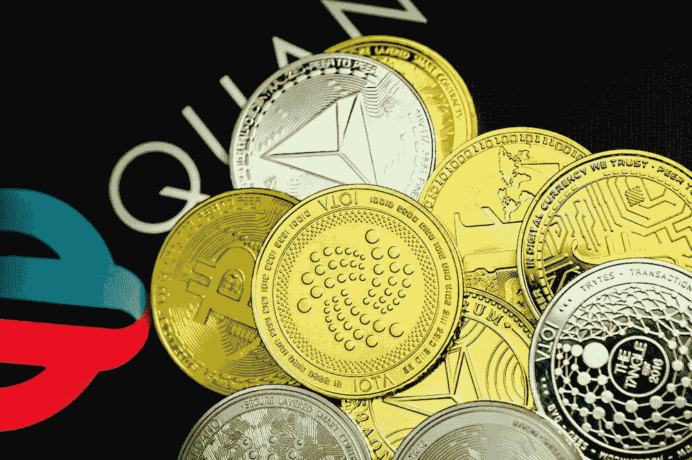

# 加密交易

> 原文：<https://medium.com/coinmonks/crypto-trading-64044e116ee5?source=collection_archive---------41----------------------->

加密货币交易是加密社区中的一项流行活动。它涉及到数字货币的买卖获利。加密货币交易是一种高风险但潜在有利可图的风险。那些交易新手应该意识到与交易相关的风险，并理解成功所需的策略。

任何想开始交易的人，第一步都是选择平台。这应该是…