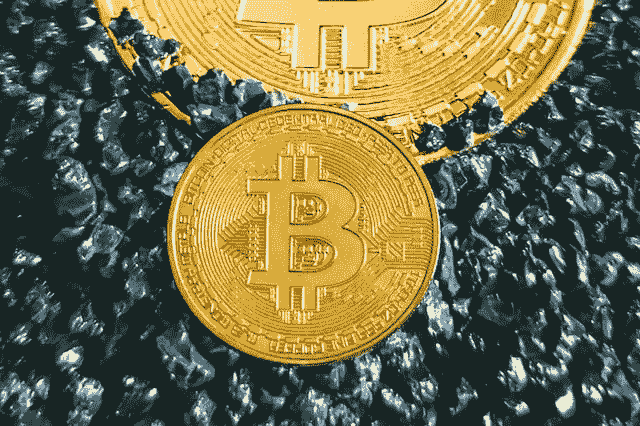

# 秘密交易。如何交易加密货币:买卖数字货币初学者指南

> 原文：<https://medium.com/coinmonks/crypto-trading-af148c8c510?source=collection_archive---------39----------------------->

# 什么是加密交易？

通过具有差价合约(CFD)的交易账户来投机加密货币的价格运动或通过交易所买卖基础硬币的行为被称为[加密货币](https://cryptobatman.blogspot.com/2022/08/Crypto-trading.-How-to-Trade-Cryptocurrencies-A-Beginners-Guide-to-Buying-and-Selling-Digital-Currencies.html)或加密货币交易。CFD 交易是一种衍生品，允许您在不拥有基础货币的情况下押注比特币(BTC)的价格。

两者都是杠杆工具，这意味着你只需要一笔小额存款，即加密货币保证金交易，就可以完全接触到基础市场。然而，由于你的盈利或亏损仍然是根据你的投资总规模来确定的，因此利用杠杆交易加密货币既增加了盈利，也增加了亏损。

此外，投资者使用加密货币期权来降低风险或增加市场敞口。加密期权交易是指一种“衍生”金融工具，其价值取决于另一种资产的价格——在这种情况下，是基础加密货币。

在考虑加密交易之前，对所涉及的资产和技术有一个完整的了解是很重要的。

与股票和其他金融市场一样，[加密货币](https://cryptobatman.blogspot.com/2022/08/Crypto-trading.-How-to-Trade-Cryptocurrencies-A-Beginners-Guide-to-Buying-and-Selling-Digital-Currencies.html)交易可能很复杂，涉及许多组成部分，需要知识。比特币于 2009 年推出，是第一种加密资产，目前仍是市值和使用率最高的加密货币。

然而，多年来，其他数字资产的整个行业已经出现，可以通过交易获利。所有其他非 BTC 加密货币都被称为替代硬币，其中最大的是以太(ETH)。

本指南将解释加密交易策略，并向您介绍加密交易平台和应用程序、交易组件、交易风格以及技术和基本面分析在创建综合交易策略中的作用。

# 新手如何交易加密货币

有许多不同的方法来交易加密货币。要开始交易加密货币，首先需要对该主题有足够的了解。了解所涉及的风险和可能适用的法律(取决于司法管辖区)也很重要，因此应做出相应的决定。

# 交易加密货币的步骤:

## 1.在加密货币交易所注册

如果你还没有加密货币，你需要在加密交易所开一个账户。市场上的顶级加密经纪公司包括币安、比特币基地、火币环球、FTX 和北海巨妖。所有这三个服务都有一个简单的用户界面和广泛的替代硬币选择。

要在加密交易所开户，您需要提供个人身份信息。创建帐户时，您需要提供您的地址、出生日期和电子邮件地址等。

## 2.向您的帐户注入资金

您将需要连接您的银行帐户后，注册与加密经纪。

银行转账通常是最经济的开户方式，在比特币基地和双子座上都有。

> 交易新手？试试[加密交易机器人](/coinmonks/crypto-trading-bot-c2ffce8acb2a)或者[复制交易](/coinmonks/top-10-crypto-copy-trading-platforms-for-beginners-d0c37c7d698c)