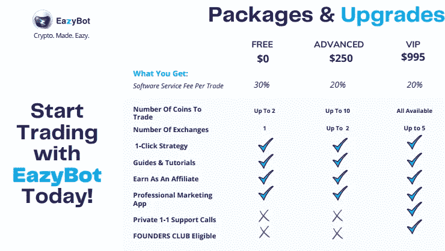
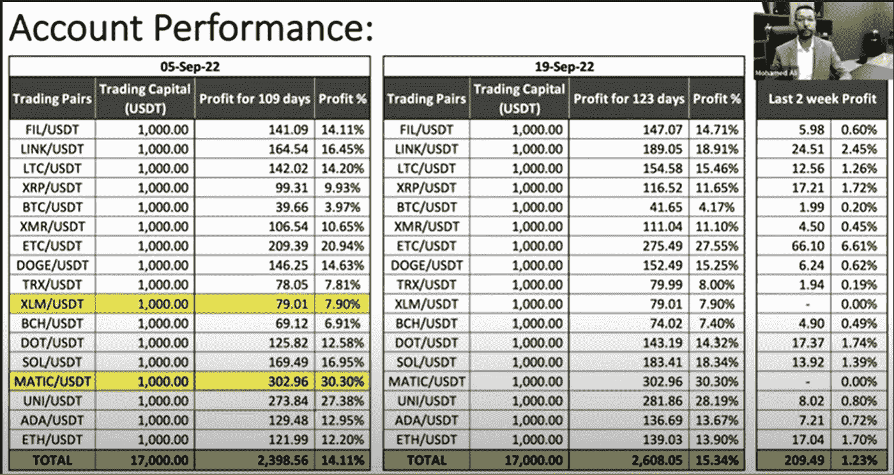
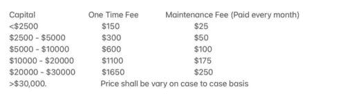

# 加密交易机器人—4 周内投资回报率高达 10%

> 原文：<https://medium.com/coinmonks/crypto-trading-bots-up-to-10-roi-over-4-weeks-67e1ff2ed1d8?source=collection_archive---------0----------------------->

嘿，伙计们，这是我之前写的一篇文章的后续，标题是[“启动 Crypto-TBAAS(交易机器人即服务)之前要考虑的事情”](/coinmonks/things-to-consider-before-starting-a-crypto-tbaas-trading-bot-as-a-service-d7c59d81ee0f)。但简而言之，随着围绕加密交易机器人的大肆宣传，有大量的骗局存在，所以我设计了一系列规则，帮助我最小化风险，同时试图最大化我的回报。让我重申一下，加密交易机器人天生就有风险，而且没有“保证回报”这回事我将在后面详细介绍，我对目前为止的一些结果很满意，所以我认为它们值得分享。

在经历了几个不同的选择后，我发现有两个机器人是有利可图的*和*也符合我的标准，它们是 [TradingBots.me](https://tradingbots.me/) 和 [EazyBot](https://my.eazybot.com/183442) 。正如我将在下面更深入地讨论的那样，两者都有一些值得在进入之前考虑的利弊，两套机器人都提供一些一致的回报，同时允许您完全托管和控制自己的资金。

在我们进入之前，作为免责声明，仅仅因为我在过去几周取得了这些回报，并不意味着我在未来也会取得同样的回报率——我们都知道加密交易是有风险的，我绝不是交易者，也不会试图冒充交易者。我只能说自从我的机器人开放以来，我已经做了多少，以及我如何定位自己的未来，这样我就有希望做更多。

# Eazybot

Eazybot 引起了我的注意，因为他们的收益历史记录非常公开——我邀请你亲自观看他们的一些业绩报告，因为它们都可以在他们的 youtube 频道上看到:[https://www.youtube.com/c/EazyBotGlobal/videos](https://www.youtube.com/c/EazyBotGlobal/videos)。除了他们的跟踪记录之外，他们的机器人是免费的(技术上不是 100%免费，但我稍后会谈到这一点)，你可以将自己的交易所与你的 API 密钥链接起来，这样你的机器人就可以执行交易，同时你可以保持对你的资金的控制。

**入门:**开户很简单，只需几分钟。非常欢迎你使用我的[推荐链接](https://my.eazybot.com/183442)或者直接去 [Eazybot 的网站](https://my.eazybot.com/)。在那里，您需要通过 API 密钥连接您的指定交易所(Binance.com、美国币安和库币的选项)。如果你不熟悉这个过程，他们有一些简单易懂的说明，告诉你如何选择交易。一旦你的交易所被连接，你还必须通过 USDT 加载至少 100 美元+约 2 美元的转让费(我建议通过 TRC20 发送，因为汽油费低)。为什么你需要在你的钱包里存至少 100 美元？这将引导我进入下一部分…

他们如何赚钱:**正如我之前提到的，开设 Eazybot 账户是免费的，但他们要求你至少向他们的 Eazybot 钱包提供 100 美元 USDT，因为他们赚钱的方式是从我们的机器人赚取的利润中撇取——但因为你可以在你指定的交易所访问你的资金，他们会从你的 Eazybot 钱包中扣除撇取费。他们有 3 种不同的会员选项，所有选项都提供了更高的可访问性级别和更低的利润费用:**

我自己选择了免费选项，因为我仍然在测试这个选项，老实说，我仍然对是否升级到高级包犹豫不决，更不用说 VIP 了。然而，正如你在图中看到的，免费包的主要缺点是你被收取 30%的“软件服务费”(再次从你的利润中扣除)，并且你被限制只能使用 2 个机器人，而付费包提供 10 个或无限个，这取决于你得到的包。

如果你想知道即使你在赔钱，你是否会被收取交易费用，机器人的工作方式是，它只会在盈利时关闭交易，这意味着你的一些交易可能会开放相当长一段时间，从技术上讲，如果你的机器人的相应令牌变为零或完全停滞，它们可能会永远开放！

一般来说，这些策略是如何工作的:像大多数机器人一样，EazyCrypto 机器人依赖于市场波动。我发现了一个很棒的视频，其中[的首席执行官详细解释了这个策略](https://www.youtube.com/watch?v=f8eUHXnJ1Mw)，但基本上一言以蔽之，不管市场是上涨还是下跌，当出现小幅回调(更具体地说是 0.5%)或小幅回撤(也是 0.5%)时，机器人就会交易。根据我的理解，机器人似乎使用 DCA 类型的方法，他们将不断地低买高卖。

**回报:**到目前为止，我已经运行了一个$ETC 机器人大约一周，在一个机器人上投资 900 美元，我获得了大约 2.69 美元，大约 0.02%的投资回报率或 16.85%的 APY。我不认为我真的认为这种回报是性感的，但机器人并没有带来全面的损失，所以在我看来，我真的不能抱怨。我之所以选择$ETC 机器人，是因为从他们最近的一次性能调用中获得的数据来看，它似乎从一开始就引起了相当多的关注:

为了了解如果我提前 4 个月启动这个机器人，我会赚多少钱，根据上面的数据，我会获得额外的 27.55%的投资回报率，这意味着我的总利润将再次达到 250.64 美元。然而，这都是取决于市场的，所以没有告诉未来的收入(或缺乏收入)。

# 交易机器人。我

我尝试的第二个机器人是 TradingBots.Me 上的那些家伙 [ShinyJackal](https://twitter.com/ShinyJackal) 和**[SMS | HCS sweet heater](https://twitter.com/sweetheater)。他们也有一个跨越几个月的公开记录，像 EazyBot 一样，你可以在机器人的整个生命周期内完全控制你的资金，你可以随时开始、停止或撤出资金。交易机器人的主要区别。然而，我和 EazyBot 认为，要开始工作，确实需要更多的信任。在他们的主页上，你会看到一些不同的推荐，这些推荐来自不同的有影响力的人，他们与他们有过良好的经历，在开始之前，我必须事先做一些审查，以确保这些人是合法的。**

**从表面上看，他们的系统似乎很草根。首先我们在 twitter 上联系，然后我们在 discord 上见面，他们向我介绍了如何设置我的账户以及我需要开设什么账户的一些细节。他们的机器人运行杠杆交易(我稍后会详细介绍)，所以为了运行杠杆交易，他们建议我开一个 3commas 账户，他们的机器人可以在那里运行，使用来自 FTX 的资金。换句话说，与 EazyBot 类似，我必须通过 API 将我的 FTX 连接到 3commas，这样机器人就可以用我的 FTX 基金执行交易。**

****他们是如何赚钱的:**这很简单，他们有一个基于初始启动费+维护费的细分，你每月支付的维护费取决于你希望更新机器人的时间:**

****

**这些费用对我来说很有意义，因为我不期望一个机器人永远持续工作，尤其是当我们经历不同类型的市场条件时。我还发现让这些人放心的是，在不到一个月的时间里，他们几次联系我，询问机器人的情况。**

**老实说，当我第一次开始时，我开始预料到我可能会失去所有的钱——我几乎做到了。当我付款时…我不小心付了 600 美元。 [ShinyJackal](https://twitter.com/ShinyJackal) 和**[SMS | HCS sweet heater](https://twitter.com/sweetheater)马上指出我的错误，秒钟就把钱退给了我。在这一点上，我对信任的任何保留都完全消失了，我不得不说，这些人表现出了很大的正直。****

****除了正直之外，当我在整个入职过程中问了一大堆问题时，这些人也对我表现出了极大的耐心。在入职过程中，他们能够向我介绍机器人通常是如何工作的，以及对它们有什么期望。这将引导我进入下一部分…****

******这些策略通常是如何工作的:**这就是 TradingBots.me 开始看起来与 EazyBot 等其他 TBAAS 有很大不同的地方。用交易机器人。对我来说，你有多个机器人协同工作——一个运行空头，另一个运行多头——两者都利用杠杆作用。此外，这些机器人(至少我正在使用的机器人)基于令牌期货，而不是实际的令牌本身。如果你不熟悉期货是如何工作的，我的理解(在我这个非交易者的大脑中)是，它们是基于投机价格的期货合约，这些价格可能是有问题的代币的价格。根据市场上发生的情况，如果令牌超买，机器人将执行短期交易，如果读取到令牌超卖，它将执行长期交易。再说一次，我不认为自己是一个交易者，所以如果你想要一个更好的解释，我强烈建议你亲自去找这些人，看看你是否能得到更多的细节。****

******回报:**我已经使用这些机器人大约 4 周了，我已经获得了大约 10%的投资回报率，平均每天大约 0.35%的投资回报率。假设事情以同样的速度进行，大约 4 个月后，这应该能够超过 EazyBot 上最好的机器人，平均每天产生大约 0.25%的能量。更进一步，我能说的是，我对交易机器人已经足够满意了。我最近决定将我的本金翻倍，只要机器人保持盈利，我可能会继续增加更多。****

# ****结论:****

****到目前为止，即使我已经获得了一些丰厚的回报，我也不能说我赚了改变生活的钱。然而，我对这些机器人超级兴奋，我确实打算在未来继续使用它们作为另一个被动收入来源。你可能会比较这两种 TBAAS 服务，认为交易机器人。我是超级机器人。就我目前所见，我不会对此提出异议，我在交易机器人上获得了更多的回报。比我和 EazyBot 在一起的时间还长。但我认为，即使是 [ShinyJackal](https://twitter.com/ShinyJackal) 或 [SMS | HCS sweetheater](https://twitter.com/sweetheater) 也会告诉你自己，一个机器人有多成功的真正证明是它能在长期内产生多少利润。****

****如果你有兴趣学习更多关于交易机器人的知识。我，我强烈建议你亲自联系 [ShinyJackal](https://twitter.com/ShinyJackal) 或 [SMS | HCS sweetheater](https://twitter.com/sweetheater) ，和/或[你可以看他们最近和詹姆斯·佩尔顿一起制作的《AMA》。](https://youtu.be/mApqgmsWd4w)****

****或者，如果你有兴趣了解更多关于 EazyBot 的知识，他们在 youtube 频道上也有大量的[教程和演练，我建议你去看看。](https://www.youtube.com/c/EazyBotGlobal/videos)****

****感谢阅读，请一如既往地在 twitter 上关注我，阅读我的最新发现和更新:[https://twitter.com/CryptosWith](https://twitter.com/CryptosWith)****

****声明:这些信息都不是财务建议，只是我在网上随便找的一个人的推测。请考虑这纯粹是教育和娱乐的目的。像往常一样，请做你自己的研究或联系财务顾问，找到什么投资可能最适合你。****

> ****交易新手？尝试[加密交易机器人](/coinmonks/crypto-trading-bot-c2ffce8acb2a)或[复制交易](/coinmonks/top-10-crypto-copy-trading-platforms-for-beginners-d0c37c7d698c)****