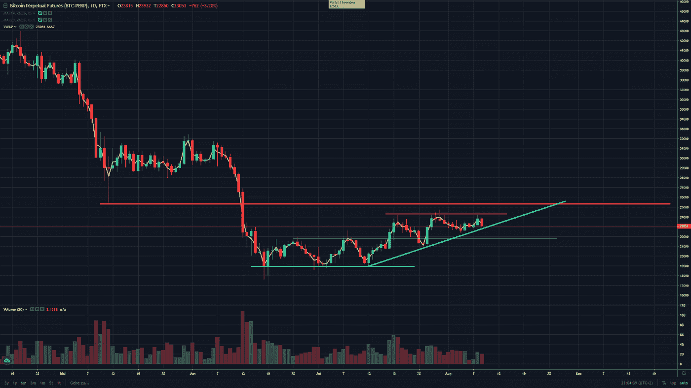
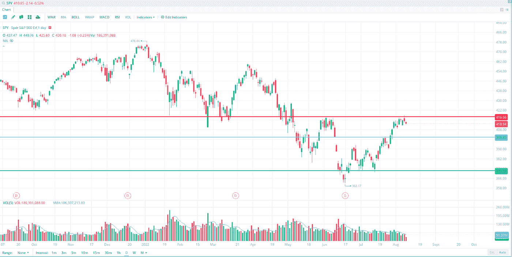
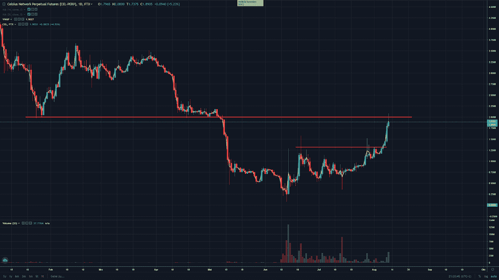

# 秘密交易的想法

> 原文：<https://medium.com/coinmonks/crypto-trading-ideas-3778e0ae95e2?source=collection_archive---------56----------------------->

在每日时间框架上，比特币(BTC)是向上的，这是由浅蓝色的趋势线标记的。它正在设定更高的低点，但在大约 24.3 美元区域有一些很好的阻力，这是由短红线标记的，短期阻力。比特币正在接近 24.3k 美元线，但所有接近该水平的日子都有良好的灯芯，表明有供应的区域。这将很难打破。

由于加密市场和股票市场往往相互关联，你应该总是关注美国指数，至少用一只眼睛。美元间谍(500 家美国公司，我用这个作为“美国市场的状态”)正在接近 418-420 美元的重要阻力区。$SPY 的图表如下所示。

如果这一阻力被打破，我们可以看到美国股票市场和加密市场的上涨。所以要小心突破或失败，但是要警惕假突破。

以下贸易理念是关于摄氏(CEL)的表征。尽管最近几天市场情绪更加乐观，但交易思路是做空。Celsis 上涨了很多，这本身根本不是做空的理由，但它在 2 美元到 2.10 美元左右的区域遇到了很大的阻力。我会等待它测试这个水平，并从那里做空。如果市场继续上涨，我会小心，并在上方止损。在图片上，你可以看到粗红线，这是 2 美元的阻力，我会做空。

这个想法是这样的:

入口区域:1.95 美元到 2 美元

止损:2.10 美元以上

利润目标:取决于市场如何变动:1.50 美元将是一个很好的目标，这里有一些支撑。如果市场似乎下跌并打破短期上升趋势，那么 1.30 美元左右是我寻找的下一个目标。

这只是一个想法，我会如何交易，所以每个人都应该设置自己的风险水平，目标水平和止损水平。这是为了让人们了解它是如何被交易的。

希望这在某些方面有所帮助。

祝您愉快！

尼克拉斯

我正在使用 https://ftx.com/referrals#a=39334503 进行交易，如果你也想这样做，请随意使用下面的推荐代码:

声明:这不是财务建议！