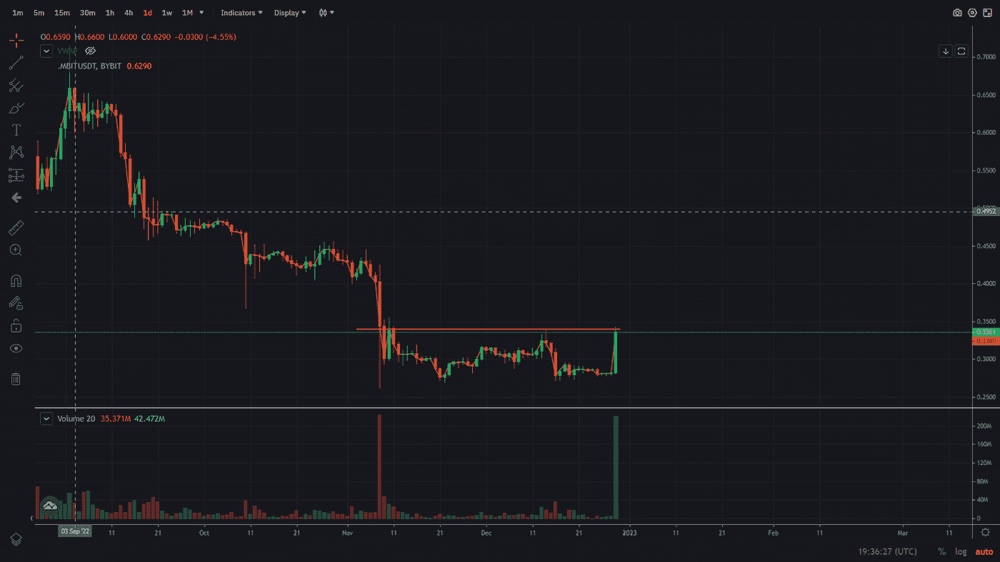
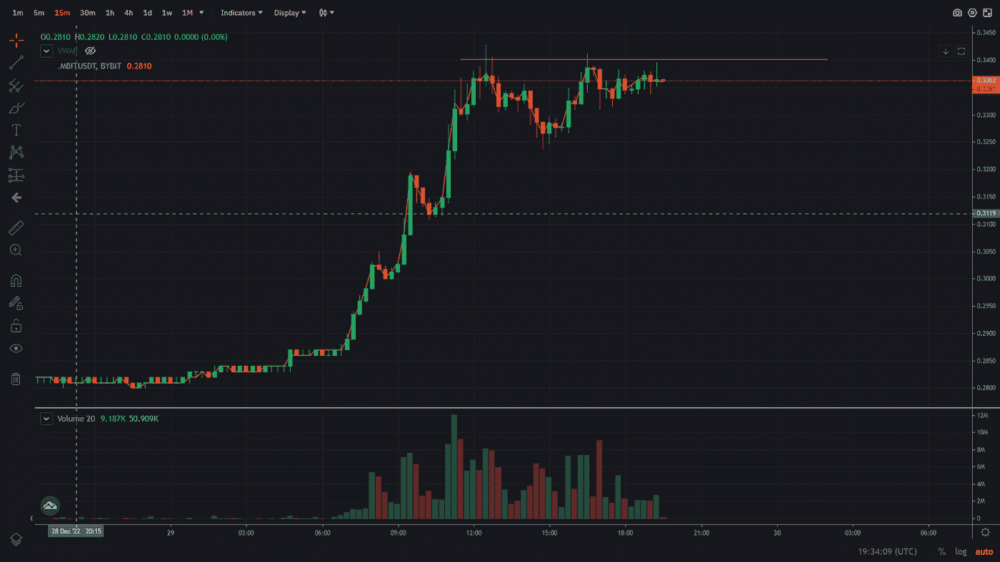

# 加密交易聚焦—位道(BIT)

> 原文：<https://medium.com/coinmonks/crypto-trading-spotlight-bitdao-bit-bb8f3d623b98?source=collection_archive---------36----------------------->

*29.12.22*

今天的加密交易聚焦于加密货币 BitDAO，这是一个由$BIT 令牌持有者管理的建设者、产品和互利生态系统的集合。

我对加密货币 Solana 的最后一个交易计划非常成功。从 12.50 美元涨到现在的 9 美元以下。可以通过以下链接看一下规划:[https://medium . com/degenarchive/trading-spot light-cryptocurrency-sola-1e 247 b 868 f 5](/degenarchive/trading-spotlight-cryptocurrency-solana-sol-1e247b868f5)

> 交易新手？在[最佳加密交易](/coinmonks/crypto-exchange-dd2f9d6f3769)上尝试[加密交易机器人](/coinmonks/crypto-trading-bot-c2ffce8acb2a)或[复制交易](/coinmonks/top-10-crypto-copy-trading-platforms-for-beginners-d0c37c7d698c)

与加密市场的其他产品相比，$BIT 已经出现了相当大的飙升，从大约 0.28 美元涨到大约 0.34 美元，现在大约为 0.337 美元。到目前为止，它 3 次超过 0.34 美元，每次都被拒绝，但它仍然呈上升趋势。它在那里遇到了阻力，这是日线图和 15 分钟图上的阻力。你可以看到下面的日线图，阻力线在 0.34 美元左右。

BitDAO 1 day chart

该计划取决于阻力线持有与加密市场仍然疲软，并没有显示出良好的实力迹象，阻力线持有的机会是很好的，在我看来。

为了支持日线图，我看了 15 分钟图，你可以在下图中看到。

$BIT

因此，交易计划是在 0.34 美元的阻力下做空，寻找 0.30 美元以下的价格水平来回补头寸。这项交易的风险正好在 15 分钟图表的近期高点之上。这个价格水平是 0.3428 美元，所以如果价格超过这个水平，我有一个止损单。

这项交易的风险范围很窄，所以风险回报很高。进场水平越接近 0.34 美元，你可以走得更大，但要小心快速飙升。你的入水越好，你就能越快地覆盖你的位置，获得一点缓冲，对你的位置更舒服。

我希望这能帮助你更好地了解我的贸易计划。下面是一个一句话的贸易计划版本。

**TLDR**

针对 0.34 美元阻力做空 BitDAO，在最近的 0.3428 美元高点上方设置止损，进场价格在 0.335 美元至 0.34 美元区间，目标价格在 0.30 美元区间下方。

祝你有美好的一天和新年。

尼克拉斯

这不是理财建议，只是出于教育目的！

> 加入 Coinmonks [电报频道](https://t.me/coincodecap)和 [Youtube 频道](https://www.youtube.com/c/coinmonks/videos)了解加密交易和投资

# 另外，阅读

*   [Pionex 双投](https://coincodecap.com/pionex-dual-investment) | [AdvCash 审核](https://coincodecap.com/advcash-review)
*   [面向开发者的 8 个最佳加密货币 APIs】](https://coincodecap.com/best-cryptocurrency-apis)
*   [加密交易机器人](/coinmonks/crypto-trading-bot-c2ffce8acb2a) | [维护审查](https://coincodecap.com/uphold-review)
*   [十大最佳加密货币博客](https://coincodecap.com/best-cryptocurrency-blogs) | [YouHodler 评论](https://coincodecap.com/youhodler-review)
*   [my constant Review](https://coincodecap.com/myconstant-review)|[8 款最佳摇摆交易机器人](https://coincodecap.com/best-swing-trading-bots)