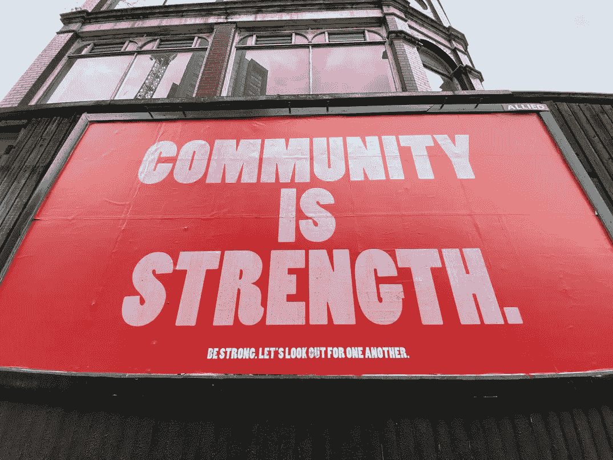

# 秘密部落主义是 FUD

> 原文：<https://medium.com/coinmonks/crypto-tribalism-is-fud-23aa42912cfe?source=collection_archive---------21----------------------->

作为人类，我们天生就是部落。在人类历史的遥远过去，部落制度是一种强有力的生存机制。部落是一个安全网。外来者争夺食物和资源，因此对部落的生存构成了威胁。在加密领域，我们看到类似的团体围绕他们的区块链协议或选择的项目形成。你可能听说过[比特币狂热分子](https://www.investopedia.com/terms/b/bitcoin-maximalism.asp#:~:text=our%20editorial%20policies-,What%20Is%20a%20Bitcoin%20Maximalism%3F,currencies%20are%20inferior%20to%20Bitcoin.)或者 Terra 的[疯子？](https://news.bitcoin.com/the-lunatic-movement-a-look-at-terra-lunas-inception-and-the-people-that-helped-do-kwon-rise/)

秘密部落制度很奇怪。它既是有毒的，同时也是一种授权。我相信秘密部落主义诞生于空间中最有力量的方面。Crypto 和 web3 来自于一个统一的构建者社区，他们相信一个去中心化的、公平分布的世界，在那里每个人都有平等的参与机会。这种公共目的感是两年前吸引我进入这个领域的原因，也是从那以后让我越来越乐观的原因。

[Credit Unsplash](https://unsplash.com/photos/-_5IRj1F2rY)

不幸的是，这在某些情况下走得太远了，问题“我们如何才能创造一个更美好的世界”已经被“我们如何才能击败其他项目”所取代。在某种程度上，这是有道理的。在 crypto 有一种强烈的社区意识，大多数人渴望归属感，特别是在疫情隔离两年之后。可以理解的是，人们会寻找他们能感觉到自己是其中一员的社区，并会尽一切努力与这个群体站在一起。当他们感到自己是这个部落的一部分时，就会增强对个人的信念，并使他们的归属感永存。对于那些寻求归属感的人来说，这是一种非常强大和令人陶醉的感觉。我当然也不能幸免。很容易陷入你所相信的社区而回避其他项目。问题是这一切都不相关，我们正在以自己的方式前进。

# **关注重要的事情**

我想提供另一种观点。部落主义是不相关的噪音，对空间没有长期影响。这实际上是 FUD 的另一个例子。最终胜出的协议将不会是最强的社区喊得最响的结果。你知道为什么吗？因为绝大多数人都不在乎。不管你有多投入，或者你有多相信你的协议的远景和技术能力，一般人最终都不会注意到这一点。

人们关心能让他们生活得更好、更有成果的事情。大多数人都有工作、家庭、抵押贷款、健康问题、信用卡债务和一堆其他现实世界的问题要处理。即使你的部落是最大和最伟大的，除非你的协议的应用程序为人们提供解决方案，使他们的生活变得更好，否则它永远不会“赢”。我认为这对于那些被自己的部落冲昏头脑的人来说是一个重要的提示。专注于重要的事情。

Investing app — Coinbase. Credit [Unsplash](https://unsplash.com/photos/9opiHRPIvR0)

# **针对投资者**

请忽略来自秘密部落的大声尖叫。这些应该不会影响您的加密投资决策。借此机会让自己摆脱任何偏见，回到投资的基础上来。看看资产的基本面。有哪些协议实际上在为用户创造可观的价值和应用？哪种协议可以支持快速创新？哪些项目为用户提供了安全性？什么工具最粘？只要看看像这样的基本问题，就可以帮助你构建一个项目的未来图景。当然，也有一些技术基础可以发挥重要作用，比如一个项目的令牌组学。但是，如果人们不想使用它，即使是一个具有优秀令牌组学的项目也会失败。

这并不是说这种投资方式会消除风险。加密仍然是一种高风险的资产类别，无论未来看起来多么光明，你都可能失去你投入的东西。但是既然你已经在这里了，你可能会好奇并且能够承受一定程度的风险。在这种情况下，忽略 FUD。消除任何源自其他部落的偏见，专注于项目的基本原则。最重要的是，享受探索这个空间的乐趣。

> ***围绕比特币和其他加密货币的部落主义正在阻碍整个 2 万亿美元的市场。我拥有比特币，我拥有以太，我拥有其他一些。我绝对相信这个行业将继续繁荣***——Ripple 首席执行官布拉德·加林豪斯。

# **对于建筑商**

由于我不是区块链或 dApp 的工程师，这主要是对那些谁是恳求。与其为你的社区而战，并试图用最响亮的声音击败“其他人”，不如更专注于确保你所构建的一切都是为了普通消费者的利益？如果你真的相信这个项目，关注人们关心的事情。让它成为你的用户的美好体验并打造最好的产品。你的“部落”就是这样赢的。简单地做最伟大的事情。

最后，记住竞争推动创新。无可辩驳的历史证据证明了健康竞争的好处。我们不再是依靠部落生存的史前人类。如果你是加密空间的支持者，并希望看到它在未来蓬勃发展，你应该庆祝竞争。更多的竞争意味着更多的人关注这个领域，更多的团队试图解决问题，以及更多优秀的产品被制造出来。我们都在一起进行加密之旅，我们可以作为一个大社区站在一起，帮助将 web3 带入主流，让世界变得更好。

这是我对秘密部落主义的简单看法。很想听听你对这个观点的想法和批评！

> 交易新手？试试[加密交易机器人](/coinmonks/crypto-trading-bot-c2ffce8acb2a)或者[复制交易](/coinmonks/top-10-crypto-copy-trading-platforms-for-beginners-d0c37c7d698c)