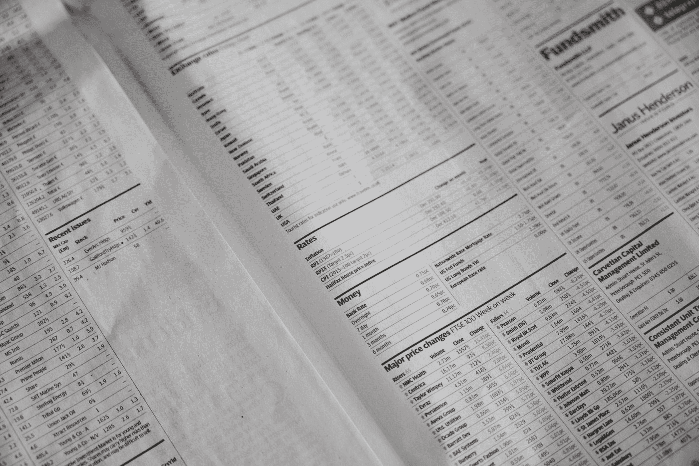

# 使用 TVL 的加密评估

> 原文：<https://medium.com/coinmonks/crypto-valuation-using-tvl-26a7fa7e9dce?source=collection_archive---------23----------------------->

Photo by [Annie Spratt](https://unsplash.com/@anniespratt?utm_source=medium&utm_medium=referral) on [Unsplash](https://unsplash.com?utm_source=medium&utm_medium=referral)

对加密项目的评估并不容易，因为传统金融理论的许多方面在这里并不适用。从金融角度来看，由于缺乏有关加密项目的信息，这项任务变得更加困难。最后靠抽象的基本面数据(无法量化)&技术分析(不掌握窍门就是巫毒)来猜测。

当 [Zignaly](https://zignaly.com/) 上个月推出其 DAO 路线图，并透露他们的目标是 100 亿美元的总价值锁定(TVL) &用户 30%的利润目标时，我很感兴趣。有了这些信息，以及 Zignaly 今天从市场上的所有利润中抽取 5%的事实，我决定用传统金融理论进行一些计算。

> **请注意，我的目的不是兜售硬币，而是分享如何从学术上解读估值模型的想法。请自行研究&自担风险。这不是财务建议。**

**框架:** 在我们开始计算之前，让我们来谈谈我们将采用的框架。

如今，该平台管理的资产仅为 1.2 亿美元。他们打算在 TVL 达到 100 亿美元(如果我们用 aum 代替他们)，我们有一个项目时间表，说他们将在 2023 年第四季度实现这一目标。在加密领域，永远不要说永远，但出于我们学术分析的目的，安全的途径是，当项目确实达到 100 亿美元的 TVL 并在那里工作时，对项目进行估值。

为了做到这一点，我决定把收入流(5%的利润分成)作为一种永久的东西。永久支付是指每年支付一次，直到永远。它们可以被指定为成本或收益。传统金融理论旨在使用[戈登增长公式](https://www.investopedia.com/terms/g/gordongrowthmodel.asp#:~:text=Key%20Takeaways,the%20required%20rate%20of%20return.)的变体来评估永续价值，其中:

*股息/要求的资本回报率=估值*

我选择走永久路线的原因是，缺乏 100 亿美元 TVL 目标实现后的增长率信息。因此，我简单的假设是，该项目将永远停留在 TVL 的水平(不太可能，但必须用现有的东西来凑合)。

> 交易新手？尝试[加密交易机器人](/coinmonks/crypto-trading-bot-c2ffce8acb2a)或[复制交易](/coinmonks/top-10-crypto-copy-trading-platforms-for-beginners-d0c37c7d698c)

**数学**

出于我们的目的，我们将考虑:

-在我们的戈登增长模型中，5 亿美元作为道国库的收入，替代股息。这是 TVL 的 5%，约为服务提供商目标利润的 16.67%。这符合目前的收费标准。

- 5%是要求的资本回报率，因为这是 Zignaly 作为一个平台目前收取的编程利润份额，并且似乎很满意。\

**未稀释基础上的估价:**

*[500，000，000/5%] /流通供应量，其中流通供应量= 413，000，000 美元。结果是每$ Zig 24.21 美元。*

> **哇！**

然而，这太简单了，因为它没有考虑流通供应的增加，所以更好的衡量标准是在完全稀释的基础上看估值。

**完全稀释基础上的估值:**

*[500，000，000/5%] /总供应量，其中总供应量= 2，000，000，000 紫币。结果是每$ Zig 5 美元。*

> **还哇！**

**结论注释**

这些估值能否实现是一个悬而未决的问题，正如我所说的，这不是一个试图兜售硬币。然而，严格地说，我相信这给了我们一个洞察力，通过传统的方法来评估加密项目是可能的。

我们的分析有一些缺陷，我认为是因为缺乏信息。这些是:

*   我们将 DAO 的收入而不是 DAO 的利润计入，因为它将是扣除费用后的国库盈余，这些费用将形成 Zig Coin 持有者应得的股息流；
*   我们假设道每年都会分配所有盈余，这也是不切实际的；
*   我们假设 5%的利润份额将保持不变，在我看来，这将合理化，因为他们的目标是为平台提供更多的服务提供商。

你觉得这个怎么样？请让我知道，因为我很乐意与你合作，听听你的反馈&也许能在这个话题上了解更多。

干杯！

> 你可以在这里 & [这里](https://aayushbhaskar.com/zignaly/)了解更多关于 Zignaly [的信息。使用我的推荐链接](/coinmonks/project-review-zignaly-part-1-cd814fcc8dd6)[注册任何投资 100 美元的利润分享服务](https://t.co/0B7OueA4iJ)，您将获得价值 20 美元的 Zig 奖金。

> **免责声明:**本文观点仅代表作者个人观点，不代表其雇主的观点，也不代表财务建议。在投资或使用文中提到的任何产品之前，请做好自己的研究。作者可能会也可能不会投资于任何特定的产品。