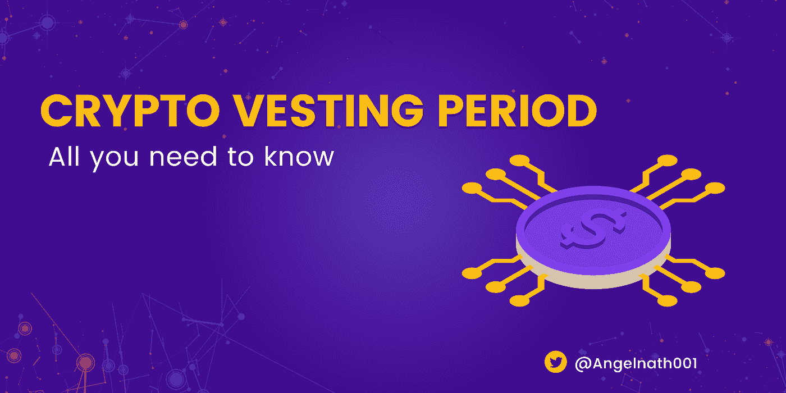

# 加密授权期:你需要知道的一切

> 原文：<https://medium.com/coinmonks/crypto-vesting-period-all-you-need-to-know-c7a085fdbd98?source=collection_archive---------28----------------------->

资金是每个加密初创公司在启动时面临的一个主要问题。因此，需要通过预售活动、首次发行硬币(ico)或公平发行向公众提供一些代币来筹集资金。这给了天使投资者、风险资本以及个人更早更便宜地购买这些代币的机会。

这些资金随后被 crypto 项目用来进一步开发他们的项目。但是当大股东同时出售他们所有的代币时，这个项目和小投资者的命运将会如何？

这就是为什么理解加密授权期的含义很重要。

# 什么是加密授权期？

加密授权期是投资者或项目团队持有一定数量项目令牌的一段时间。

在此期间，既得代币不可出售或交易。授权期结束后，所有投资者或项目团队都可以在市场上自由出售代币。许多项目经常使用授权期来确保员工在项目的成功中有股份。

许多项目为员工提供股票期权或其他形式的股权，这些股权会随着时间的推移而归属。投资者也可以利用授权期来帮助管理他们的风险。通过投资有归属期的加密货币，投资者可以从长计议，减少市场波动风险。

这可以帮助他们保护自己的投资免受加密货币价格不断变化的影响。因此，每个投资者和密码爱好者都需要充分了解不同类型的密码授权期如何影响他们的投资。

# 加密归属期的类型

了解不同类型的归属期以及它们如何影响代币的价值是很重要的。通过了解不同类型的归属期及其运作方式，您可以就何时交易或清算您的代币做出明智的决定。

每个项目可以决定使用不同类型的授权期，但在加密领域有三种常见的主要类型。

*   **线性归属期**

这是一种授权期，在此期间，一个项目将在一段时间内释放等量的授权股票。

例如，项目**恐惧公司**以令牌**$恐惧**使用线性授予类型授予其令牌四年。这意味着该项目将在第四年之前每年释放 25%的既得权标。

*   **分级可行权期**

这是一种授予期，授予的代币在设定的时间段内以 **的增量**释放**。**

例如，如果归属期为四年，那么第一年后可以释放 20%的代币，第二年后释放 25%，第三年后释放 25%，第四年后释放剩余的 30%。

这种类型的授权期在员工薪酬中很常见，员工在一段设定的时间内获得递增的代币。但是，如果团队成员在授权期结束前未经核实批准而离开，则他/她将无法获得其授权令牌的剩余部分。

*   **悬崖归属期**

这是一种授权期，在此期间，一个项目决定在一段时间后立即释放其所有的授权令牌。

如果某个项目**【c 罗】**决定授予某个金额的代币**【山羊】**3 年，代币将一直锁定到第三年之后才可以交易或出售。这种类型的授权主要用于 ICO 和 IGO，所有投资者只允许在一段时间后出售，通常是在 ICO 或 IGO 结束后。

# 加密授权期的重要性

对于那些希望将加密货币用于投资或作为一种支付形式的人来说，加密授权期是一个重要的概念。

由于各种原因，这段时间非常重要，了解这段时间有助于确保您在投资或使用加密货币时做出明智的决定。这一原因包括但不限于:

*   **它有助于防止投资者诈骗**

授权加密消除了对泵和转储撇油感兴趣的买家。这些投资者发现，在出售资产之前等待一段特定的时间是没有吸引力的。他们的目标是围绕代币制造炒作，以提高硬币的价格，并尽快出售。因此，授权加密阻止了这种方案。

*   **它有助于减少代币波动**

有一个归属期可以帮助降低投资的波动性，确保大投资者不会一下子卖掉他们所有的股票。

当代币被安全地锁定在一个授权计划中时，如果公司被认为是成功的，它们更有可能保持其价值，甚至增值。这也让早期投资者确信他们的加密投资是安全的，并且可能会增值。

*   **它给开发者时间来构建他们的项目**

在项目最终向公众发布之前，授权给了开发者时间来建造他们的项目。团队也可以利用这段时间通过意识让项目进入人们的头脑。投资者也有时间评估项目并检查其进展。这将决定他们是否会持有、出售或交换项目发布时的代币。

# 结论

加密授权期是投资和使用加密货币的重要组成部分。通过理解这一概念及其工作原理，您可以确保在投资或使用加密货币时做出明智的决策。花时间研究你投资的项目的授权期可以帮助你免受诈骗，降低风险。

# 你觉得这篇文章怎么样？下面分享一下你的想法。

如果你想了解更多关于区块链、GameFi、NFTs 和元宇宙的信息，请关注这个频道。

# 您也可以通过 [Twitter](https://www.twitter.com/Angelnath001) 与我联系