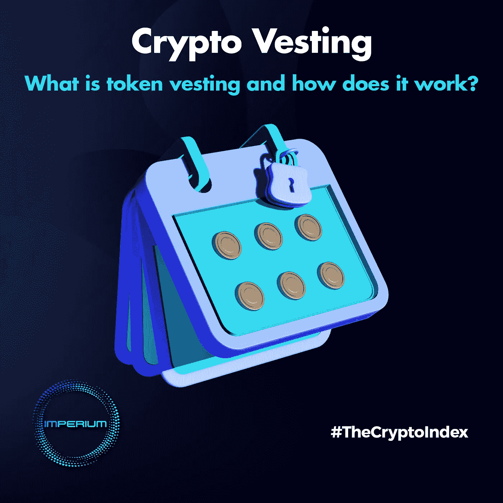
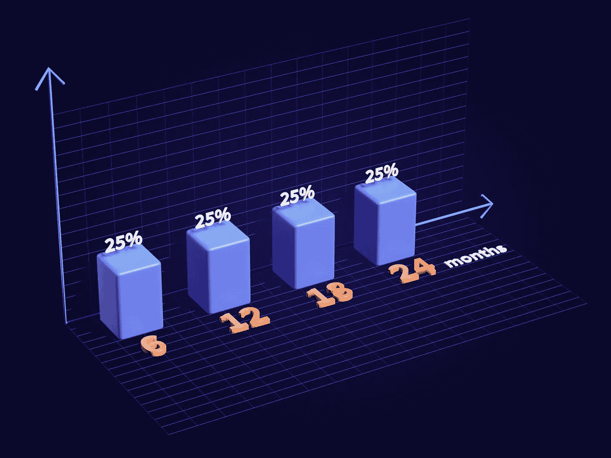
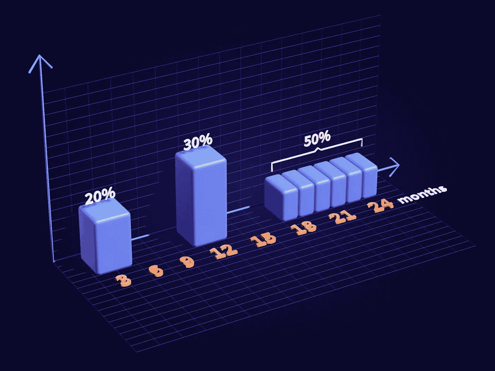

# 加密授权:什么是令牌授权，它是如何工作的？

> 原文：<https://medium.com/coinmonks/crypto-vesting-what-is-token-vesting-and-how-does-it-work-d5e6be189b40?source=collection_archive---------50----------------------->

所有的企业在开始时都需要资金来将他们的愿景变成现实。加密项目也不例外。

大多数情况下，这些资金来自通过预售和首次发行硬币(ico)进行的外部投资，机构和个人投资者参与其中，希望在令牌可以在交易所交易时获利。

为了防止投资者同时卖出他们所有的代币，从而倾销硬币的价格，实施了一个锁定期，称为“归属”。

# 什么是加密授权？

传统上，授权是指员工随着时间的推移获得对雇主提供的资产的权利的方式。这是一种激励他们表现出色并在公司呆更长时间的机制。这些奖金可以是公司的股票或 401(k)计划，员工根据雇主制定的授权计划获得全部所有权。

在加密中，授权是锁定一定数量的流通令牌的过程。这意味着代币在特定时间范围内被限制出售，投资者只有在该时间到期后才能获得对其资产的完全控制权。

通常实施加密授权(或代币授权)是为了防止硬币在交易所上市后市场上代币供应增加。如果没有这样的措施，投资者可能会一次性出售所有代币，这将导致硬币价格暴跌。

此外，授权是一种安全措施，可以防止开发团队放弃项目并带着资金逃跑。

授权计划可以持续 48 个月甚至更长时间。过去，平均授权期通常是 0-24 个月，但现在，它可以延长到 36-48 个月。

# 令牌归属是如何工作的？

每个项目根据自己的需求和目标决定自己的归属时间表，每个项目都有所不同，每个项目都试图在对投资者有吸引力的投资报价和安全的发行时间表之间找到最佳平衡。

在授权到期后，根据合同中建立的令牌锁定条件，可以手动分发令牌。

但这通常是通过智能合约或第三方平台自动完成的，因为一个加密项目可能有许多投资者，在一个 ICO 中有许多小额投资。这也降低了违规操作和安全攻击的风险。

参与加密项目早期开发的所有各方(核心团队、合作伙伴、顾问和其他各种贡献者)以及种子或售前阶段、ico 或 IDOs(首次 DEX 发行)的早期投资者都属于授权对象。虽然，他们可能有不同的归属时间表。

# 归属计划的类型

传统上，授权有两种类型:

**悬崖归属** —在某个日期之后，资产所有权被一次性授予。

**分级归属**——资产随着时间的推移逐渐解锁或分配的情况。

在 crypto 中，通常采用混合模型，这意味着归属时间表由初始悬崖(没有奖励代币的区间)和随后的分级归属日历组成。

分级归属本身有两种类型:

**线性归属** —代币在指定的时间内平均分配。例如，一个项目可能每 6 个月发布 25%的锁定令牌，总共 24 个月。

Linear vesting

**扭曲授予** —代币在不同的时间段内随机发放。例如:20%的代币在第三个月发行，然后 30%的代币在一年后发行，随后是 6 个月的悬崖，其余的在 6 个月内每月解锁。在这里，想象力是唯一的限制。当然，还有项目的目标。

Twisted vesting

# 象征性归属期的好处

首先，授权有助于防止“垃圾”充斥市场，这已被证明会降低代币的价格和项目的整体价值。当代币被锁定时，稀缺性就产生了，这有助于硬币保持甚至增值。

随着 DeFi 空间充满骗局和阴谋，授权团队成员和早期投资者的资产可以保护加密空间免受欺诈或不道德行为的影响。如果一个项目没有授权期，它可能会有机会主义创始人和投资者的风险，一旦价格达到最高，他们就会卖掉手中的代币，然后放弃这个项目，从相信它的人那里获利。

授权过程也给团队时间去开发他们的产品。因此，开发团队有空间和安心去测试、改进和上线，而不必担心马上卖掉他们的股份。在此期间，项目可以以健康的方式建立其受众，并达到其路线图中的里程碑，而无需担心流动性问题。

此外，投资者可以利用这段时间来评估项目的表现，并决定他们是否要投资更多，持有他们的代币或清算它们。

最后，就像在传统市场中一样，授权培养了团队成员对项目的忠诚和承诺。随着他们持续的财务承诺，他们将投入更多的时间和精力来发展和创新产品，以增加其长期价值。

作为尽职调查的一部分，投资者应考虑项目的授权时间表。

应该避免大的解锁时间表，因为它们会产生沉重的抛售压力，抑制积极的价格行动。

投资者还可以通过比较硬币的流通供应量和总供应量来衡量代币价格的健康程度。之间的差异代表了将来要解锁的既得令牌

拥有一个健康的授权时间表对于一个加密项目的发展和吸引新的投资者，平衡他们的利益和早期投资者和贡献者的利益是至关重要的。

> 交易新手？试试[加密交易机器人](/coinmonks/crypto-trading-bot-c2ffce8acb2a)或者[复制交易](/coinmonks/top-10-crypto-copy-trading-platforms-for-beginners-d0c37c7d698c)