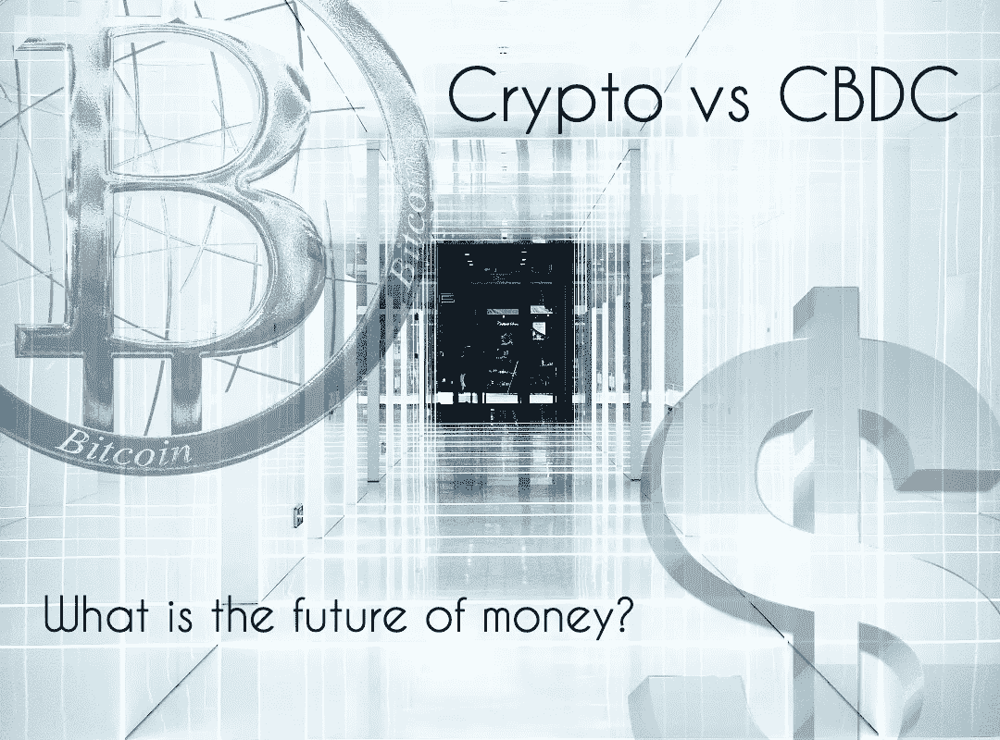

# Crypto vs CBDC:货币的未来是什么？

> 原文：<https://medium.com/coinmonks/crypto-vs-cbdc-what-is-the-future-of-money-3352253438c9?source=collection_archive---------4----------------------->

CBDCs 正在世界各国进行测试。有没有好处，有什么风险，对 crypto 意味着什么？

Image: PixTeller

# 一枚硬币统治所有人？

中央银行数字货币(CBDCs)是加密社区的一个主要话题。也就是说，我认为可以有把握地说，加密投资者对 CBDCs 不太感兴趣。