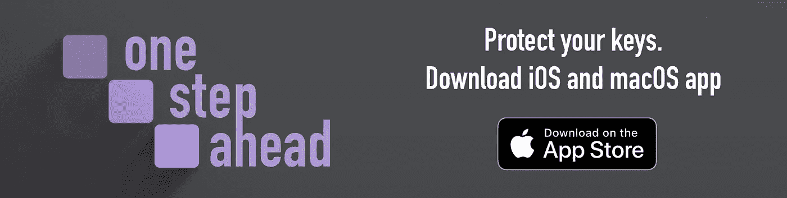

# 加密钱包

> 原文：<https://medium.com/coinmonks/crypto-wallets-8d9705c24877?source=collection_archive---------32----------------------->

Crypto wallets image

是时候澄清一些围绕理解加密钱包的困惑了。钱包是密码难题中最重要的应用之一。没有他们，就没有比特币、以太坊、XRP 等。钱包是加密货币生态系统不可或缺的一部分。它们是用户和服务之间交易的支柱。

如果你声称拥有加密货币，但从未设置钱包，很可能你无法控制对资产的访问，交易是代表第三方服务进行的。因为这些钱包是由与你有协议的第三方服务保管的，所以它们被称为保管钱包。你必须非常小心你把你的资产放在哪里。如果服务出了什么问题，你可能会付出很高的代价。

One Step Ahead app for iOS and macOS

# 那么为什么不建议把钱包里的资产交给专业商家管理呢？

让我们从解释什么是真正的加密钱包和它是如何工作的开始。钱包是一种连接到特定加密货币的区块链的软件。它有独特的公共地址作为它的身份。这个地址通常由字母数字字符串表示，您将它提供给其他人或服务来接收您的加密货币资金。

要使钱包存在，它必须有一对私钥和公钥。提到的公共地址来源于公共密钥(注意，钱包地址和公共密钥是不同的)。即使密钥是公开的，您自己保存它也更安全。有些钱包让你选择创建多个地址。他们甚至鼓励更好的安全性，每笔交易都应该创建新的地址。不是所有的钱包都有这个功能。

另一方面，私钥仅供您个人使用，不应共享。它们在钱包中有特殊的位置——它们允许发送加密资金。在加密领域，它们也是资产所有权的证明。因此，你经常会听到这样一句话 ***不是你的钥匙，不是你的硬币***——指的是拥有私人钥匙。丢失私钥相当于丢失资产。把你的比特币或其他加密货币放在钱包里，而私钥不在你的控制之下，就是放弃所有权。

简而言之，保管钱包是私人钥匙不受你控制的钱包。非保管钱包为你提供私人钥匙，你拥有它们，你需要保管它们。做出更好的选择。

# 冷热储存

到目前为止，您已经了解了保管型和非保管型钱包的区别。

但是，更有趣的是，非托管钱包可以是一个简单的软件，运行在你连接到网络的设备(手机、笔记本电脑、台式机)上。这种钱包被称为热钱包。因为它们是在线的，你可以随时处理你的资产。它们非常舒适，但是它们有一个很大的安全缺陷——容易受到在线攻击。

与之相对的是冰冷的钱包。通常，但不是必须以 USB 设备的形式。冷藏被认为是更安全的选择，因为不需要互联网来存储加密资金。您只需设置一次，就能保证它们的安全，远离网络。从冷库中窃取资金是很困难的，因为占有并不能立即获得其资产。

冷钱包不仅仅是 USB 设备，而是任何让你的资金远离网络的方法。它们包括纸质钱包，实物比特币，或自我发明的离线存储。

# 纸质钱包

该术语源自传统方法，并不仅仅指将您的密钥存储在纸上。在比特币的早期阶段，将你的私钥打印在一张纸上，然后放在袜子抽屉里是很多人的选择。由于加密货币的普及程度增加，不再推荐这种方式。

纸质钱包这一术语涵盖了任何将您的私钥拿在手中并安全存储它们的方法，而没有直接在任何钱包中呈现数字资产，无论是冷的还是热的，保管的还是非保管的。需要时，您可以随时使用您选择的恢复密钥和钱包来访问您的资金。许多人认为这是最安全的方法。

纸质钱包可以是你的金属板，上面刻有短语、打印输出，甚至是你自己发明的安全存储方法。

**下载我们领先一步的应用程序，帮助您保护您的钥匙:**

 [## 领先一步

### “领先一步”应用程序允许您在某种程度上保护您的机密信息，因此没有任何单一事件会导致…

apps.apple.com](https://apps.apple.com/de/app/one-step-ahead/id1592642367?l=en&mt=12) 

关注我们:

 [## 尽量避免同…的竞争

### 先行一步。4 个赞。离线安全解决方案。以独特的方式保护您的机密信息，因此没有单一的…

www.facebook.com](https://www.facebook.com/OneStepAheadApp) 

我们的网站:

 [## 脱机安全管理器

### 以独特的方式保护您的机密信息，因此没有任何单一事件会导致无法访问您的数据…

onestepahead.info](https://onestepahead.info/) 

> 交易新手？试试[密码交易机器人](/coinmonks/crypto-trading-bot-c2ffce8acb2a)或者[复制交易](/coinmonks/top-10-crypto-copy-trading-platforms-for-beginners-d0c37c7d698c)