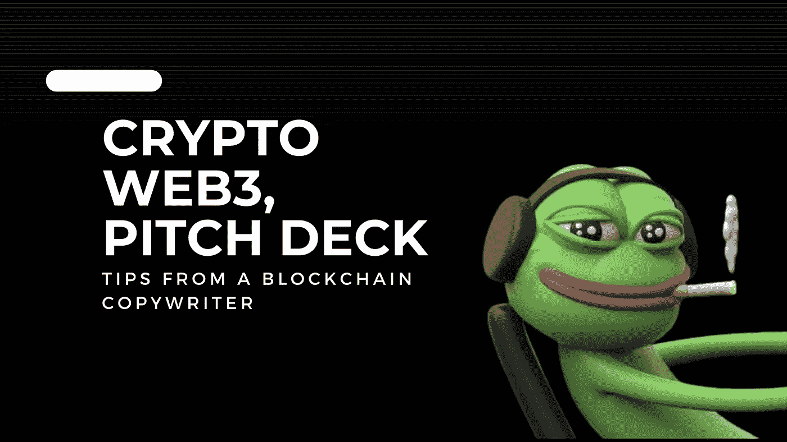

# 来自区块链撰稿人的 Crypto、Web3 宣传技巧

> 原文：<https://medium.com/coinmonks/crypto-web3-pitch-deck-tips-from-a-blockchain-copywriter-7ef2de3ef659?source=collection_archive---------0----------------------->

推介平台是创业者从投资者和风投那里寻求融资时创建的演示文稿。就像在 Web2 世界中一样，在 Web3 世界中也普遍使用宣传资料。这种流行是因为区块链、NFT 和加密货币是大多数人还不了解的新技术。

此外，数字货币和资产是不稳定和不可预测的，这意味着区块链初创企业的创始人必须让投资者相信他们可以增加投资。幸运的是，宣传资料包含了听众需要理解并做出明智决定的信息。

Alejandro Cremades 在他的书《创业融资的艺术》中描述了创业者需要两种不同的平台。一个版本将包含大量的文本和信息，你将通过电子邮件与人和自由职业者分享。

另一个版本应该亲自(或在网上)向核心投资者展示，用更多的视觉效果来帮助你抓住投资者的注意力。

这篇文章概述了创建可获得资助的推介资料的最佳步骤和基本信息。

# 强大推介平台的关键

强大的推介平台的三个关键是:

*   强迫
*   易于阅读和操作
*   清晰简单

也就是说，下面是你想在演示中包含的幻灯片。

# 我应该在加密货币/区块链初创公司推介资料中包括哪些幻灯片？

一份普通的推介资料最少应该有 10 张幻灯片，最多不超过 19 张(我上一个客户的推介资料有 20 页)。

# 标题幻灯片

标题幻灯片是营销资料的第一页，也是最重要的一页，因为它总结了您打算演示的内容。此外，标题吸引了投资者对项目目的的注意。

因此，幻灯片必须包含您的品牌名称、徽标、公司口号和电子邮件地址，以方便想要联系的投资者。此外，请确保此幻灯片中使用的徽标也出现在幻灯片的其他页面上。

# 问题幻灯片

这张幻灯片解释了您的区块链解决方案填补的市场空白。值得注意的是，这必须是一个你的目标受众能够理解并一直试图解决的痛苦问题。此外，你只是在解决一个问题。不是两三个。专注于一个问题会让你(和你的合伙人)看起来专注并且有能力解决这个问题。

我建议为问题和解决方案创建不同的幻灯片，以免在一张幻灯片中淹没读者。请注意，当投资者参与您的项目时，可能是因为以下原因之一:

*   他们过去也经历过同样的问题
*   他们了解生态系统的问题
*   他们确信投资回报，因为他们知道解决问题会有收益

如果某个投资者符合上述任何一个(或多个)兴趣类别，那就意味着你得到了一个主要投资者。因此，确保你以一种触动读者情感的方式呈现问题。

# 解决办法

你对上述问题的解决方案对你的读者来说必须是显而易见的。在这张幻灯片中，您可以自由谈论这个空间，以及您的产品如何帮助这个空间。

在制作这张幻灯片时，研究并突出显示主要问题，然后将它们与您的解决方案联系起来。然后，列出已经存在的解决方案及其缺点(如果有的话)。

概述你为什么现在开始也很重要。你可能知道，在商业中，时机就是一切，处于历史的正确时机才是最重要的。

你的项目太早或太晚都会导致失败，这是我们不希望的。此外，不要说你是唯一一个这样做的人，是这个行业的先驱。

正如马克·库班所说，在你和其他公司用不同的方法解决这个问题之前，至少有 100 个人有过同样的想法。

# 市场/竞争

每个业务增长的关键指标之一是它所处的市场/可用的竞争。

为什么？

因为它决定了投资者的潜在退出。

一般来说，加密/区块链市场是有吸引力的，因为它目前是 1 万亿美元，这意味着投资者可以期待更好的 x 回报。此外，一个成功的企业必须在良性竞争中生存并占据主导地位。

如你所知，加密行业竞争激烈，几乎每个人都想涉足其中。你的推介材料应该清楚地陈述你击败竞争对手的方法和策略。

基本上，你将如何脱颖而出？

我建议用图表展示这些信息，概述过去的市场增长和潜在的未来增长，这样投资者就可以量化他们投资的收益和投资回报率。同样，在这里用研究论文的来源来支持信息。

# 牵引力/公制

在这张幻灯片中，你必须让投资者相信，你的企业能够长期生存。你可以通过展示业务的月环比增长(如收入、指标)来做到这一点。

例如，像 Y Combinator 这样的加速器项目预计每月至少有 15%的增长。然而，避免提及如果你很早或者你的成长不是那么有趣。

你也可以包括你的客户的增长率和活跃的社交媒体追随者的数量，比如脸书、Twitter 和 Instagram。这样做有助于你的社交证明。

# 提出的要求/金额。

在要资金的同时，你要有策略。

不要说出你想筹集的具体数额。例如，如果你想筹集 300 万美元，我会建议你将金额设定在 200 万至 600 万美元之间。

其中一个原因是因为公司通常对他们的投资有限制，这意味着如果你投入特定的金额(**$ 300 万**)。该公司可能被要求投资不超过**300 万美元，**，所以他们很可能会通过。

通过把 300 万美元到 500 万美元的融资额包括在内，你也把这样的公司包括在内了。选择范围而不是具体的数量来吸引尽可能多的目标。然后，详细分析你将如何使用这笔资金。

# 组

团队可能是所有推介活动中最重要的幻灯片之一。这是因为它显示了参与项目的团队。你的潜在投资者和读者想知道驾驶这艘船的人，以及是什么让他们与众不同。

因此，在制作这张幻灯片时，用要点突出每个成员的两三项成就和角色(与项目成功相关的角色和成就)。如果你有一个大团队，首先说出团队中重要成员的名字，以避免幻灯片过度拥挤。

我相信如果你的团队中有合适的人，你的品牌将会受益。

如果你(和你的团队)是第一次创业者，就把它放出来。这将有助于你建立信任，毫无疑问，投资者不会介意这一点。但是，当然，这意味着他们投资于你的教育、经验和过去的错误。没关系，因为这是旅程的一部分。

# 几个其他的提示

始终确保您的幻灯片中没有不必要的信息和图表。

保持每张幻灯片简单，直截了当，使用你的投资者熟悉的词语。

最后，如果你的投资者对这个项目有任何疑问，不要犹豫。

这就是创建球场甲板！

我希望我的建议对您有所帮助，能够帮助您创建获得所需资金的宣传资料。

有问题可以在评论里问。

想谈谈如何创建宣传资料、资金、区块链和文案吗？

[书](https://calendly.com/blockchaincopywriter-1/30min)时间到了我们好说话。

> 交易新手？尝试[加密交易机器人](/coinmonks/crypto-trading-bot-c2ffce8acb2a)或[复制交易](/coinmonks/top-10-crypto-copy-trading-platforms-for-beginners-d0c37c7d698c)