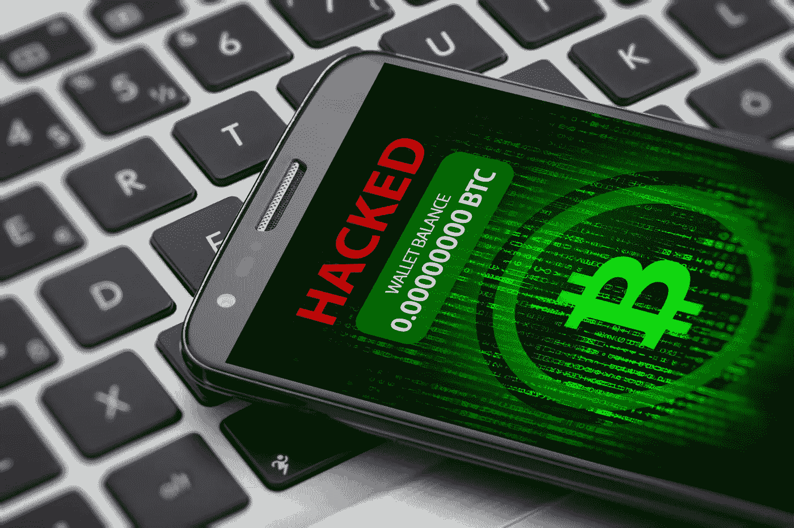

# 如果这些攻击继续下去，加密将会失败

> 原文：<https://medium.com/coinmonks/crypto-will-fail-if-these-hacks-continue-2767cde0081c?source=collection_archive---------20----------------------->

## 查看最近和过去的密码破解

[KeremYucel](https://www.istockphoto.com/portfolio/KeremYucel?mediatype=photography)

我希望加密货币能和黑客问题一起行动。加密货币是一种独特的新技术，它让我们能够摆脱现代现金的官僚主义膨胀。但是如果加密比你的标准银行更容易被黑客攻击，为什么还要有它呢？

# 这里面发生了什么…