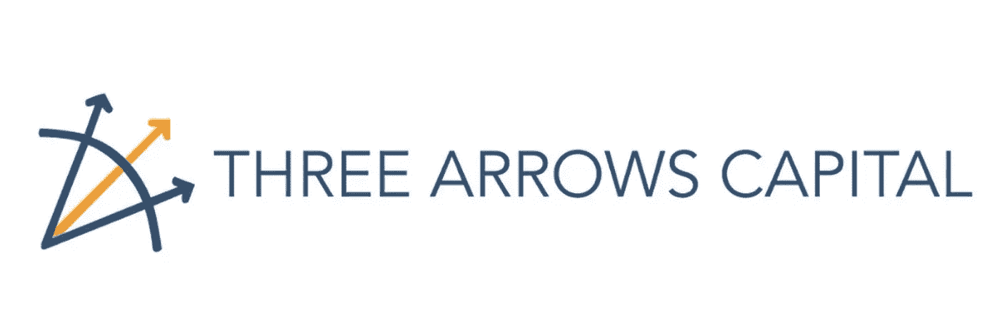
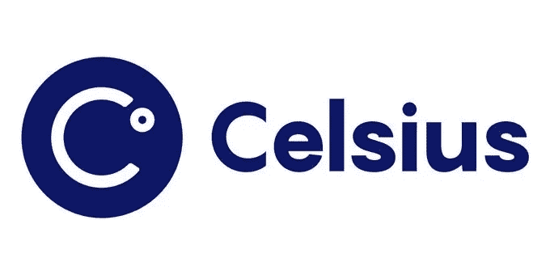
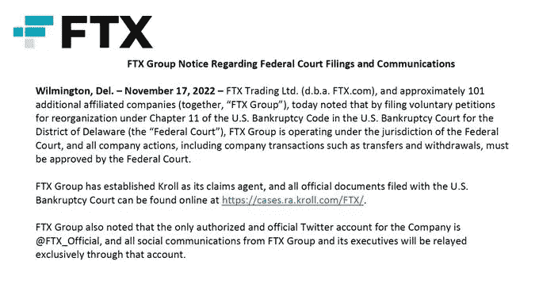
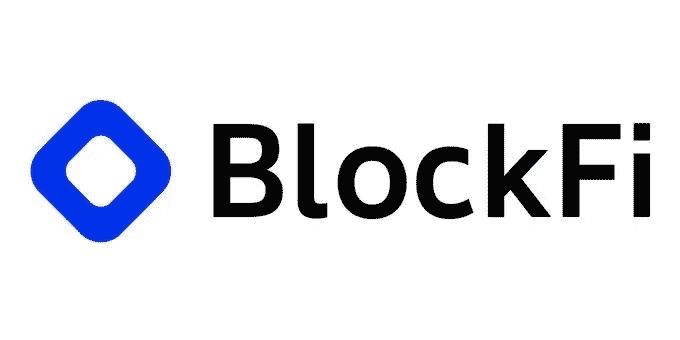

# 加密冬天:2022 年 4 家加密公司破产

> 原文：<https://medium.com/coinmonks/crypto-winter-4-crypto-companies-that-went-bankrupt-in-2022-be2ca4e97976?source=collection_archive---------12----------------------->

Image source: Pixabay

2022 年可以算是密码冬天；NFT 很粗糙，加密令牌崩溃了，甚至大品牌也没有被排除在这个威胁之外。6 月份，公司之间开始出现重大动荡，加密贷款解决方案出现了破产问题。因此，使得一些加密公司破产，产品失去价值。以下是 2022 年破产的 4 大加密公司:

## 1.三箭资本

三箭资本也被称为 3AC，是世界上最大的加密货币对冲基金之一。这家总部位于新加坡的公司专注于向投资者借钱，并将资金投入有前景的加密项目。该公司从事这项业务已经超过 10 年，管理着约 100 亿美元的加密资产，但在加密市场危机期间，情况开始变得不稳定。当加密价格暴跌时，3AC 也因其对以太等加密资产的投资而下滑。因此，该公司别无选择，只能清算其他加密硬币中的资产。

Image source: Twitter

除了市场低迷，据报道，该公司还参与了一些大型定向交易，如 Luna classic (LUNC)、gray bit coin Trust(GBTC)、staked Ether (stETH)，向 Luna 投资了 2 亿美元，据称还从 20 多家机构借入了资金。3AC 的高杠杆交易导致该公司陷入财务危机，并在该公司开始清算时打击了加密贷款公司。

尽管 3AC 创始人在英属维尔京群岛申请破产保护后获得了法院命令，但据报道，该公司未能配合破产调查，并下令对公司资产进行清算。

## 2.“旅行者”号

Voyager 是一家加密公司，通过向市场交易员和金融机构出借加密货币资产来产生兴趣。Digital 首席执行官斯蒂芬·埃利希(Stephen Ehrlich)在公司的破产申请中表示，公司的低迷是由加密崩溃和低利率造成的。

Image source: Twitter

然而，航海家号失事的主要导火索是新加坡对冲基金 Three Arrow capital 的破产，航海家号为该基金提供了价值 6.6 亿美元的加密贷款。危机发生在三箭资本在 TerraUSD stablecoin 投资中损失了 2 亿美元之后，该投资后来导致加密货币市场崩溃和暴跌。最近，该公司发布了关于重组的[更新](https://www.newswire.ca/news-releases/voyager-digital-and-voyager-official-committee-of-unsecured-creditors-provide-update-on-reorganization-plan-883658364.html)，但是到目前为止，没有给投资者带来运营方面的好消息。

## 3.摄氏网络

Celsius Network (CEL)在一个月前冻结了客户账户，并以“极端的市场条件”为由，于 7 月申请破产。谣言开始流传，该公司已经完全破产，当该公司明确表示客户的资产将被无限期冻结时，该公司开始增加其 170 万用户的 FUD 和恐慌。

Image source: Twitter

7 月，由于流动性问题，Celsius 裁员 23%，后来，分散金融(DeFi)聚合器 KeyFi 在纽约最高法院对 Celsius 提起诉讼，指控其违反协议，并称其为庞氏骗局。KeyFi 表示，Celsius 参与了市场操纵，未能实施会计管理以保护用户的资产。

Celsius 问题的另一个主要原因似乎是来自 staked Ethereum，也称为 stETH，它代表锁定在以太坊 2.0 信标链上的 ETH 令牌——该链将在[合并](https://builtin.com/blockchain/ethereum-merge#:~:text=The%20Ethereum%20Merge%20refers%20to,proof%2Dof%2Dstake%20system.)期间加入以太坊主网，即以太坊共识从工作证明变为利益证明。Celsius 将其客户的资产锁定在 stETH，而 stETH 的脱钩加剧了流动性危机。

该公司声称手头有 167 美元现金，[寻求继续业务运营](https://www.businesswire.com/news/home/20220713005911/en/Celsius-Network-Initiates-Financial-Restructuring-to-Stabilize-Business-and-Maximize-Value-for-All-Stakeholders)。Celsius 希望在这场灾难中反弹，到目前为止，该公司还在与 T4 的破产案作斗争。

## 3.FTX

FTX 的崩溃是历史上最灾难性的加密事件之一，事实上，它在导致比特币在 11 月暴跌 63%后震动了加密市场。

Image source: Twitter

在遭遇困境之前，FTX 是仅次于币安的第二大加密货币交易所。该交易所与 NBA 球星斯蒂芬·库里(Steph Curry)和美式足球四分卫汤姆·布拉迪·索思(Steve thousand)建立了巨大的营销合作伙伴关系，使得该公司的增长突飞猛进。

多年来，币安和 FTX 一直处于友好竞争状态，以至于币安在他的竞争对手 FTX 公司拥有股份。后来，币安决定出售其在该公司的股份，并将 20 亿美元的收购资金投入其竞争对手的本土令牌 FTT。

11 月，一个意想不到的转机出现了；币安首席执行官赵昌鹏在推特上向他的 700 万粉丝公开表示，他的友好竞争对手 Sam Bankman-Fried 一直在说他公司的坏话，因此他将[抛售他在 FTT 的 20 亿美元资产](https://twitter.com/cz_binance/status/1589283421704290306?s=19)。这导致了加密市场的恐慌，因为投资者知道这样的行动将导致 FTT 价格下跌，所以他们开始出售他们的股份。第二天，代币的价格已经下跌了约 20%，投资者继续以荒谬的价格出售他们的股份。

然而，阿拉米达，也就是萨姆·班克曼-弗里德在 FTX 之前创立的对冲基金，也被发现有 70 亿美元的负债和 120 亿美元的资产，其中一半资产在 FTT。

image source: Twitter

随着 FTT 股价继续下跌，公司的情况变得更糟，导致首席执行官山姆·班克曼-弗里德辞职。该公司受到了一些密码研究人员和记者的审查，也成为了证券交易委员会的目标。FTX 和它的美国分公司阿拉米达都申请破产，根据美国破产法庭，FTX 的资产价值在 100 亿到 500 亿美元之间，负债也在这个范围内。

## 4.BlockFi

当 FTX 崩溃时，几家公司受到影响，其中一家是加密贷款平台 BlockFi。尽管加密市场崩溃导致贷款平台破产，但 BlockFi 在从 FTX 获得约 4 亿美元贷款后陷入了更大的麻烦，据报道，这家巨头已经崩溃。

Image source: Twitter

BlockFi 不得不在美国申请[第 11 章破产保护](https://blockfi.com/November28-ClientUpdate)，文件显示该公司有超过 100，000 名债权人，负债在 10-100 亿美元之间。

## 结论

尽管有几个破产消息，Genesis 和 Gemini 在加密市场上引起了情绪波动，但最终没有达到预期。Genesis 是 Gemini 的主要贷款人，年收益率为 7.4%。两家公司都在 11 月份暂时停止了撤资，这导致人们猜测，在 FTX 和加密市场崩溃的情况下，Genesis 也可能很快申请破产。尽管市场对 Genesis 和 Gemini 等产品感到恐慌，但这两个平台似乎都已启动并运行。

> 交易新手？尝试[加密交易机器人](/coinmonks/crypto-trading-bot-c2ffce8acb2a)或[复制交易](/coinmonks/top-10-crypto-copy-trading-platforms-for-beginners-d0c37c7d698c)
> 
> 多样化的密码持有，了解[币安替代品](https://coincodecap.com/binance-alternatives)
> 
> 加入 Coinmonks [电报频道](https://t.me/coincodecap)和 [Youtube 频道](https://www.youtube.com/c/coinmonks/videos)获取每日[加密新闻](http://coincodecap.com/)

# 另外，阅读

*   [复制交易](/coinmonks/top-10-crypto-copy-trading-platforms-for-beginners-d0c37c7d698c) | [加密税务软件](/coinmonks/crypto-tax-software-ed4b4810e338)
*   [网格交易](https://coincodecap.com/grid-trading) | [加密硬件钱包](/coinmonks/the-best-cryptocurrency-hardware-wallets-of-2020-e28b1c124069)
*   [密码电报信号](/coinmonks/top-3-telegram-channels-for-crypto-traders-in-2021-8385f4411ff4) | [密码交易机器人](/coinmonks/crypto-trading-bot-c2ffce8acb2a)
*   [最佳加密交易所](/coinmonks/crypto-exchange-dd2f9d6f3769) | [最佳加密交易所](/coinmonks/bitcoin-exchange-in-india-7f1fe79715c9)
*   开发人员的最佳加密 API
*   最佳[密码借贷平台](/coinmonks/top-5-crypto-lending-platforms-in-2020-that-you-need-to-know-a1b675cec3fa)
*   [免费加密信号](/coinmonks/free-crypto-signals-48b25e61a8da) | [加密交易机器人](/coinmonks/crypto-trading-bot-c2ffce8acb2a)
*   [杠杆代币](/coinmonks/leveraged-token-3f5257808b22)终极指南