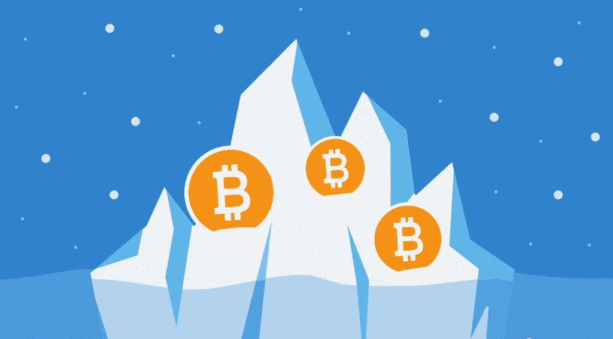

# Crypto Winter:为什么密码市场会崩溃？

> 原文：<https://medium.com/coinmonks/crypto-winter-why-is-the-cryptomarket-crashing-6f6a2a3447bc?source=collection_archive---------31----------------------->

每个市场都有起起落落，加密市场也不例外。在 2021 年大幅上涨后，比特币和其他加密货币继续暴跌。一些专家称之为“隐秘的冬天”

什么是隐冬？这个术语基本上意味着价格已经下跌了很长一段时间，然后在几周或几个月内保持低位。迹象无处不在:5 月初 Terra (Luna) crypto 崩溃导致价格进一步下跌，加剧了经济衰退，后来一个贷款平台 Celsius Network 停止提款，引发抛售，将比特币推至 17 个月低点。尽管此后 Celsius 偿还了其对 Maker (MKR)协议的大量未偿债务，表明在可信的破产传言中，陷入困境的加密贷款平台正试图避免彻底崩溃，但加密交易员的情绪仍然悲观。

那么，加密行业正在发生什么，为什么每个人都将今年的市场形势称为新的加密冰河期？简而言之，为什么 crypto 会崩溃？

# 美联储收紧政策

今年 5 月，美联储将利率上调了 0.5 个百分点，这是世界上最大的央行 20 多年来从未做过的事情。这是为了对抗四十年来的高通胀，部分原因是两年前美联储在新冠肺炎疫情开始时采取了前所未有的行动来稳定经济。它和加密有什么关系？这些紧缩措施，加上地缘政治的担忧，对金融市场产生了抑制作用，随着投资者远离风险更高的投资，给股票和加密带来了压力。投资减少意味着加密技术的衰落。

技术工程师罗伯特·梅特卡夫说，数字网络的价值与生态系统连接的用户数量的平方成正比，这让问题更加严重。如果美联储正在打击高贝塔股票和密码，并驱逐投机者，他们实际上是在大规模收缩网络。这种现象被称为梅特卡夫定律。这使得一个隐秘的冬天几乎不可避免。

# 股票和密码一致

在比特币 14 年历史的大部分时间里，加密市场通常不会与股票市场或更广泛的经济趋势同步发展。然而，在当前的熊市中，这两个领域都在经历衰退。事实上，crypto 的表现更像科技股等传统“风险”资产。传统金融领域的人才大量流向加密领域，其中包括驾驭复杂金融环境的关键专业技能。所有这些都使得加密市场类似于传统的股票市场，当股票市场正在经历衰退时，加密货币行业进入了新的加密冬天。

# 比特币正在贬值

自去年 11 月达到约 69，000 美元的历史高点以来，这种世界上最受欢迎的加密货币已经贬值了约 70%。自 2021 年初以来，加密资产的总市值已从 2021 年 11 月的 3 万亿美元峰值降至不到 1 万亿美元。比特币已经连续下跌了近 12 周，这是该资产有史以来最大的跌幅之一。

# 系绳损失 1 美元挂钩

作为世界上最大的稳定货币和加密货币生态系统的基石，Tether 的价格在 5 月份脱离了 1 美元的盯住汇率，在整个市场崩溃和加密货币价格暴跌的情况下加剧了人们的担忧。在高度动荡的密码市场中，稳定的密码被认为是相对安全的避风港。它们通过与其他资产挂钩——包括像美元这样的法定货币和像黄金这样的有形资产——或者通过一种算法来保持稳定。

Tether 的市值超过 800 亿美元，是迄今为止世界上最大的稳定货币，也是第三大加密货币。它在数字市场中占据核心地位，用于完成其他交易和存储价值。然而，监管可能会导致这些数字资产失去价值。包括美国在内的全球监管机构已经将稳定币确定为加密货币市场中需要规则和指导的领域。监管者正在这个领域打转，观察可能威胁他们控制加密的新生计划的不稳定迹象。随着 Terra 的崩溃，甚至在春天宣布的规则也不得不改变，一些管辖区正在准备规则以减轻失败的 stablecoin 系统的系统性影响。

# 成因

随着加密冬天的开始，包括比特币基地全球在内的公司已经在最近几周宣布裁员和停止招聘，而航海家数码等该领域的主要参与者由于加密贷款的崩溃而面临压力。Gemini 等允许投资者交易数字资产的加密交易所也宣布裁员。

根据市场分析师的说法，导致加密冬天的其他因素是高通胀和整体地缘政治局势，包括对世界经济产生重大影响的乌克兰持续冲突。

# 2022 年 Crypto 会再次崛起吗？

普通加密爱好者最担心的是加密的未来。这只是动荡的加密货币市场的又一次崩溃，还是这种替代资产类别结束的开始？

首先，这不会是比特币第一次贬值。尽管长期上涨，但比特币也有暴跌的时候。最近一次是自 2021 年 11 月以来，当时金融市场利率上升和流动性减少的前景使比特币的价格大幅下跌。众所周知，比特币的价格是由情绪驱动的。当市场转向“贪婪”阶段时，比特币就会飙升。在“恐惧”阶段，比特币的价格似乎没有吸引力，因为卖家会在坏消息或市场普遍低迷时压低价格。

在其存在期间，BTC 的价格已经下跌了超过 5 倍。在下一个牛市中，比特币会再次上涨，变得更加昂贵。尽管这个加密的冬天是不同的，加密爱好者仍然看到了这个资产类别的未来。

尽管如此，许多传统期刊和专家对加密市场的未来持怀疑态度。华尔街日报说，加密市场“部分建立在狂妄、热情和乐观的基础上”，所有这些都在更广泛的经济问题中蒸发了。彭博表示，投资者将很难决定哪些加密货币将从这场衰退中幸存下来或强劲崛起，这加剧了负面影响。

今年下半年的预期事件包括拜登政府可能出台的监管澄清措施，以及以太坊向利益相关者共识机制的过渡。这两个事件可能会阻止密码市场陷入更深的危机。

# Crypto Whales 正在积极购买 Crypto

此外，所谓的加密鲸鱼不仅持有他们的加密，还积极购买:在持续的加密崩溃中，来自 IntoTheBlock 的链上数据表明，所谓的比特币鲸鱼已经悄悄地在他们的袋子里装满了更多的加密资产。在这样的大规模抛售中，许多投资者会平仓。然而，对于那些拥有超过 1000 BTC 的人来说，情况似乎并非如此。区块链分析 Glassnode 表示，鲸鱼正在积极增加他们的余额，每月直接从交易所获得 14 万比特币。根据他们的数据，加密鲸拥有多达 869 万 BTC，占比特币总供应量 2100 万的 45.6%。

# 结论

加密市场仍然是一个不稳定的领域，继续遵循其自身的规则和趋势，使加密货币成为一种风险很大且往往不可预测的投资。然而，随着围绕加密货币的[炒作逐渐消退，这可能会给加密爱好者带来](https://stealthex.io/blog/2022/06/24/what-is-hidden-behind-crypto-hype-and-whats-coming-next/)[又一个购买加密货币的机会](https://stealthex.io/how-it-works)。StealthEX 在这里帮助您以适中的价格购买超过 450 种数字资产。你可以私下做这件事，不需要注册服务。

# 如何购买 Crypto？

只需去 [StealthEX](https://stealthex.io/) 并遵循这些简单的步骤:

1.  选择要兑换的货币对和金额。例如，BTC 到瑞士联邦理工学院。
2.  按下“开始交换”按钮。
3.  提供收件人地址。
4.  处理交易。
5.  接收您的加密硬币。

在 [Medium](https://stealthex-io.medium.com/) 、 [Twitter](https://twitter.com/Stealthex_io) 、 [Telegram](https://t.me/StealthEX) 、 [YouTube](https://www.youtube.com/channel/UCeES_XBesX76ge7xf1meuSw) 和 [Reddit](https://www.reddit.com/user/Stealthex_io) 上关注我们，了解关于 [StealthEX.io](https://stealthex.io/) 和其他加密世界的最新消息。

在购买任何密码之前，不要忘记做自己的研究。本文表达的观点和意见仅代表作者个人。

*原载于 2022 年 7 月 6 日*[*https://stealthex . io*](https://stealthex.io/blog/crypto-winter-why-is-the-cryptomarket-crashing/)*。*

> 交易新手？尝试[加密交易机器人](/coinmonks/crypto-trading-bot-c2ffce8acb2a)或[复制交易](/coinmonks/top-10-crypto-copy-trading-platforms-for-beginners-d0c37c7d698c)