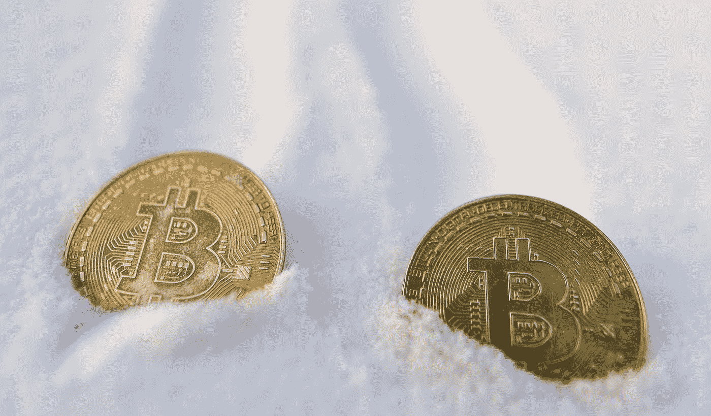
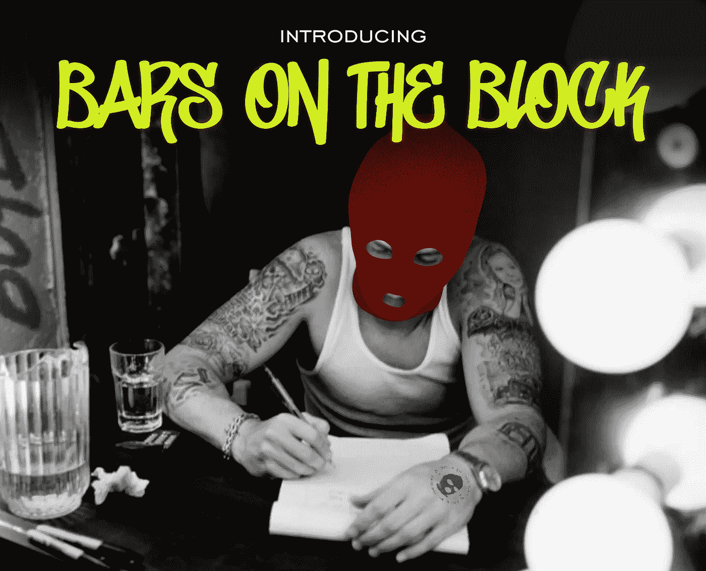
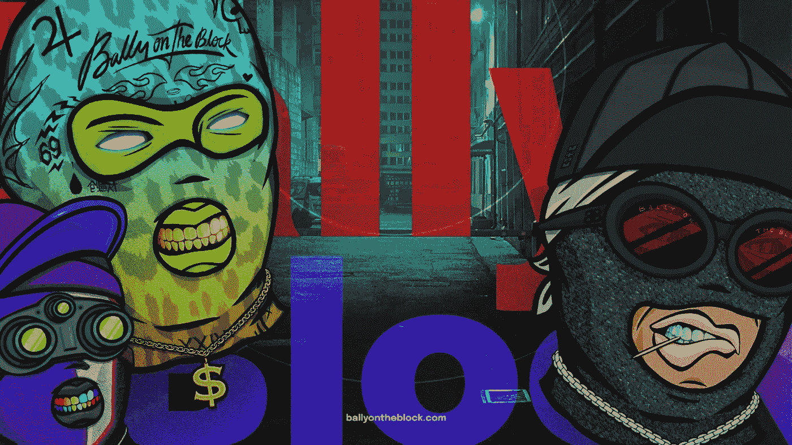

# 秘密的冬天:为什么我们对当前的衰退不恐慌

> 原文：<https://medium.com/coinmonks/crypto-winter-why-we-arent-panicking-about-the-current-slump-f60e521c6689?source=collection_archive---------50----------------------->

> 提示:它与现实世界的效用有关。

我听说过，你也听说过:我们正处于一个残酷的隐秘的冬天，而且是一个寒冷的冬天。

当我们说加密冬天时，我们通常指的是低价格复苏、活动减少和负面的市场情绪。从很多方面来说，这是一个漫长的熊市——就像我们在过去已经写过的一样。

总而言之，已经有四个值得注意的加密冬天，2018 年是最值得纪念的。然而，这个隐秘的冬天是不同的。过去，加密崩溃与炒作泡沫破裂有关，但这一次，手头有更广泛的宏观经济问题，包括通胀上升、衰退担忧和央行加息。

除此之外，加密是一项高风险投资，所以当全球经济下滑时，它自然是第一个被清算的。

总的来说，即使世界(秘密地)发现了它的灭亡，加密市场也总是重新振作起来。2022 年[开始，比特币的价值几乎是 2021 年 1 月的两倍](https://time.com/nextadvisor/investing/cryptocurrency/bitcoin-price-predictions/)，截至 2022 年 7 月，以太坊又开始崛起。

虽然比特币的价格确实仍远低于其峰值近 69，000 美元，但仍远远高于其 0.09 美元的初始价格****。****

****本周，世界上最大的 NFT 市场 OpenSea 在经历了长时间的销售低迷后，被迫裁员 20%,这是加密崩溃的现实。****

****OpenSea 首席执行官 Devin Finzer 在一条推文中宣布:“我们之前已经度过了冬天，我们建立这家公司时就考虑到了加密的周期性。现实是，我们已经进入了一个前所未有的组合，即加密的冬天和广泛的宏观经济不稳定，我们需要让公司为长期低迷的可能性做好准备。”****

****这里的关键词是 ***准备。从许多方面来看，OpenSea 的裁员并不是一个不可持续的、垂死的市场的迹象——而是一个公司知道如何以及何时做出艰难决定以保持其未来寿命的证据。*******

****正如 Finzer 所补充的那样:“我们今天所做的改变使我们能够在各种冬季加密场景下保持多年的跑道(按目前的数量计算为 5 年)，并给我们高度的信心，我们只需经历一次这个过程[…] **冬季是我们建造**的时候了。”****

****在市场动荡时期，有一个金玉良言可以帮助我们在街区的 Bally 睡个好觉，那就是**效用。******

> ****在这个隐秘的冬天，关注那些具有长期效用而非快速回报的项目是很重要的****

****正如我们之前所说，熊市是参与 NFT 项目的最佳时机，因为这是项目建设的时候。正如芬泽在他的 OpenSea 声明中所说:“在这个冬天，我们将看到整个生态系统的创新爆炸。”****

****如果你一直在关注 Bally，你就会知道我们一直在努力开发我们的去中心化音乐平台，Bally ' s Got Talent——这是我们的长期效用。****

********

****Bars on the Block, our freestyle lyric contest that is already building a real life community for Bally’s Got Talent****

****经济会波动，但对好音乐的渴望不会。其实经济越差，艺人越难成功。****

****作为一个平台，Bally's Got Talent 将使用分散的社区投票来直接支持伦敦和其他地方的音乐艺术家。通过我们的 NFTs，我们的目标是让真正的艺术家的生活有所不同，这些艺术家正在积极的中央音乐产业中努力取得成功。****

****这一工具将转化为现实生活中的音乐，包装好的音乐会，商品等等——所有人们欣赏的东西，不管他们是否知道“密码”这个词的意思。****

****我们将很快写一篇关于街区酒吧的文章，这是我们的自由式歌词比赛，标志着我们与 Bally's Got Talent 音乐之旅的开始，敬请关注！****

********

******要了解 Bally 的最新动态和 Bally 的达人秀，请加入 Bally fam on Discord** [**这里**](https://discord.gg/mHcEPUeZDN) **。******

****[推特](https://twitter.com/Ballyontheblock) | [网站](http://ballyontheblock.com/) | [不和](https://discord.gg/mHcEPUeZDN)****

> ****交易新手？试试[加密交易机器人](/coinmonks/crypto-trading-bot-c2ffce8acb2a)或者[复制交易](/coinmonks/top-10-crypto-copy-trading-platforms-for-beginners-d0c37c7d698c)****