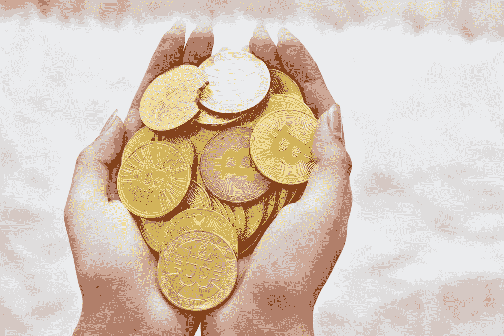

# 加密资产和分散金融

> 原文：<https://medium.com/coinmonks/cryptoassets-and-decentralised-finance-e20cb3bf390?source=collection_archive---------15----------------------->

近几年来，加密资产和去中心化金融一直是讨论的热门话题，这是有充分理由的。这项新技术有可能彻底改变我们管理财务的方式，为传统的银行和金融服务提供一种安全、透明的替代方案。在其核心，分散金融是一种形式的金融技术，依靠区块链技术来创建一个安全和…