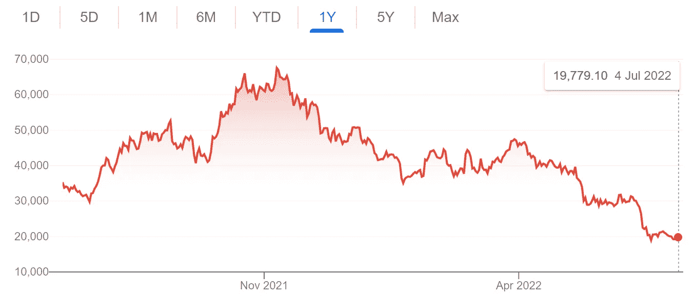

# 加密货币:鉴于最近的动荡，我们的立场是什么

> 原文：<https://medium.com/coinmonks/cryptocurrencies-where-we-stand-given-latest-turmoil-62c246e0a2e8?source=collection_archive---------37----------------------->

今天，我把我的想法追溯到我在 Medium 上写的第一篇文章，题为“[加密货币:是还是不是？](/@petru_vdwfelix/cryptocurrencies-yea-or-nay-694146c812c)”，发表于 2 月份，当时比特币的价值仍远高于 3 万美元，为 3.67 万美元。

在这个水平上，它实际上已经是 2021 年 11 月峰值时的一半，当时它的售价为 67，500 美元，自那以来，它当然已经跌至 19，779 美元的惊人低点，所有投资者都对它是否会复苏失去信心。

谷歌在谷歌上的照片

最近的暴跌几乎肯定排除了这位投资者在这里打字的选择(甚至考虑)。有高风险、不稳定的投资选择，还有加密货币！在可预见的未来，我可能会避开这两者。

> 交易新手？试试[密码交易机器人](/coinmonks/crypto-trading-bot-c2ffce8acb2a)或者[复制交易](/coinmonks/top-10-crypto-copy-trading-platforms-for-beginners-d0c37c7d698c)

第一篇文章的最后一段包括了**的警告，这让我松了一口气,“不要期待快速、持续的收益或稳定的前路。你应该做好打持久战的准备。”这些话比以往任何时候都更真实。**

这种大幅跌至 20，000 美元以下的后果，现在被投资界称为“加密崩溃”，再次提出了加密货币在我们现代货币体系中应该扮演的角色的关键问题。包括英国《金融时报》记者马丁·沃尔夫在内的许多人认为，这根本不是什么建议。

沃尔夫认为，该系统还有很多需要改进的地方——鉴于最近发生的事件，我倾向于同意他的观点——因为它有一个根本性的缺陷，其底层经济学驱使它像蘑菇一样扩散，从而导致一个支离破碎的系统，其中已经有 10，000 多种不同味道的加密货币。这是目前的数字，尽管实际上无论是 1 万还是 10 亿，结果都是一样的。

这种不同加密货币的碎片化宇宙创造了一个脆弱的货币系统，我们应该明智地避开它，相反，我们应该集中精力建立一个为我们服务的替代方案，不只是在短期内通过一些幸运的打击，而是提供长期潜力，作为当前游戏状态的真正替代方案。

我们需要一个改进的货币系统，以促进安全、稳定、隐私、效率和责任，这些方面是我们的加密货币系统在大多数方面所欠缺的。

毫无疑问，我很快会再次谈到这个话题，因为上述所有内容确实提出了一个首要问题，即为什么在如此多的投资者损失了数百万美元之后，我们现在才发现所有这一切。当然，如果它有根本性的缺陷，早就应该被扼杀在萌芽状态了。当然，她说。

请注意，我并没有把自己标榜为领域专家——我远远不是。我所有的文章纯粹代表我自己的观点。基于研究的明智意见，但意见也一样。

我很想听听你的想法，所以请写一封短信——从“你说对了！”到“这完全是胡说八道！”将不胜感激。更不用说一个'**或者两个:-)**

**随意也跟我上* [***推特***](https://twitter.com/petru_vdwfelix)**同一把手下****petru _ vdwfelix*****