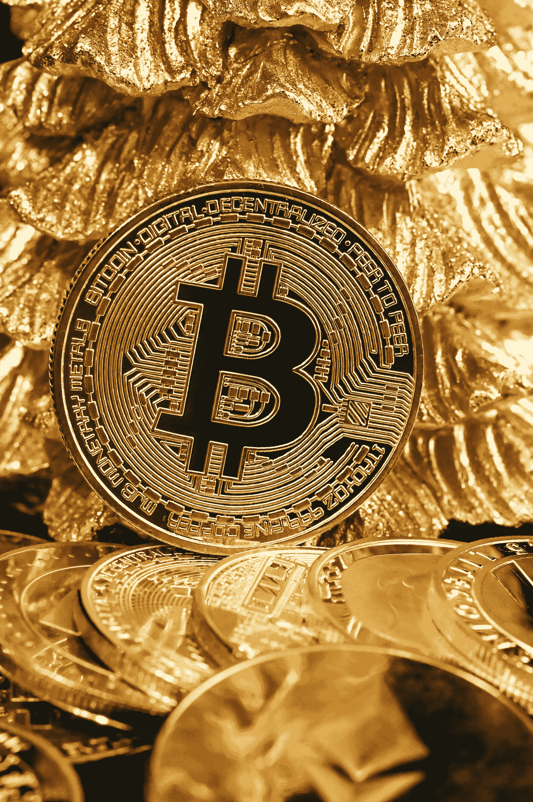

# 加密货币 101:比特币、区块链和加密货币简介

> 原文：<https://medium.com/coinmonks/cryptocurrency-101-an-introduction-to-bitcoin-blockchain-and-cryptocurrencies-b23aa46a5fa6?source=collection_archive---------43----------------------->

## 加密货币是一个不断发展的现象，它不会很快停止。

**Photo by** [**Quantitatives**](https://unsplash.com/@quantitatives?utm_source=medium&utm_medium=referral) **on** [**Unsplash**](https://unsplash.com?utm_source=medium&utm_medium=referral)

这么多人对这项令人兴奋的新技术感兴趣，可能很难知道从哪里开始。在本指南中，我们将向您介绍比特币、区块链和…