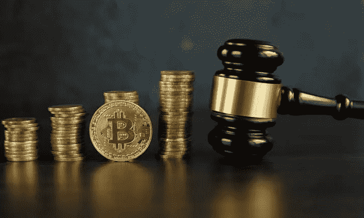

# 加密货币和监管。

> 原文：<https://medium.com/coinmonks/cryptocurrency-and-regulation-1f674e43ae89?source=collection_archive---------16----------------------->

监管涉及使用法律或行政规则来指导和规定人们的行为。它确保任何特定组织的效率，并通过控制和限制个人和机构的行动来发挥监督作用。

***调控能否在 web 3 中发生；一个分散的、没有权限的网络？***

开发 Web 3 是为了使个人对所有资产、数据和信息拥有完全的权利和所有权，并且在行使这些权利时不受任何外部机构的干涉。这自动消除了 web 3 将采用的任何形式的监管。随后，web 3 被大量采用，尤其是加密货币。全球有超过 3 亿人使用加密货币。作为领先的加密货币，比特币也在与股票和黄金等其他投资品进行激烈的竞争，甚至在某些时候超过了这些其他投资品。这吸引了来自世界各地的投资者，包括知名公司，当然也包括恶意公司。

缺乏对加密货币的监管或执行机构使得资产的安全性很难保证。网络盗窃和黑客攻击在 web 3 中非常普遍，web 的匿名特性被恶意的人利用来欺骗用户。这些事件已经引起了负责保护公民的政府机构的注意，因此有必要对加密货币进行监管。由于不同国家的经济状况不同，不可能采用统一的法规，因此一些国家已经决定制定适合其国家的加密货币法规。

包括美国和英国在内的大多数国家允许使用加密货币，但仅限于作为交易媒介、数字资产、价值储存手段，而不是该国可接受的法定货币。这些国家还采取了进一步措施来监管加密货币在本国的使用。例如，美国的[金融犯罪执法网络(FINCEN)](https://www.fincen.gov/) 在 2020 年提出一项法规，对加密货币交易所和钱包提出数据收集要求。以采用分散金融而闻名的英国宣布，将对该国的密码业务进行监管。

最近，[印度尼西亚](http://news.bitcoin.com)宣布他们计划加强加密监管，“三分之二的加密交易所董事必须是居住在该国的印度尼西亚公民”。这项新规定是 Zipmex 引发金融危机的后续措施，Zipmex 是一家专注于东南亚的加密货币交易所，它停止了用户在该平台上的取款。

因此，无论一个人是否是投资者，加密货币的行为都被视为会影响公众。这方面的一个例子是比特币采用的工作证明机制，以前由以太坊用于验证交易。这种机制在运行中消耗了大量的能量，对气候造成了威胁。这显然不适合政府，政府已经投入了这么多来节约能源和减少气候变化，就在最近，白宫发表声明说[禁止](https://www.barrons.com/articles/white-house-bitcoin-proof-of-work-mining-ban-51662728547)可能是采矿的一个可能选择(战俘)。

加密货币价值的不断波动也可能对一个拥有许多投资者的国家的经济稳定构成威胁。世界各经济体已经意识到这一点，并已采取措施避免这种情况。美国在这些行动中发挥了重要作用，因为加密货币的价值与美元挂钩。美元的剧烈波动会对加密硬币产生影响。当美元升值时，代币对非美国投资者来说会变得更贵，他们会购买法币；这有助于减少流入密码市场。这使得美国能够通过 FOMC 这样的政策和机构间接影响和监管加密货币。

[联邦公开市场委员会(FOMC)](https://www.federalreserve.gov/monetarypolicy/fomc.htm) ，一个负责审查经济和金融状况的机构，决定货币政策并评估长期面临的稳定和可持续经济增长的风险。这些功能是在他们的会议期间执行的，通常被称为一年八次的美联储会议。

刚刚结束的美联储会议报告称，利率将会提高，其影响是公司将不得不以更高的利率借款，从而节省开支。这种购买力守恒扩散到几乎每一个零售商、消费者和投资策略，包括加密货币。报告和图表显示，美国货币政策对加密货币价格的影响甚至超过了美国股票。这是过去六个月中连续第五次提高工资，这是控制通货膨胀的有意识的尝试。

***管制对 crypto 是好是坏？***

大多数反对对加密货币进行监管的投资者担心，这可能会导致独裁统治，社区的意见不会得到考虑，并可能抑制创新和增长。其他人认为，有必要进行监管，以确保其资产的安全，并防止利用加密货币进行的持续黑客攻击和洗钱。

加密货币的不安全性正在不断发生，犯罪者逍遥法外的事实是许多人担忧和愤怒的一个重要来源。如果监管应用正确，将在不篡改或试图控制加密货币其他部分的情况下解决不安全问题。以正确的利益正确地实施监管，不仅有助于确保安全，而且还能消除社区的恐惧，使他们仍然能够享有自己的权利。

监管将有助于增强投资者的信心，因为已经有了某些规则，以应对欺诈企图。就在最近，LUNA coin 的创始人 Do Kwon 被韩国政府逮捕，并被要求冻结与他有关的价值 6700 万美元的比特币。不管崩溃是否完全是 kwon 的错，知道一个人可能会被起诉会让加密货币的创始人采取额外措施来保护投资者的资产。

监管对加密是好是坏这个问题的答案很大程度上取决于负责监管的机构。监管机构的主要目标应该是为投资者创造一个更好、更安全的网络。一个旨在对这些协议做出重大改变或实施严厉政策的监管机构将为投资者创造一个非常严峻的金融环境。一旦投资者同意受某项法规的约束，无论该法规是否有利，它都将被强制执行，至少在被新的法规推翻之前是如此。

例如，拜登总统最近在美国州发布了一项关于加密货币的行政[命令；该国将参与加密货币研究，包括数字资产的法律框架，以确保安全、隐私、金融，并在 web 3 中找到美元的全球视角。虽然没有人知道这项研究背后的真实意图，但从表面上看，美国似乎正在计划对加密货币进行监管，完全是出于让网络对投资者更好、更安全的需要。](https://www.coindesk.com/policy/2022/09/16/bidens-executive-order-produces-few-answers-in-crypto-reports-from-us-treasury/)

所有已经到位的监管加密货币的措施仅仅是触及了这个概念。尽管对加密货币的监管有所增加，但非法行为和黑客攻击仍然每天都在发生，而没有任何力量来检查它们。这是由于加密货币的分散性质，试图执行直接影响加密货币的法律可能是一项艰巨的任务，因为其控制权掌握在不同的人手中。

加密货币正被世界各地的各种人大量使用，很快，监管的需求将变得几乎势在必行。该行业的先驱和利益相关者有责任寻找一种方法，可以质疑投资者的行为，但不侵犯投资者进行合法合理交易的权利，以及积极参与有关加密货币的开发和决策的权利。

> 交易新手？试试[加密交易机器人](/coinmonks/crypto-trading-bot-c2ffce8acb2a)或者[复制交易](/coinmonks/top-10-crypto-copy-trading-platforms-for-beginners-d0c37c7d698c)