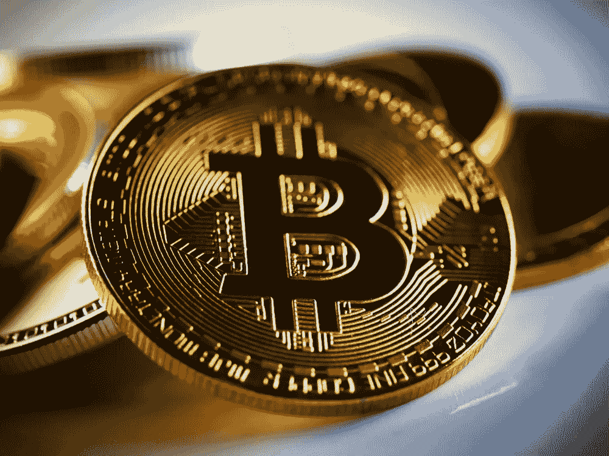

# 加密货币是对未来的投资

> 原文：<https://medium.com/coinmonks/cryptocurrency-as-an-investment-in-the-future-a34bcb10ad41?source=collection_archive---------41----------------------->

期货市场的投资非常有趣，因为它们既提供了很高的获利机会，也带来了风险。这是你应该了解的加密货币。

对许多人来说，加密货币仍然是一种炒作，肯定会消失。然而，任何阅读该主题的人都会很快意识到，加密货币，尤其是相关的区块链，在长期内具有改变世界的巨大潜力——无论是在支付交易、数据库解决方案还是其他去中心化方法方面。任何投资数字货币的人也是在投资未来。如果有一件关于创新投资的事情，那就是它们可能非常有利可图。

## [投资哪些加密货币？](https://cryptobatman.blogspot.com/2022/05/Cryptocurrency-as-an-investment-in-the-future.html)

几年前，选择哪种加密货币应该是显而易见的:比特币和以太坊通常是最受怀疑的，其余的选择仍然有限。然而，今天全球有超过 12000 种加密货币。虽然不是所有的交易都是通过网上经纪人进行的，但是选择仍然是困难的。大多数加密货币的高波动性是许多投资者的额外障碍。

因此，越来越多的投资者想要购买(USDT) Tether:这是一种所谓的稳定币——即非常稳定的加密货币。因此，系绳非常适合作为价值储存手段，但也适合分散的货币交易——因为它与美元挂钩，所以总是可能以低成本进行快速交易

## [如何投资加密货币？](https://cryptobatman.blogspot.com/2022/05/Cryptocurrency-as-an-investment-in-the-future.html)

如果你想从加密热潮中受益，你不一定要购买硬币。投资者现在有各种可能的投资类型可供选择。下面我们为读者总结了其中最常见的一些。

> 交易新手？试试[密码交易机器人](/coinmonks/crypto-trading-bot-c2ffce8acb2a)或[复制交易](/coinmonks/top-10-crypto-copy-trading-platforms-for-beginners-d0c37c7d698c)