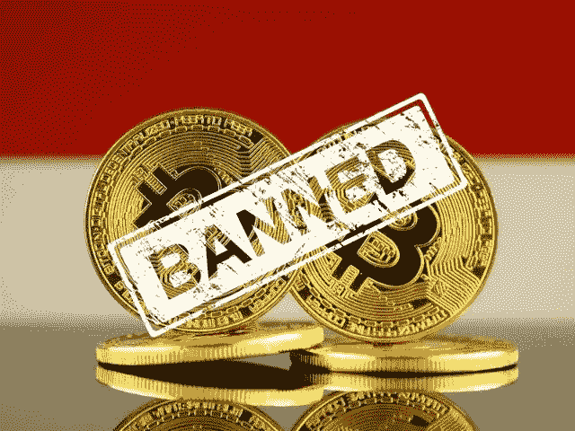

# 加密货币禁令:22 个国家禁止或限制加密货币

> 原文：<https://medium.com/coinmonks/cryptocurrency-ban-22-countries-where-cryptocurrency-is-banned-or-restricted-ac88a03c8559?source=collection_archive---------25----------------------->

不是每个政府都对加密货币感兴趣。是的，一些政府对虚拟货币漠不关心，以至于他们还没有下定决心。

还有孤独者，他们希望证明自己比其他人都聪明，也就是萨尔瓦多和中非共和国。他们是目前唯一将电子货币(比特币)作为官方法定货币的国家(明智之举？只有时间能证明)。

还有一些小心谨慎的预告片，他们没有勇气制作任何数字硬币的官方法定货币，但足够果断地通过法律承认加密，宣布它合法。

现在，这篇文章不是关于任何好人或中立的人。这是关于那些被加密货币社区标记为“不友好”的人。是的，不友好的加密小组。

需要注意的是，禁止和限制不是一回事。

当一种行为或做法被禁止时，它就被禁止、不允许和禁止。另一方面，约束需要规章、约束或限制。

这篇文章列出了大多数已知的在某种程度上对加密货币世界表示怀疑的国家。有些只是设置限制，有些则完全禁止。

值得一提的是，我们不能指责他们的决定没有可原谅的理由(特别是如果我们选择忽视全球政治和国际关系中微妙和冒险的戏剧性)。

# 加密应该被禁止和限制吗？

亿万富翁投资者[沃伦巴菲特](https://en.wikipedia.org/wiki/Warren_Buffett)可能是最令人厌恶的亿万富翁。这个想法似乎让他想吐

从 2018 年左右开始，他的理由很简单:没有内在价值；他把他的投资放在他理解的风险投资上；他只是不认为这是一种可行的货币；这与他的策略相去甚远，而且“可怕地”不稳定。

对密码不友好的国家可能会分享巴菲特的担忧(假设没有隐藏的意图)。在这种情况下，他们阻止[区块链科技](https://www.36crypto.com/blockchain/blockchain-definition-what-is-blockchain-technology-and-how-does-it-work/)现金流入的决定可能符合他们公民的利益。

我们几乎没有责任指出或解释。我们在这里要做的是给你名单——你通过判断。

> 交易新手？试试[加密交易机器人](/coinmonks/crypto-trading-bot-c2ffce8acb2a)或者[复制交易](/coinmonks/top-10-crypto-copy-trading-platforms-for-beginners-d0c37c7d698c)

# 以下是 22 个禁止或限制加密货币的国家，按字母顺序排列:

1.  阿尔及利亚(被禁)
2.  巴林(受法律限制)
3.  孟加拉国(被禁)
4.  玻利维亚(被禁)
5.  中国(禁止)
6.  哥伦比亚(受法律限制)
7.  多米尼加共和国(被禁)
8.  埃及(被禁)
9.  加纳(被禁)
10.  香港(受法律限制)
11.  印度(被禁)
12.  印度尼西亚(受法律限制)
13.  伊朗(受法律限制)
14.  伊拉克(被禁)
15.  哈萨克斯坦(受法律限制)
16.  尼泊尔(被禁)
17.  尼日利亚(被禁)
18.  北马其顿(被禁)
19.  卡塔尔(被禁)
20.  俄罗斯(受法律限制)
21.  沙特阿拉伯(受法律限制)
22.  土耳其(受法律限制)

# 禁令和限制阻止了加密的繁荣吗？

政府的禁令和限制就像父母匆忙出门去工作，给他们成年的孩子留下一张该做和不该做的清单(他们知道如何掩盖自己的痕迹)——他们制定了规则，但不能在场确保严格遵守。

“不要带朋友过来”，父母可能会说，但一旦老人离开，小伙子们可以举办一个家庭聚会，并在一天结束前清理所有痕迹。事实上，禁令和限制就像有一个密室，却给每个人都留了一把备用钥匙。

政府出于几个合理的原因禁止或监管加密货币，许多不是出于不感兴趣，而是出于疑虑和跟踪经济的意愿。但禁令和限制更多的是作为免责声明、怀疑声明，以及警告国民要自担风险。

政府可能很少这样说，因为他们应该听起来足够强大，可以强制停止任何他们认为在其权限内非法的行为。然而，无法阻止任何可以访问互联网的人使用加密货币的事实应该足以说明政府的无奈。

也许对加密社区来说最疯狂的讽刺是[大多数政府禁止加密货币的国家都是生态系统的最大用户](https://36crypto.com/cryptocurrency/top-7-countries-with-the-most-cryptocurrency-users-2022/):印度、俄国、尼日尼亚等。这三个国家总共为加密货币社区提供了超过 1.5 亿用户。

如果禁令和限制阻止了密码的使用，那么这些数字就是一个谜。然而，它们并不神秘，因为加密货币是分散的，你需要使用它的所有条件是访问互联网，而不是获得政府的许可。

加密货币禁令或监管可以说是政府的一种方式，表明他们既没有认可这种货币形式，也没有将其作为法定货币。

***免责声明:*** *以上博文包含了作者的想法。这不是任何代币或加密货币的宣传或广告——贡献者不为此担保。您如何处理上述加密货币信息以及它如何影响您的投资选择是您的唯一决定，风险由您自行承担。*

最初发布于 [36crypto](https://36crypto.com/cryptocurrency/cryptocurrency-ban-22-countries-where-cryptocurrency-is-banned-or-restricted/)