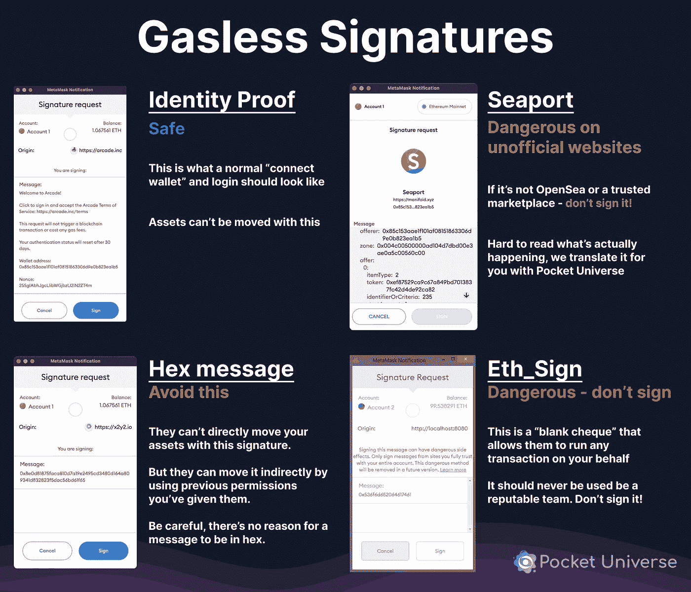

# 钱包交易中的加密货币犯罪

> 原文：<https://medium.com/coinmonks/cryptocurrency-crime-in-wallet-transactions-3ad367aa4aa?source=collection_archive---------24----------------------->

自 2021 年初以来，加密货币犯罪一直很普遍。加密货币犯罪造成的损失价值记录为 140 亿美元 (Chainanalysis)。加密货币中的犯罪不仅仅是 DEX(去中心化交易所)和 CEX(中心化交易所)所经历的，每个个体都可能经历。

在 Wallet DEX 中，犯罪不仅经常发生在包含种子短语的计算机数据存储在计算机文件中时，而且可能是由于我们自己的错误，因为我们在没有检查的情况下不知不觉地批准/签署了钱包中的交易。

以下是正确的加密交易活动和被黑客攻击的加密交易的示例。

[https://twitter.com/PocketUniverseZ/status/1604373525610999808](https://twitter.com/PocketUniverseZ/status/1604373525610999808)

1.  **身份证明**
    包含连接到 DEX 或者 CEX 的权限。它通常包含可读的信息和解释
2.  **海港(避免)**
    通常来自不可信网站并包含不明确消息的犯罪。用户看不懂！尽可能避免这些！
3.  **Hex Messages(避免)**
    罪犯无法将资产转移到您的钱包，除非您通过签名给予他们许可。用户看不懂！尽可能避免这些！
4.  **ETH_Sign ( Avoid )** 用户看不懂！尽可能避免这些！

**提供贷款、保险和其他金融服务(允许非银行交易)的 DeFi 网站面临许多问题**，包括基础代码中的弱点和不清晰的治理。

自 2020 年以来，加密货币盗窃总量增长了五倍多，去年估计有价值 32 亿美元的硬币被盗。这些资金中约有 22 亿美元，或总数的 72%，是从 DeFi 网站被盗的。

因为加密货币在不受银行或政府监管的金融服务中提供便利，因此在这些交易中没有监管。每个人都应该对自己的钱包负责

> 交易新手？尝试[加密交易机器人](/coinmonks/crypto-trading-bot-c2ffce8acb2a)或[复制交易](/coinmonks/top-10-crypto-copy-trading-platforms-for-beginners-d0c37c7d698c)